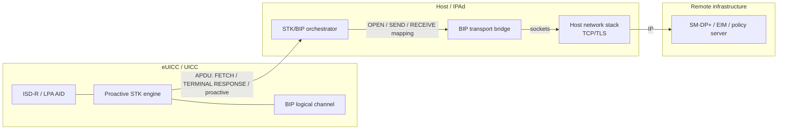
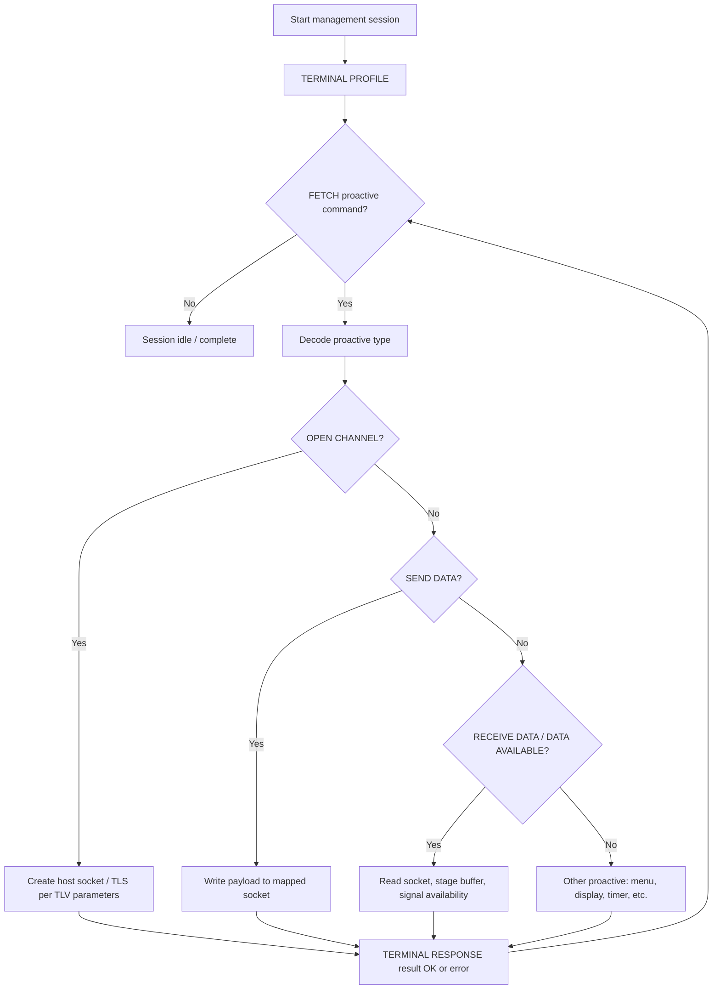
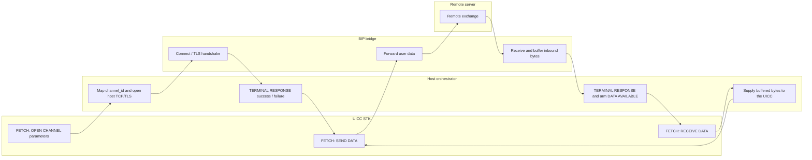
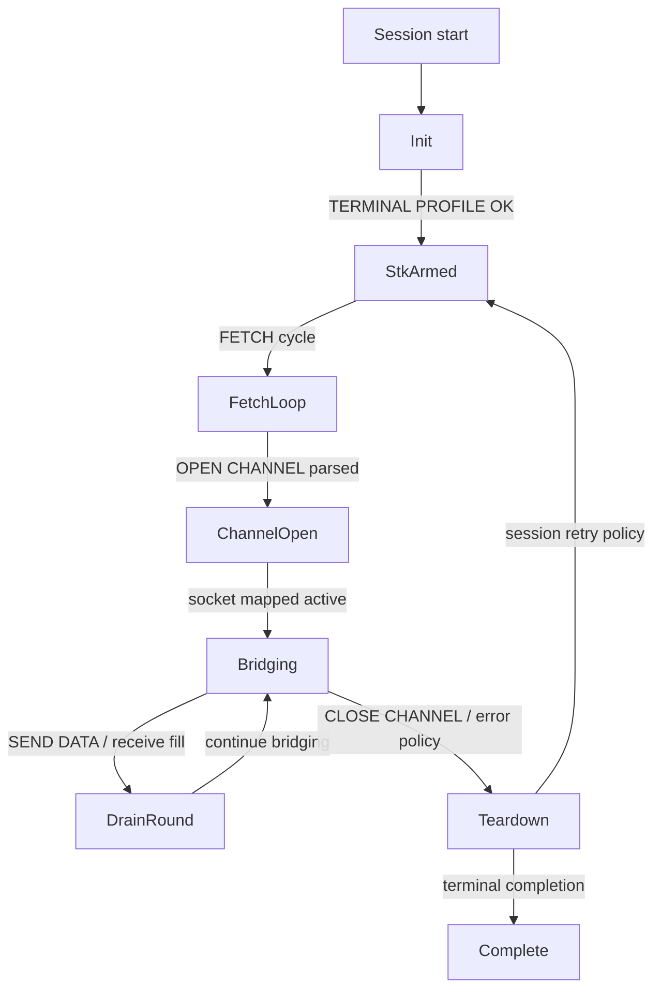

Title (working)

Systems and Methods for Bridging SIM Toolkit Bearer-Independent Protocol Sessions to Host Network Stacks for eSIM Management

────────────────────────────────────────

Scope note

This document is a technical invention draft, not a normative operator guide or
an exact statement of shipped repository behavior. Where it discusses polling
diagnostics, bridge heuristics, or related orchestration details, treat those as
conceptual or optional embodiments unless they are separately documented in
`CAPABILITIES.md`, `ARCHITECTURE.md`, or the active plugin/runtime guides.

────────────────────────────────────────

Abstract (technical draft)

A computing system couples a secure element (eUICC) executing proactive SIM Toolkit (STK) commands with a host management agent. The host implements a bridge that maps STK OPEN CHANNEL / SEND DATA / RECEIVE DATA (and related proactive sequences) to a host socket or TLS
session, while preserving FETCH / TERMINAL RESPONSE semantics and timing constraints. The bridge enables profile- or platform-management traffic that is initiated or tunneled via the UICC proactive session to reach remote servers (e.g. SM-DP+, EIM, or policy endpoints)
without requiring a full modem data path for that traffic. Stateful polling, event-list arming, and DATA AVAILABLE handling coordinate buffer drain and continuation rounds so long transactions complete reliably.

────────────────────────────────────────

Field of invention

Wireless subscriber identity modules, embedded UICC (eUICC), remote SIM provisioning (RSP), SIM Toolkit, BIP, IPAd/host agents, and secure OTA management.

────────────────────────────────────────

Background (concise)

eSIM management often assumes IP connectivity via the device modem. Some management flows are instead driven from the UICC using proactive STK and BIP, which expose a logical channel to a remote peer. Hosts must terminate BIP at a network stack, map buffer semantics, and keep
the STK state machine coherent with FETCH polling and TERMINAL RESPONSE requirements. A bridge that unifies these layers reduces fragmentation between card-side proactive commands and host-side TCP/TLS while supporting retries, logical channels, and watchdog timing.

────────────────────────────────────────

Summary of invention (embodiments, non-limiting)

1. Bridge module on the host that maintains a mapping between BIP channel identifiers (from STK OPEN CHANNEL) and host transport handles (TCP/UDP/TLS).
2. Proactive orchestrator executing TERMINAL PROFILE, FETCH loops, parsing proactive commands, and issuing TERMINAL RESPONSE with correct status and optional user confirmation simulation where applicable.
3. Buffer mediation: SEND DATA payloads forwarded to the socket; inbound socket data staged for RECEIVE DATA / DATA AVAILABLE events per event-list configuration.
4. Continuation policy: bounded rounds of “drain buffered BIP / announce availability” to avoid deadlock when the card and host disagree on buffer state.
5. Integration with eSIM management: the same bridge carries management-related APDUs or application payloads (e.g. ES10x-style interactions or EIM polling) where the UICC uses STK/BIP as the user-plane substitute.
6. Fallback paths (optional): base channel vs logical channel vs STK mode selection for STORE DATA / management commands when direct channel attempts fail.
7. Poll-thread diagnostics (optional): the host groups EIM polling activity into per-target threads and per-attempt stages, computes condensed DNS / OPEN CHANNEL / TLS summaries, and emits heuristic diagnoses that distinguish, for example, DNS-only progression, successful reachability up to TLS, certificate-path mismatch candidates, or missing-payload candidates.

────────────────────────────────────────

Brief description of figures

The following figures are represented as Mermaid flowcharts below (export to SVG/PDF for a formal filing package).

────────────────────────────────────────

Figure 1 — System context

────────────────────────────────────────

Figure 2 — High-level STK proactive loop (flowchart)

────────────────────────────────────────

Figure 3 — BIP bridge data plane (flowchart)

────────────────────────────────────────

Figure 4 — State machine (flowchart representation)

────────────────────────────────────────

Matrices (for specification + attorney workbook)

Table A — Proactive command family vs bridge responsibility

┌─────────────────────────────────┬───────────────────────────────────────────────────┬─────────────────────────────┐
│ Proactive family (illustrative) │ Host/orchestrator role                            │ Bridge / network role       │
├─────────────────────────────────┼───────────────────────────────────────────────────┼─────────────────────────────┤
│ SET UP EVENT LIST               │ Arm FETCH triggers (e.g. data available, timer)   │ Usually none                │
│ OPEN CHANNEL (BIP)              │ Parse buffer size, transport type, remote address │ Create/map socket, DNS, TLS │
│ SEND DATA                       │ Extract LLU/channel ref + payload                 │ Write to socket             │
│ RECEIVE DATA                    │ Build TERMINAL RESPONSE with segment              │ Read staged buffer          │
│ CLOSE CHANNEL                   │ Release mapping, confirm to card                  │ Close socket                │
│ TIMER MANAGEMENT                │ Schedule polling / watchdog                       │ Optional keep-alive         │
└─────────────────────────────────┴───────────────────────────────────────────────────┴─────────────────────────────┘

Table B — Failure class vs recovery strategy (embodiment)

┌───────────────────────────┬────────────────────────────────────┬──────────────────────────────────────────────────────────┐
│ Failure class             │ Example symptom                    │ Recovery / mitigation                                    │
├───────────────────────────┼────────────────────────────────────┼──────────────────────────────────────────────────────────┤
│ FETCH/transport SW        │ 6Fxx, 62xx, channel busy           │ Retry with backoff; switch logical channel               │
│ OPEN CHANNEL host connect │ DNS/TLS failure                    │ Surface error TERMINAL RESPONSE; optional alternate FQDN │
│ Buffer underrun           │ RECEIVE with no data               │ Wait / poll socket; re-arm DATA AVAILABLE                │
│ Buffer overrun            │ Card buffer smaller than segment   │ Chunking / segmentation per BIP rules                    │
│ Stale BIP session         │ OPEN CHANNEL without active socket │ Re-open from last parameters cache                       │
│ Watchdog / timer          │ STK timer expiry                   │ Extend window or reset proactive session                 │
└───────────────────────────┴────────────────────────────────────┴──────────────────────────────────────────────────────────┘

Table C — Comparison to “modem data path” management

┌──────────────┬──────────────────────────┬────────────────────────────────────────────┐
│ Aspect       │ Modem-routed management  │ STK/BIP bridge management                  │
├──────────────┼──────────────────────────┼────────────────────────────────────────────┤
│ Trigger      │ Mostly host-initiated IP │ Often UICC-initiated proactive             │
│ Transport    │ Cellular PDP/PDU session │ Host stack to Wi‑Fi/Ethernet               │
│ Coupling     │ OS telephony APIs        │ IPAd + PC/SC or embedded channel           │
│ Use case fit │ Consumer data always on  │ Lab, M2M, constrained devices, EIM polling │
└──────────────┴──────────────────────────┴────────────────────────────────────────────┘

────────────────────────────────────────

Detailed description (embodiment paragraphs for counsel to refine)

Host agent. In one embodiment, a IoT Profile Assistant (IPA) or test harness runs on a general-purpose processor and exchanges APDUs with the eUICC via PC/SC, SPI, or embedded SE API. A submodule labeled an orchestrator performs STK initialization: TERMINAL PROFILE,
iterative FETCH, and TERMINAL RESPONSE construction.
Bridge. Upon OPEN CHANNEL with Bearer Independent Protocol parameters, the bridge resolves transport protocol (e.g. TCP client), destination address (IPv4/IPv6/FQDN), and port, then associates a channel handle returned in subsequent SEND DATA / RECEIVE DATA proactive
commands. The bridge may implement TLS as a transparent wrapper so upper layers see a byte stream consistent with card expectations.
Buffer semantics. Inbound data read from the socket is copied into a host staging buffer whose depth respects UICC buffer size TLVs. When the event list requires DATA AVAILABLE, the orchestrator issues the appropriate TERMINAL RESPONSE sequence so the UICC issues RECEIVE
DATA.
eSIM management coupling. In a further embodiment, the payload bytes exchanged over the bridge encapsulate RSP or EIM messages (e.g. TLS records carrying ES9+/ES10+ or vendor EIM framing). The bridge is agnostic to payload except for segmentation and flow control imposed by
STK.
Safety limits. A maximum continuation round counter prevents infinite loops when DATA AVAILABLE and buffer state diverge.
Poll-thread diagnostics. In one embodiment, the host records poll-related proactive, DNS, OPEN CHANNEL, and TLS summaries and reconstructs per-target polling threads keyed by FQDN. Each thread may contain multiple poll attempts. For each attempt, the host computes a compact
two-stage summary including DNS transmission count, DNS-stage OPEN CHANNEL count (e.g. resolver port usage), eIM-stage OPEN CHANNEL count, TLS event count, and the first TLS alert if one was observed.
Heuristic inference. A diagnostic layer derives human-readable technical inferences from those summaries. Illustrative inferences include: (i) a first TLS alert of bad_certificate identifies the target FQDN as a primary certificate-path or certificate-byte mismatch candidate;
(ii) an alert value of 0x00 0x00 indicates a possible case where the TLS path was entered but no usable eIM payload was fetched; (iii) presence of TLS records without an alert indicates that the polling thread reached TLS; (iv) DNS traffic plus OPEN CHANNEL activity without TLS
indicates a completed DNS precheck stage where no TLS exchange is yet expected for that attempt; and (v) absence of TLS evidence indicates that the thread did not reach TLS. At aggregate poll scope, the same diagnostic layer may infer whether the run progressed only to timer /
event handling, to OPEN CHANNEL, to DNS, or to a live TLS exchange, and may annotate the result with the last queried or all polled FQDNs. In a further embodiment, a live deployment path reuses the same STK/BIP polling and diagnostic methods as an experimental path so the
diagnostic semantics remain aligned between lab and field tooling.

────────────────────────────────────────

Illustrative claim set (DRAFT — counsel must rewrite)

Independent claim (conceptual only):
A method comprising: receiving, at a host processor, a proactive SIM Toolkit command from a UICC via an APDU interface; responsive to an OPEN CHANNEL command specifying a bearer-independent protocol, establishing a network connection from the host processor to a remote
endpoint; mapping a channel identifier of the OPEN CHANNEL command to the network connection; forwarding payload data between the UICC and the remote endpoint via FETCH and TERMINAL RESPONSE exchanges; and tearing down the network connection responsive to a CLOSE CHANNEL
command or an error condition.
Dependent examples (topics for counsel): TLS wrapper; IPv4/IPv6/FQDN resolution; logical channel fallback; watchdog timer coordination; integration with IPA profile download state machine; bounded continuation rounds for DATA AVAILABLE; per-thread polling diagnostics that
correlate DNS, OPEN CHANNEL, and TLS-stage evidence to a target FQDN and emit heuristic failure-class inferences.
