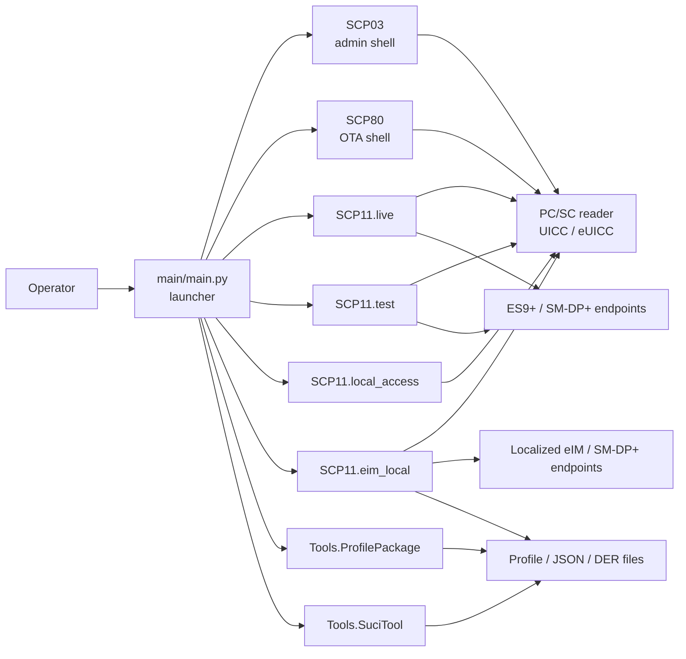
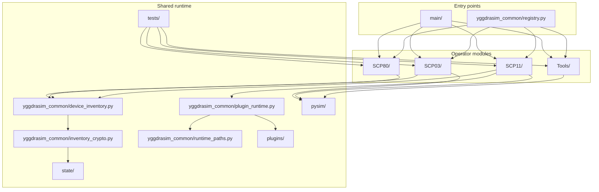
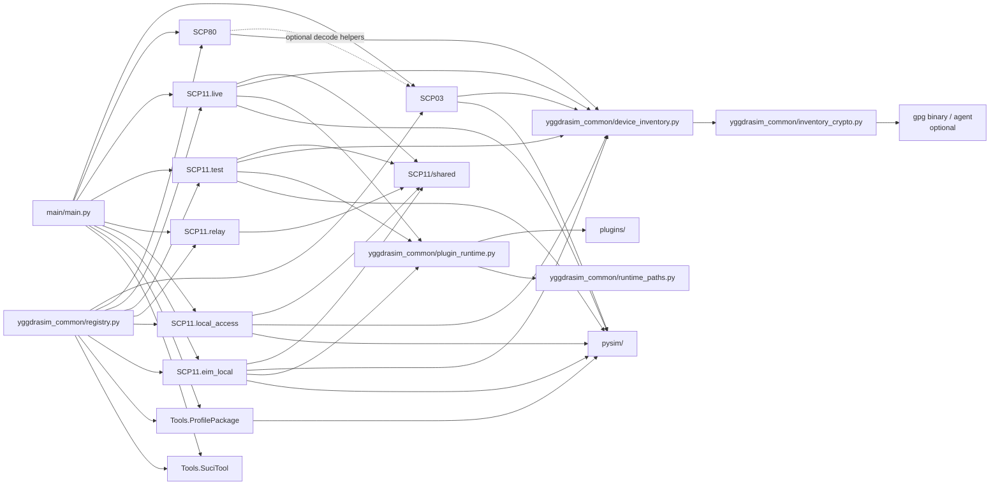
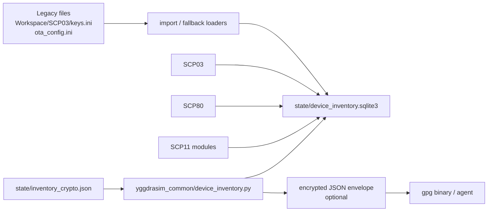
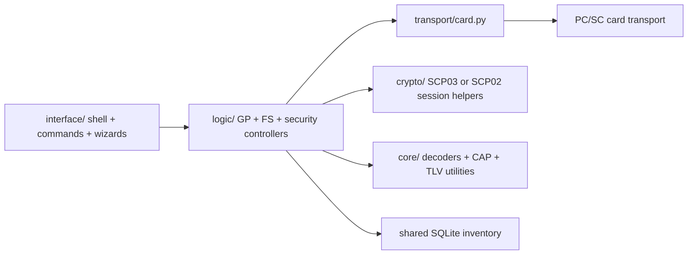
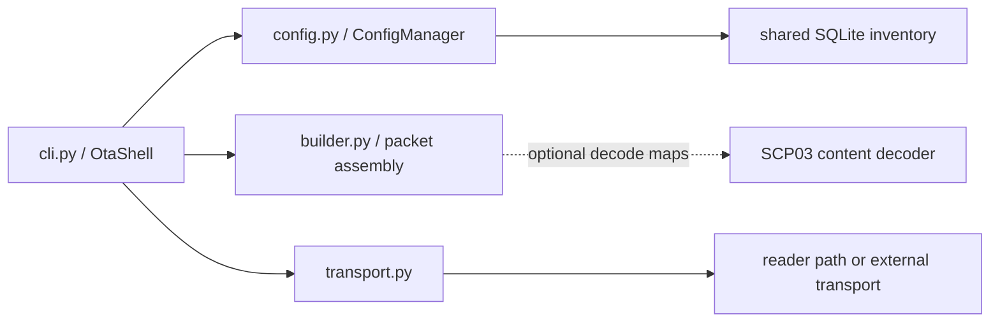
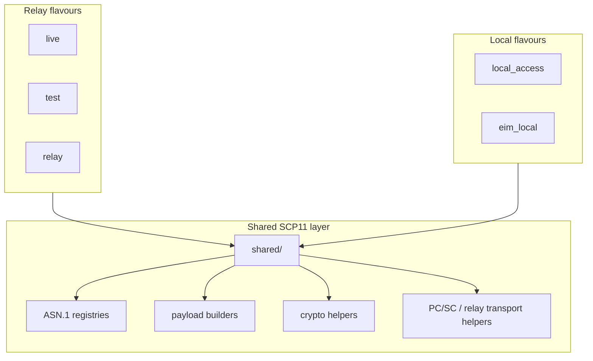
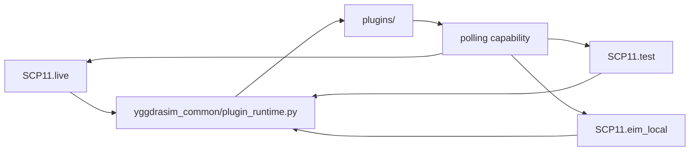
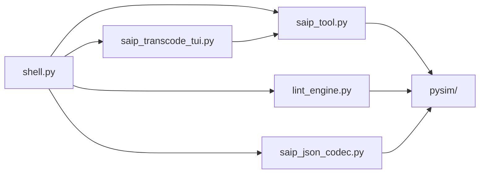

# YggdraSIM Architecture

This document explains how YggdraSIM is organized, which subsystems depend on
each other, and how runtime state moves between shells, helpers, storage, and
optional encryption. For operator usage and launch commands, see the top-level
`../README.md`. For discoverable entry points and symbol names, see
`../yggdrasim_common/registry.py`.

## 1. Architectural intent

YggdraSIM keeps adjacent smart-card, eUICC, OTA, SCP11, and SAIP workflows in
one repository so that:

- the same operator can move between card administration, relay work, and
  profile-package tooling without leaving the workspace
- shared helpers stay local to the repository instead of being split across
  several packages
- state that belongs to a card, eUICC, or eIM identity can be stored once and
  reused by multiple modules

The architecture favors:

- interactive shells as the primary operator surface
- direct Python module entry points for automation
- repository-local shared helpers
- SQLite for mutable cross-module state
- plain files where manual review is still the correct interface

## 2. System context

## 3. Repository structure

## 4. Interdependency matrix

The table below shows the operational dependency shape of each major subsystem.

| Subsystem | Launcher | PC/SC | Network | `pysim/` | Shared inventory | Optional crypto envelope | Notes |
|-----------|----------|-------|---------|----------|------------------|--------------------------|-------|
| `SCP03` | Primary | Primary | No | Optional | Primary | Primary | GlobalPlatform admin shell and filesystem tools |
| `SCP80` | Primary | Optional | Optional | No | Primary | Primary | OTA builder / send / decode shell |
| `SCP11.live` | Primary | Primary | Primary | Primary | Primary | Primary | Live relay-oriented shell; plugin-backed `POLL` surface |
| `SCP11.test` | Primary | Primary | Primary | Primary | Primary | Primary | Test relay shell; plugin-backed `POLL` surface |
| `SCP11.relay` | Optional | Optional | Primary | Primary | Optional | Optional | Compatibility namespace |
| `SCP11.local_access` | Primary | Primary | No | Primary | Primary | Primary | Direct `ISD-R` local flow |
| `SCP11.eim_local` | Primary | Primary | Primary | Primary | Primary | Primary | eIM-local package, localized polling, handover shell, and standalone `IPAd` export |
| `Tools.ProfilePackage` | Primary | No | No | Primary | No | No | SAIP tooling and transcode UI |
| `Tools.SuciTool` | Primary | No | No | No | No | No | File and stdin helper shell built around the external `suci-keytool` tool |

## 5. Complete dependency graph

## 6. Entry points

Direct module entry points:

- `python -m SCP03`
- `python -m SCP80`
- `python -m SCP11`
- `python -m SCP11.live`
- `python -m SCP11.test`
- `python -m SCP11.relay`
- `python -m SCP11.local_access`
- `python -m SCP11.eim_local`
- `python -m Tools.ProfilePackage`
- `python -m Tools.SuciTool`

The menu launcher in `main/main.py` remains the umbrella entry point for
interactive use.

## 7. Runtime state and secret flow

Mutable runtime state is now centralized where card identity or module identity
is the correct key.

Primary runtime state:

- `state/device_inventory.sqlite3`
- `state/inventory_crypto.json`

Legacy compatibility sources retained for import or fallback:

- `Workspace/SCP03/keys.ini`
- `SCP80/ota_config.ini`

State model:

- per-card namespaces are keyed by `ICCID` or `EID`
- module-level mutable settings are stored separately from per-card inventory
- encrypted payloads are decrypted only when a module reads them back into the
  active command path
- source runs load optional plugins directly from the repository `plugins/`
  tree, while frozen builds load them from the writable runtime root

## 8. SCP03 architecture

`SCP03` is the local administration and filesystem environment.

Responsibilities:

- secure-channel establishment and card session handling
- GlobalPlatform registry and lifecycle work
- ETSI / 3GPP filesystem navigation
- export and report generation
- module-level and per-card state persistence through the shared inventory

## 9. SCP80 architecture

`SCP80` is an OTA packet-building and transport shell.

Responsibilities:

- manage OTA security parameters and packet layout
- bind mutable state to `ICCID`
- decode and inspect payload content
- optionally reuse SCP03 decode helpers for filesystem-aware output

## 10. SCP11 family architecture

The `SCP11` tree is split by operational flavor while still sharing a common
helper layer.

Relay flavors:

- `SCP11.live` is the production-oriented relay shell.
- `SCP11.test` mirrors the live shell with test-certificate defaults.
- `SCP11.relay` is mainly a compatibility namespace.

Local flavors:

- `SCP11.local_access` performs direct local `ISD-R` flows such as
  `DISCOVER`, metadata operations, and `LOAD-PROFILE`.
- `SCP11.eim_local` layers eIM package authoring, localized polling,
  hotfolder execution, response logging, handover orchestration, and an
  adapter-first standalone `IPAd` runner on top of the local SCP11 stack.

Shared state in SCP11:

- relay shells persist per-card settings by `EID`
- local access persists selected certificate, profile, and metadata state by
  `EID`
- relay and eIM-local polling surfaces depend on the optional `polling`
  capability when that plugin is present
- eIM local persists eIM identity counters and runtime markers in the shared
  inventory and keeps poll-result evidence in SQLite and JSONL logs
- the Local eIM endpoint identity in `Workspace/LocalEIM/eim_identity.json` is
  intentionally separate from the simulated card's default BF55 identity in
  `Workspace/SIMCARD/eim_identity.json`
- full card-side eIM layouts can still override the seeded BF55 default through
  `Workspace/SIMCARD/isdr_config.json` with explicit `eim_entries`

Optional plugin extension path:

Plugin notes:

- `yggdrasim_common/plugin_runtime.py` scans `plugins/` from the active runtime root
- the current shipped contract reserves the `polling` capability name
- `SCP11.live` and `SCP11.test` use that capability to expose relay `POLL`
- `SCP11.eim_local` uses the same capability for localized `IPAE-*` polling
- `SCP11.eim_local/ipad_standalone.py` is intentionally separate from the
  plugin runtime so it can be exported into external Python environments
- seeded fake-eIM peer-provisioning artifacts live under
  `Workspace/LocalEIM/eim_packages/` and remain file-based rather than plugin-owned
- the wrapper-level simulator override surface owns card-side defaults such as
  `Workspace/SIMCARD/eim_identity.json`, rather than reusing the Local eIM
  identity file directly

## 11. Profile package tooling architecture

`Tools/ProfilePackage` is a file-oriented tooling surface rather than a card
session shell.

Responsibilities:

- SAIP shell and subprocess bridge
- profile linting
- JSON↔DER transcode
- configurable transcode output directory persisted in workspace config
- transcode sidecar persistence as `*.transcode.json`, `*.transcode.der`, and
  `*.transcode.txt`
- transcode UI clipboard integration plus persisted pane-layout preferences
- uncapped inspector/decode reporting in the transcode UI panes

## 12. Dependencies

High-signal Python dependencies:

- `pyscard` for PC/SC reader access
- `cryptography` and `pycryptodome` for certificate and key handling
- `asn1crypto` and `asn1tools` for ASN.1 and schema work
- `textual` for the SAIP transcode TUI
- `pySim` as an upstream Python dependency. The recommended install path
  is the `[saip]` extra (`pip install 'yggdrasim[saip]'`), which pulls
  upstream pySim directly from its GitHub mirror and unlocks the SAIP
  ASN.1 compile path, the SAIP transcode TUI, and the SCP11-local /
  eIM-local flows. An **optional** developer checkout at `pysim/`
  (gitignored; `git clone https://github.com/osmocom/pysim.git pysim`)
  takes priority over the installed wheel and is only needed when you
  want to pin against an unreleased upstream branch.

Non-Python operational dependencies:

- PC/SC daemon and reader drivers
- certificate material under module trees
- network access for relay and eIM endpoint workflows
- `gpg` only when encrypted inventory storage is enabled

## 13. Tests and maintenance

Documentation and architecture changes should stay aligned with:

- `../README.md`
- `CLI_AND_PIPING_GUIDE.md`
- `PROFILE_LIFECYCLE_CLI_CHEATSHEET.md`
- `../NOTICE`
- `../requirements.txt`
- `../yggdrasim_common/registry.py`
- `../SCP11/README.md`
- `../SCP11/live/README.md`
- `../SCP11/test/README.md`
- `../SCP11/local_access/README.md`
- `../SCP11/eim_local/README.md`
- `../SCP11/eim_local/GUIDE.md`
- `../SCP11/relay/README.md`
- `../SCP11/shared/README.md`
- `../plugins/README.md`

When a new cross-module dependency is added, update both:

- the interdependency matrix
- the complete dependency graph
