# YggdraSIM Architecture

This document explains how YggdraSIM is organized, which subsystems depend on
each other, and how runtime state moves between shells, helpers, storage, and
optional encryption. For operator usage and launch commands, see the top-level
`../README.md`. For discoverable entry points and symbol names, see
`../yggdrasim_common/registry.py`.

## 1. Architectural intent

YggdraSIM keeps adjacent smart-card, eUICC, OTA, SCP11, and SAIP workflows in
one repository so that:

- the same operator can move between card administration, relay work, and
  profile-package tooling without leaving the workspace
- shared helpers stay local to the repository instead of being split across
  several packages
- state that belongs to a card, eUICC, or eIM identity can be stored once and
  reused by multiple modules

The architecture favors:

- interactive shells as the primary operator surface
- direct Python module entry points for automation
- repository-local shared helpers
- SQLite for mutable cross-module state
- plain files where manual review is still the correct interface

## 2. System context

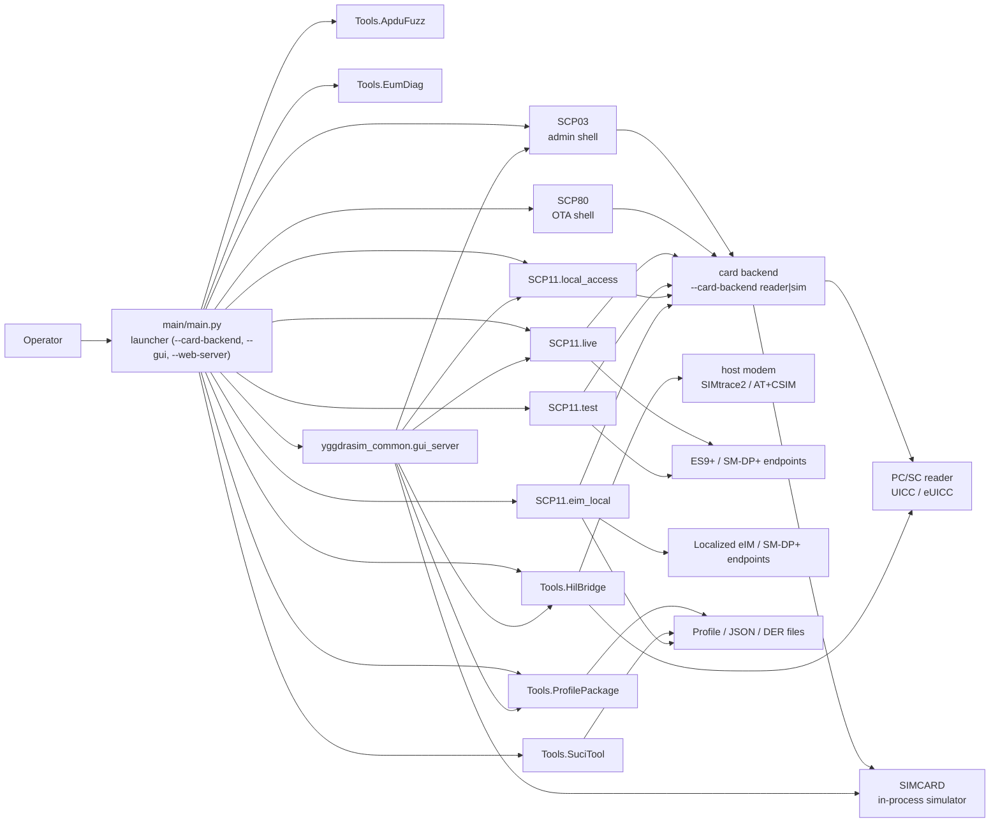

## 3. Repository structure

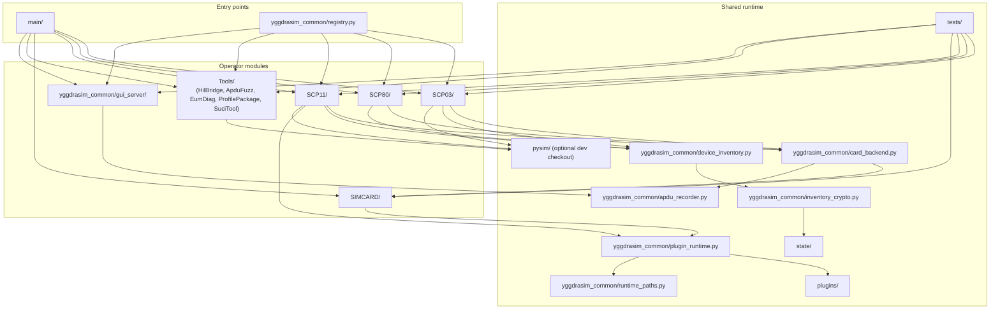

## 4. Interdependency matrix

The table below shows the operational dependency shape of each major subsystem.

| Subsystem | Launcher | PC/SC | Network | `pysim/` | Shared inventory | Optional crypto envelope | Notes |
|-----------|----------|-------|---------|----------|------------------|--------------------------|-------|
| `SCP03` | Primary | Primary | No | Optional | Primary | Primary | GlobalPlatform admin shell and filesystem tools |
| `SCP80` | Primary | Optional | Optional | No | Primary | Primary | OTA builder / send / decode shell |
| `SCP11.live` | Primary | Primary | Primary | Primary | Primary | Primary | Live relay-oriented shell; plugin-backed `POLL` surface |
| `SCP11.test` | Primary | Primary | Primary | Primary | Primary | Primary | Test relay shell; plugin-backed `POLL` surface |
| `SCP11.relay` | Optional | Optional | Primary | Primary | Optional | Optional | Compatibility namespace |
| `SCP11.local_access` | Primary | Primary | No | Primary | Primary | Primary | Direct `ISD-R` local flow |
| `SCP11.eim_local` | Primary | Primary | Primary | Primary | Primary | Primary | eIM-local package, localized polling, handover shell, and standalone `IPAd` export |
| `SIMCARD` | Backend | No | No | No | Primary | Primary | In-process simulated UICC / eUICC; selected via `--card-backend sim` for SCP03 / SCP80 / SCP11.local_access |
| `Tools.HilBridge` | Primary (Linux) | Primary | Optional | No | No | No | SIMtrace2 bridge (`pyudev`, `osmo-remsim-client-st2`); RSPRO 9997, GSMTAP 4729, AT+CSIM transcoder |
| `Tools.ProfilePackage` | Primary | No | No | Primary | No | No | SAIP tooling and transcode UI |
| `Tools.SuciTool` | Primary | No | No | No | No | No | File and stdin helper shell built around the external `suci-keytool` tool |
| `Tools.ApduFuzz` | Primary | Primary | No | No | No | No | Opt-in eUICC APDU mutation fuzzer with hard `--i-mean-it` + allow-list gates |
| `Tools.EumDiag` | Primary | No | No | No | No | No | EUM / SM-DP+ session-key injection + Wireshark/tshark Lua dissector for BF36 BPPs |
| `yggdrasim_common.gui_server` | Optional | No | Primary | No | Primary | Primary | Universal GUI Command Center (`--gui` desktop / `--web-server` remote-lab); requires the `gui` or `gui-server` extra |

## 5. Complete dependency graph

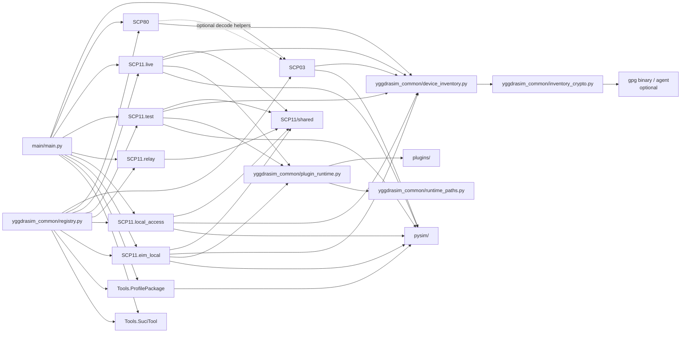

## 6. Entry points

Direct module entry points:

- `python -m SCP03`
- `python -m SCP80`
- `python -m SCP11`
- `python -m SCP11.live`
- `python -m SCP11.test`
- `python -m SCP11.relay`
- `python -m SCP11.local_access`
- `python -m SCP11.eim_local`
- `python -m Tools.HilBridge.main`
- `python -m Tools.HilBridge.supervisor`
- `python -m Tools.ProfilePackage`
- `python -m Tools.SuciTool`

`SIMCARD` is a library package with no `__main__`; it is reached
through the launcher (`--card-backend sim`), through the GUI Command
Center, or imported directly from operator scripts.

The menu launcher in `main/main.py` remains the umbrella entry point for
interactive use. The launcher's flag matrix includes:

- `--card-backend {reader,sim}` plus the simulator personality flags
  (`--sim-isdr-config`, `--sim-quirks`, `--sim-eim-identity`,
  `--sim-euicc-store`, `--sim-profile-store`, `--sim-import-profile`,
  `--sim-import-enable`)
- `--open-pcap <path>` and `--keybag <path>` for offline HIL pcap
  review
- `--gui` and `--web-server` (with `--host`, `--port`, `--token-file`,
  `--tls-cert`, `--tls-key`, `--tls-self-signed`) for the optional
  Universal GUI Command Center
- `--doctor` and `--version` diagnostic shortcuts

## 7. Runtime state and secret flow

Mutable runtime state is now centralized where card identity or module identity
is the correct key.

Primary runtime state:

- `state/device_inventory.sqlite3`
- `state/inventory_crypto.json`

Legacy compatibility sources retained for import or fallback:

- `Workspace/SCP03/keys.ini`
- `SCP80/ota_config.ini`

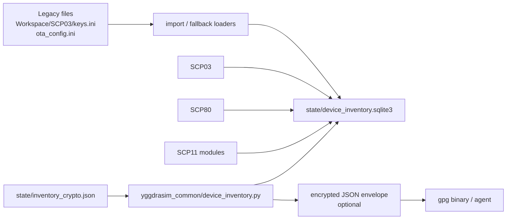

State model:

- per-card namespaces are keyed by `ICCID` or `EID`
- module-level mutable settings are stored separately from per-card inventory
- encrypted payloads are decrypted only when a module reads them back into the
  active command path
- source runs load optional plugins directly from the repository `plugins/`
  tree, while frozen builds load them from the writable runtime root

## 8. SCP03 architecture

`SCP03` is the local administration and filesystem environment.

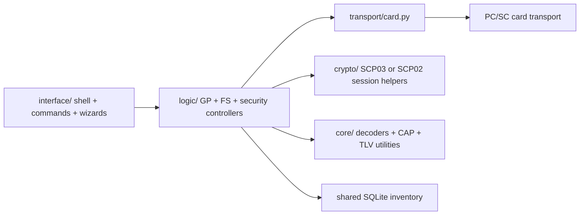

Responsibilities:

- secure-channel establishment and card session handling
- GlobalPlatform registry and lifecycle work
- ETSI / 3GPP filesystem navigation
- export and report generation
- module-level and per-card state persistence through the shared inventory

## 9. SCP80 architecture

`SCP80` is an OTA packet-building and transport shell.

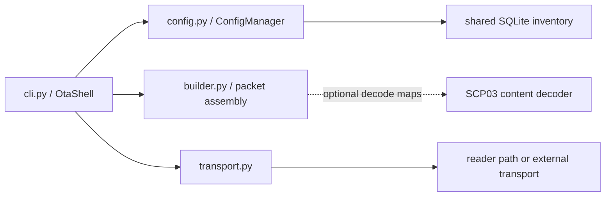

Responsibilities:

- manage OTA security parameters and packet layout
- bind mutable state to `ICCID`
- decode and inspect payload content
- optionally reuse SCP03 decode helpers for filesystem-aware output

## 10. SCP11 family architecture

The `SCP11` tree is split by operational flavor while still sharing a common
helper layer.

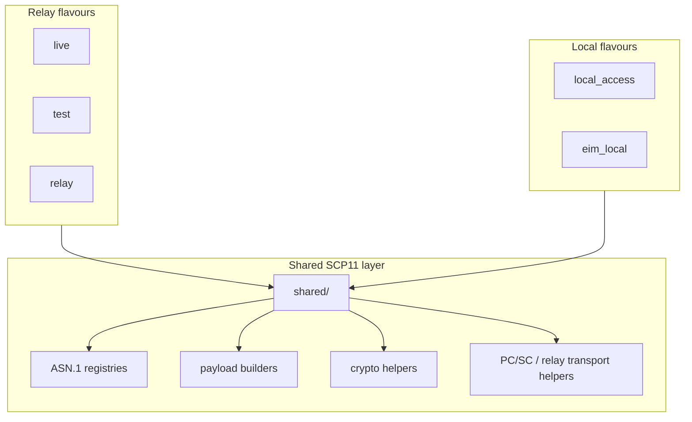

Relay flavors:

- `SCP11.live` is the production-oriented relay shell.
- `SCP11.test` mirrors the live shell with test-certificate defaults.
- `SCP11.relay` is mainly a compatibility namespace.

Local flavors:

- `SCP11.local_access` performs direct local `ISD-R` flows such as
  `DISCOVER`, metadata operations, and `LOAD-PROFILE`.
- `SCP11.eim_local` layers eIM package authoring, localized polling,
  hotfolder execution, response logging, handover orchestration, and an
  adapter-first standalone `IPAd` runner on top of the local SCP11 stack.

Shared state in SCP11:

- relay shells persist per-card settings by `EID`
- local access persists selected certificate, profile, and metadata state by
  `EID`
- relay and eIM-local polling surfaces depend on the optional `polling`
  capability when that plugin is present
- eIM local persists eIM identity counters and runtime markers in the shared
  inventory and keeps poll-result evidence in SQLite and JSONL logs
- the Local eIM endpoint identity in `Workspace/LocalEIM/eim_identity.json` is
  intentionally separate from the simulated card's default BF55 identity in
  `Workspace/SIMCARD/eim_identity.json`
- full card-side eIM layouts can still override the seeded BF55 default through
  `Workspace/SIMCARD/isdr_config.json` with explicit `eim_entries`

Optional plugin extension path:

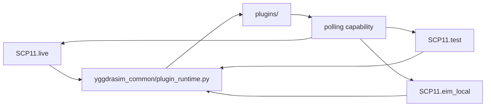

Plugin notes:

- `yggdrasim_common/plugin_runtime.py` scans `plugins/` from the active runtime root
- the current shipped contract reserves the `polling` capability name
- `SCP11.live` and `SCP11.test` use that capability to expose relay `POLL`
- `SCP11.eim_local` uses the same capability for localized `IPAE-*` polling
- a standalone IPAd entry point is intentionally separate from the
  plugin runtime so it can be exported into external Python environments
- seeded fake-eIM peer-provisioning artifacts live under
  `Workspace/LocalEIM/eim_packages/` and remain file-based rather than plugin-owned
- the wrapper-level simulator override surface owns card-side defaults such as
  `Workspace/SIMCARD/eim_identity.json`, rather than reusing the Local eIM
  identity file directly

## 11. SIMCARD simulator architecture

`SIMCARD/` is the in-process simulated UICC / eUICC backend selected
through `--card-backend sim` (or the `YGGDRASIM_CARD_BACKEND` env
flag). Card-facing modules (`SCP03`, `SCP80`,
`SCP11.local_access`, the GUI Command Center) talk to it via the
shared `yggdrasim_common.card_backend` factory, which returns a real
`pyscard` connection in `reader` mode and a
`SimulatedCardConnection` driving
`SIMCARD.engine.SimulatedSimCardEngine` in `sim` mode. The same APDU recorder feeds either path so the GUI
APDU dock is backend-agnostic.

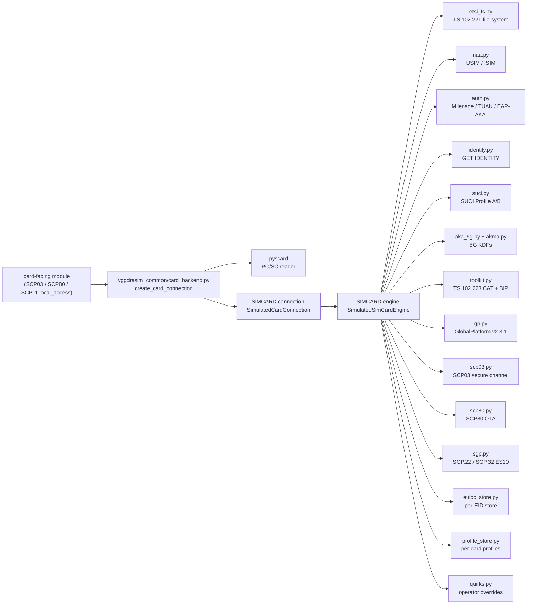

Persistence:

- `Workspace/SIMCARD/eim_identity.json` seeds the simulator's default
  BF55 eIM identity. The launcher flag `--sim-eim-identity` and the
  GUI Command Center settings dialog can override it at runtime
  without rewriting the file.
- `Workspace/SIMCARD/isdr_config.json` seeds the full ISD-R / eUICC
  personality (EID, EUM identity, supported PKID set, AKMA flag,
  optional `eim_entries` list).
- `Workspace/SIMCARD/sim_quirks.py` is an optional Python override
  module loaded through `quirks.py:load_quirk_registry`. It is
  `exec`'d, so the trust model is "operator owns the file"; treat it
  the same as a per-host config script.
- `Workspace/SIMCARD/profile_store/` holds per-card profile artifacts
  imported via `--sim-import-profile` or the SAIP tooling.
- `Workspace/SIMCARD/euicc_store/` holds per-EID eUICC state so the
  simulator survives launcher restarts cleanly.

## 12. HIL bridge architecture

`Tools/HilBridge/` lives only on Linux flavors that ship `pyudev` and
`osmo-remsim-client-st2`. The bridge takes exclusive ownership of
the PC/SC reader and exposes:

- a `RSPRO` server on `127.0.0.1:9997` for the SIMtrace2 client
- a brokered side channel (`apdu_relay.py`) so YggdraSIM-side modules
  can still send APDUs to the same physical card while the modem
  drives it
- a GSMTAP mirror on UDP 4729 for live Wireshark capture
- an offline `tshark -r` pipeline for saved `.pcap` / `.pcapng`
  review (`--open-pcap <path>` from the launcher)
- a SCP keybag replay engine (`scp_replay.py`) that consumes the
  JSONs exported by `EXPORT-KEYBAG` to overlay plaintext APDUs onto
  encrypted SCP03 / SCP11c traces
- a modem cold-boot path through `at_simlink.py` that turns
  `AT+CSIM=...` / `AT+CRSM=...` request lines into raw ISO 7816
  APDUs and back, suitable for any serial / TCP loopback to a host
  modem (3GPP TS 27.007 §8.17 / §8.18)
- a `supervisor.py` health-checker / restarter, suitable for
  `systemd --user` deployment (see `guides/systemd/`)

## 13. Universal GUI architecture

`yggdrasim_common/gui_server/` (experimental) is the optional Universal GUI
Command Center. It is installed via the `gui` or `gui-server` extra
and never imported until the operator passes `--gui` or
`--web-server`.

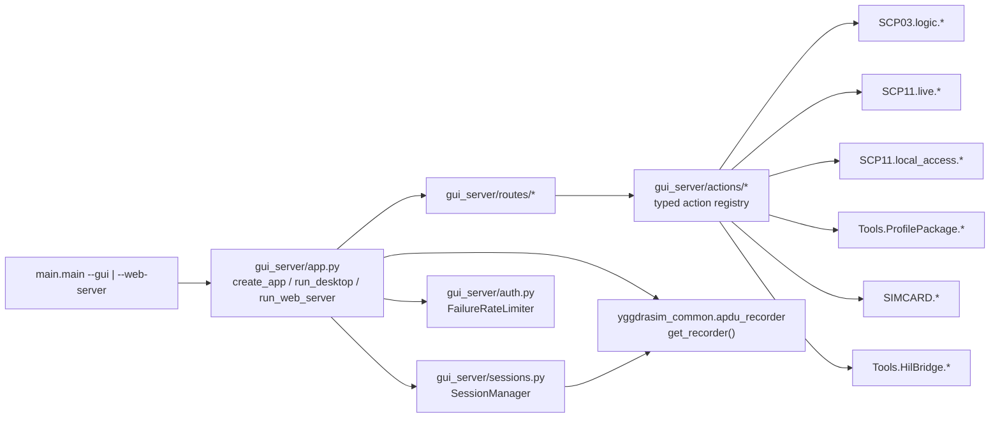

Properties:

- the action registry is typed: every action declares its inputs,
  output renderer, and confirmation policy so the SPA auto-builds the
  form
- the bottom-dock APDU tab subscribes to the process-wide recorder
  via WebSocket, so any module that goes through
  `card_backend.create_card_connection` shows up live
- `--web-server` requires a bearer token (`--token-file`) and supports
  BYO TLS (`--tls-cert` / `--tls-key`) or generated self-signed
  (`--tls-self-signed`, persisted under `state/gui_tls/`)
- xterm.js per-tab PTY bridges back the C-6 sub-shell handoffs so an
  operator can drop into `STK-SHELL` or `python -m SCP80` without
  leaving the browser

## 14. Profile package tooling architecture

`Tools/ProfilePackage` is a file-oriented tooling surface rather than a card
session shell.

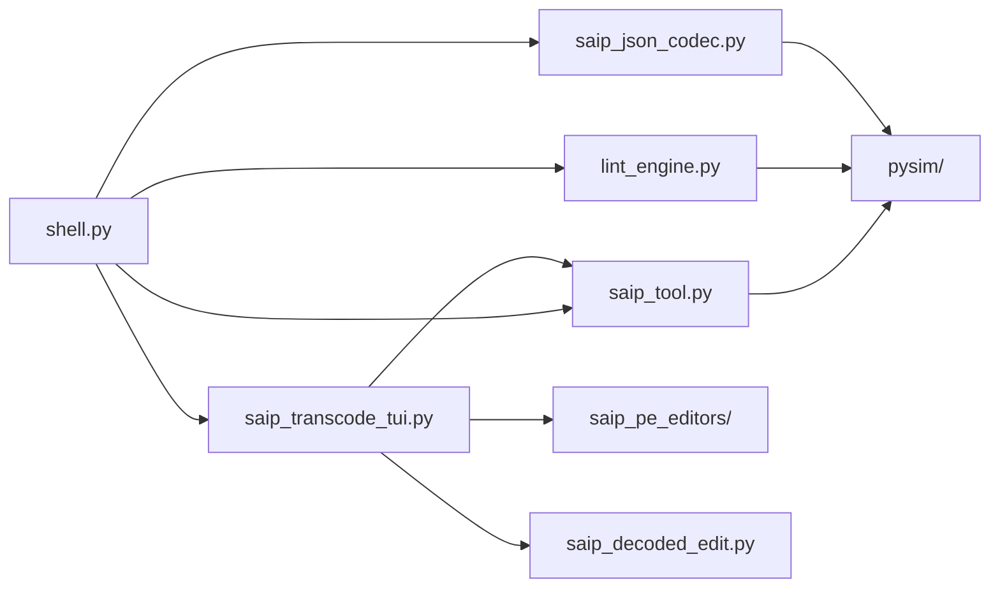

Responsibilities:

- SAIP shell and subprocess bridge
- profile linting
- JSON↔DER transcode
- configurable transcode output directory persisted in workspace config
- transcode sidecar persistence as `*.transcode.json`, `*.transcode.der`, and
  `*.transcode.txt`
- transcode UI clipboard integration plus persisted pane-layout preferences
- uncapped inspector/decode reporting in the transcode UI panes
- structured Profile Element editors (`saip_pe_editors/`) wired into the
  decoded slot of the transcode TUI

### 14.1 Structured PE editor surface

The transcode TUI no longer surfaces decoded payloads only as JSON. Each pane
slot can be flipped between four modes:

- `asn1` -- the existing JSON-tagged decode stream backed by `saip_decoded_edit`
- `pe_editor` -- a structured form for the currently selected Profile Element
- `filesystem` -- an MF/DF/EF tree reconstructed from PE-DF, PE-MF, PE-USIM,
  PE-ISIM, PE-CSIM, PE-Telecom, PE-PhoneBook and PE-GenericFileManagement
- `applications` -- an ISD + applications tree derived from PE-SecurityDomain
  and PE-Application

Editor classes live in `Tools/ProfilePackage/saip_pe_editors/` and are
selected through `PE_EDITOR_REGISTRY` / `lookup_pe_editor`:

- `_base.BasePeEditor` -- abstract Textual `Vertical` host that owns the
  `PeHeaderForm` (mandated/identification round-trip), guards initial paint
  with a deferred `_suppress_emit` window, and emits
  `BasePeEditor.Changed` once an operator commits a change
- `_header.PeHeaderForm` -- reusable header form bound to every PE root
- `_pin.PinCodesEditor` / `PukCodesEditor` -- per-row PIN / PUK forms
- `_aka.AkaParameterEditor` -- algorithm picker, key material, SQN options
- `_naa.NaaPeEditor` / `TelecomPeEditor` -- header + template ID dropdown
  + EF presence toggles for USIM / OPT-USIM / ISIM / OPT-ISIM / CSIM /
  OPT-CSIM / Telecom
- `_security_domain.SecurityDomainEditor` -- instance parameters, key list
  rows, and personalisation blob list
- `_filesystem.FileSystemView` / `_applications.ApplicationsView` -- read-only
  navigation views that emit `FileSelected` / `ApplicationSelected` so the
  JSON outline can jump to the matching PE

Round-trip flow when an operator edits a PE:

1. Editor widget collects its form into a JSON-tagged PE dict.
2. `BasePeEditor.Changed` propagates to `saip_transcode_tui` which calls
   `_apply_document_edit` with the new PE value.
3. `saip_decoded_edit.encode_decoded_payload_change` writes the update back
   into the JSON document and re-renders the JSON / DER previews.

Adding a new structured editor:

1. Subclass `BasePeEditor` and implement `compose`, `_refresh_widgets`, and
   the collect-and-emit path.
2. Register the class in `PE_EDITOR_REGISTRY` (or call
   `register_pe_editor`) keyed by the PE section type -- duplicates such as
   `pinCodes_2` are resolved through `base_pe_type_for_section_key`.
3. Add a unit test under `tests/test_saip_pe_editors.py`. Use
   `_drive_with_callback` so assertions run while the editor is mounted --
   queries against widget DOM state must execute inside the active pilot.

## 15. Dependencies

High-signal Python dependencies:

- `pyscard` for PC/SC reader access
- `cryptography` and `pycryptodome` for certificate and key handling
- `asn1crypto` and `asn1tools` for ASN.1 and schema work
- `textual` for the SAIP transcode TUI
- `pySim` as an upstream Python dependency. The recommended install path
  is the `[saip]` extra (`pip install 'yggdrasim[saip]'`), which pulls
  upstream pySim directly from its GitHub mirror and unlocks the SAIP
  ASN.1 compile path, the SAIP transcode TUI, and the SCP11-local /
  eIM-local flows. An **optional** developer checkout at `pysim/`
  (gitignored; `git clone https://github.com/osmocom/pysim.git pysim`)
  takes priority over the installed wheel and is only needed when you
  want to pin against an unreleased upstream branch.

Non-Python operational dependencies:

- PC/SC daemon and reader drivers
- certificate material under module trees
- network access for relay and eIM endpoint workflows
- `gpg` only when encrypted inventory storage is enabled

## 16. Tests and maintenance

Documentation and architecture changes should stay aligned with:

- `../README.md`
- `CAPABILITIES.md`
- `BUILD_AND_PACKAGING.md`
- `CLI_AND_PIPING_GUIDE.md`
- `DIAGNOSTICS_TOOLBOX.md`
- `HIL_BRIDGE_GUIDE.md`
- `PROFILE_LIFECYCLE_CLI_CHEATSHEET.md`
- `SIMTRACE2_CARDEM_GUIDE.md`
- `TEMPLATE_AND_TOKENS.md`
- `../NOTICE`
- `../pyproject.toml`
- `../requirements.txt`
- `../yggdrasim_common/registry.py`
- `../SCP11/README.md`
- `../SCP11/live/README.md`
- `../SCP11/test/README.md`
- `../SCP11/local_access/README.md`
- `../SCP11/eim_local/README.md`
- `../SCP11/eim_local/GUIDE.md`
- `../SCP11/relay/README.md`
- `../SCP11/shared/README.md`
- `../SIMCARD/`
- `../Tools/HilBridge/`
- `../yggdrasim_common/gui_server/`
- `../plugins/README.md`

When a new cross-module dependency is added, update both:

- the interdependency matrix
- the complete dependency graph
