# Architecture

The architecture pages set out how YggdraSIM is organized, how subsystems
depend on each other, and how runtime state moves between shells, helpers,
storage, and optional encryption. Each section here pairs a short
description with a flow chart so the intended shape is visible at a glance.

For operator usage and launch commands, see [Getting Started](getting-started.md)
and [Operator Surfaces](operator-surfaces.md). For discoverable entry points
and symbol names, see `yggdrasim_common/registry.py` and the
[Registry and Launcher](internals/registry-and-launcher.md) internals page.

## Architectural intent

YggdraSIM keeps adjacent smart-card, eUICC, OTA, SCP11, HIL, and SAIP
workflows in one repository so the same operator can move between card
administration, relay work, package tooling, and hardware-in-the-loop
capture without leaving the workspace.

The architecture favors:

- interactive shells as the primary operator surface
- direct `python -m ...` entry points for automation
- repository-local shared helpers
- SQLite for mutable cross-module state
- plain files where manual review remains the correct interface

## System context

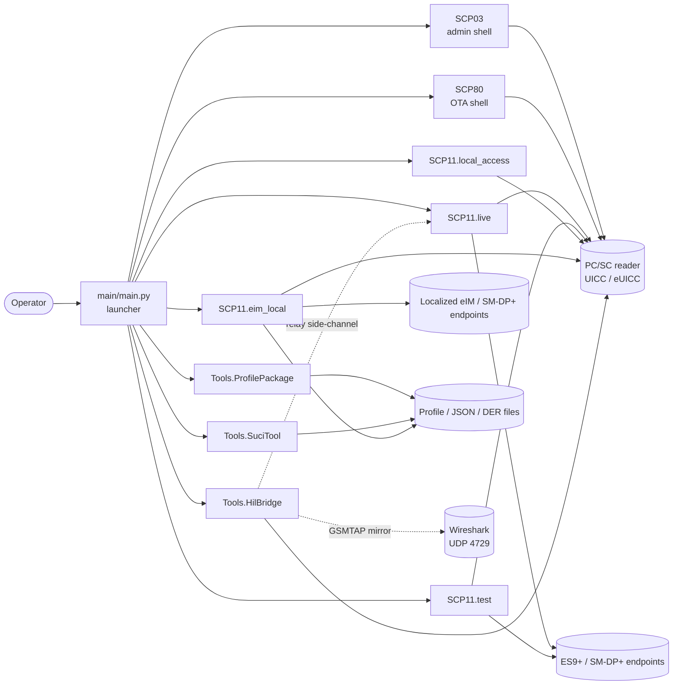

## Repository structure

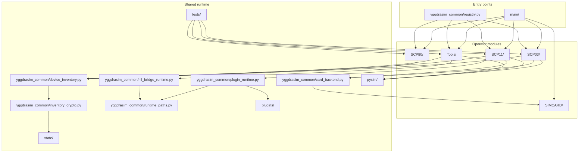

## Interdependency matrix

| Subsystem | Launcher | PC/SC | Network | `pysim/` | Shared inventory | Optional crypto envelope | Notes |
| --- | --- | --- | --- | --- | --- | --- | --- |
| `SCP03` | Primary | Primary | No | Optional | Primary | Primary | GP admin, filesystem, retrieval |
| `SCP80` | Primary | Optional | Optional | No | Primary | Primary | OTA build, send, decode |
| `SCP11.live` | Primary | Primary | Primary | Primary | Primary | Primary | Live relay-oriented shell, plugin-backed `POLL` |
| `SCP11.test` | Primary | Primary | Primary | Primary | Primary | Primary | Test relay shell with lab-only shaping |
| `SCP11.relay` | Optional | Optional | Primary | Primary | Optional | Optional | Compatibility namespace |
| `SCP11.local_access` | Primary | Primary | No | Primary | Primary | Primary | Direct local `ISD-R` flow |
| `SCP11.eim_local` | Primary | Primary | Primary | Primary | Primary | Primary | eIM-local package, polling, handover, IPAd standalone |
| `Tools.ProfilePackage` | Primary | No | No | Primary | No | No | SAIP tooling and transcode UI |
| `Tools.HilBridge` | Primary | Primary | No | No | No | No | HIL supervisor and relay |
| `Tools.SuciTool` | Primary | No | No | No | No | No | File/stdin shell around `suci-keytool` |

## Complete dependency graph

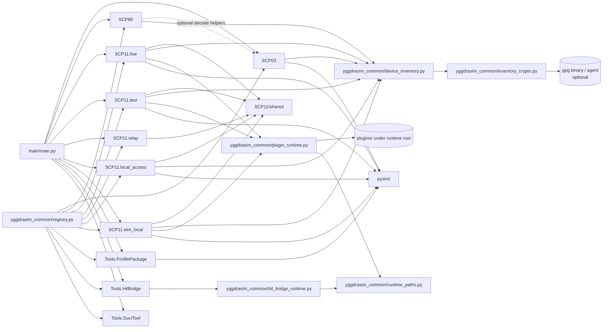

## Runtime-root resolution

Every subsystem resolves its writable paths through a shared resolver. The
resolution order is deterministic:

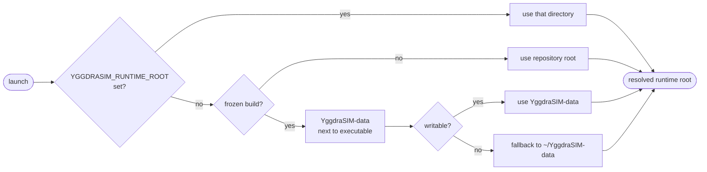

See [Runtime Root](reference/runtime-root.md) for the full picture.

## Shared state and secret flow

Mutable runtime state is centralized under `state/`. Legacy files feed the
inventory on first launch and then stay on disk as fallback or diff
material.

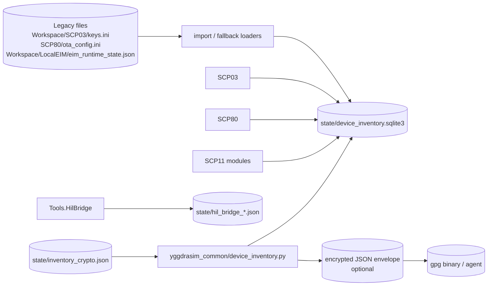

State model:

- per-card namespaces are keyed by `ICCID` or `EID`
- module-level mutable settings are stored separately from per-card inventory
- encrypted payloads are decrypted only when a module reads them back into
  the active command path
- source runs load optional plugins directly from the repository `plugins/`
  tree, while frozen builds load them from the writable runtime root
- HIL supervisor and relay publish their state to dedicated JSON files so a
  second operator shell can observe readiness without opening a PC/SC handle

See [State Schema](reference/state-schema.md) for the current schema and
identity-key rules.

## Session lifecycle

One operator command touches many layers. The swimlane below is a typical
`DISCOVER` or `STATUS` path through `SCP11/live`.

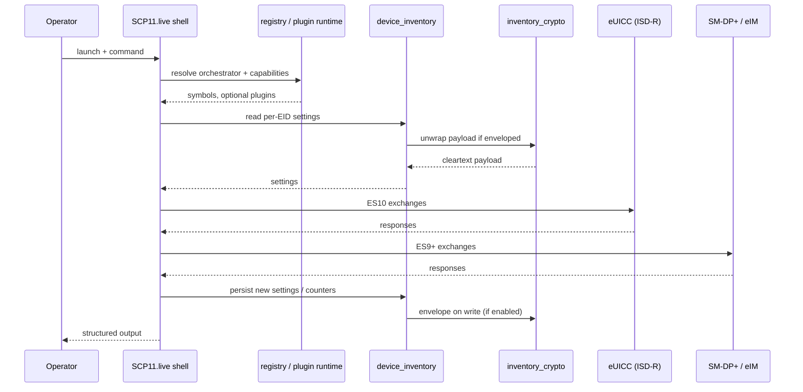

## SCP03 internal shape

`SCP03` keeps a clean separation between the shell surface, domain logic,
transport, cryptography, and decoders.

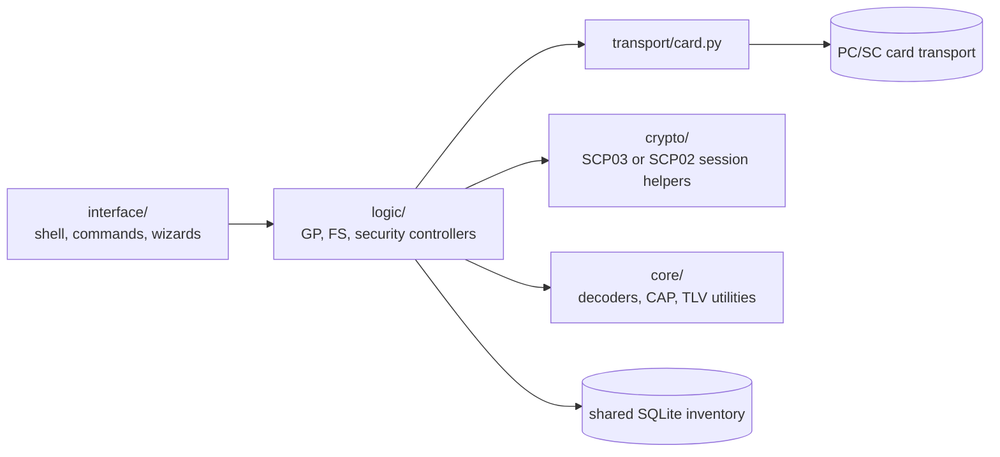

Responsibilities:

- GP secure-channel establishment and card session handling
- registry and lifecycle work
- ETSI / 3GPP filesystem navigation
- export, report generation, and gold-snapshot diffs
- module-level and per-card state persistence through the shared inventory

## SCP80 internal shape

`SCP80` is deliberately small and state-driven.

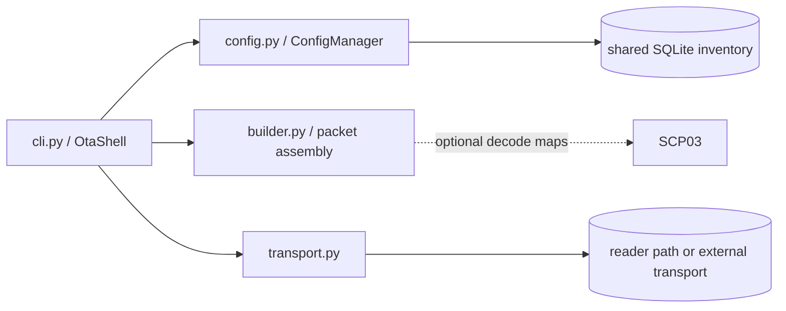

Responsibilities:

- manage OTA security parameters and packet layout
- bind mutable state to `ICCID`
- decode and inspect payload content
- optionally reuse SCP03 decode helpers for filesystem-aware output

## SCP11 family landscape

The `SCP11` tree is split by operational flavor and anchored by a single
shared helper layer.

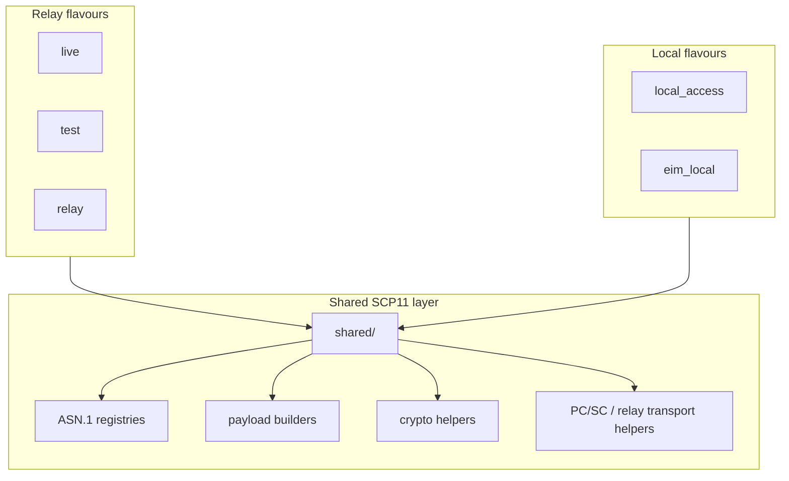

Relay flavors:

- `SCP11.live` is the production-oriented relay shell
- `SCP11.test` mirrors `live` with test-certificate and shaping defaults
- `SCP11.relay` is a compatibility namespace

Local flavors:

- `SCP11.local_access` performs direct local `ISD-R` flows
- `SCP11.eim_local` layers eIM package authoring, localized polling,
  hotfolder execution, response logging, handover, and a standalone `IPAd`
  runner on top of the local SCP11 stack

## Optional plugin runtime

Plugins are optional. The core must remain runnable without any plugin
present. `yggdrasim_common/plugin_runtime.py` scans the active runtime
root's `plugins/` directory at launch.

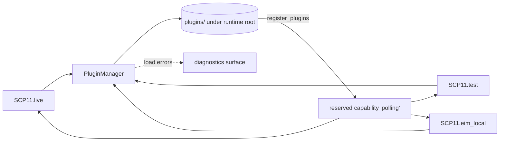

See [Plugin Contract](internals/plugin-contract.md) for the loader
contract, reserved capability names, and absent-plugin behavior.

## Profile lifecycle on the eUICC

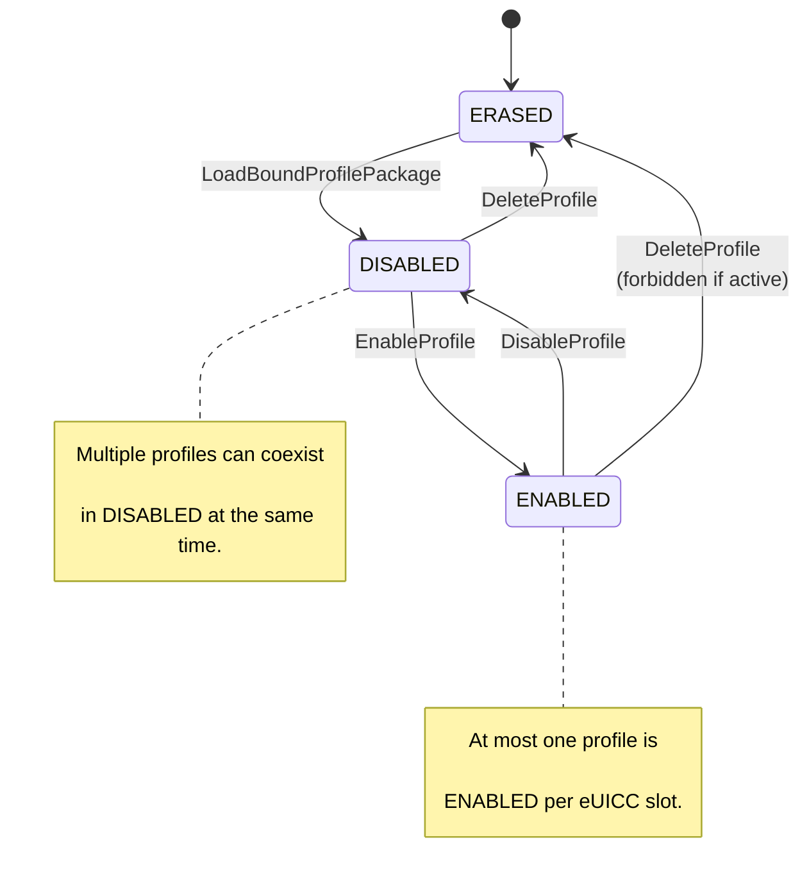

## SAIP profile pipeline

A profile moves through several representations before it lands on a card.
`Tools/ProfilePackage` owns the file-side transforms. `SCP11/local_access`
and `SCP11/live` own the card-side consumption.

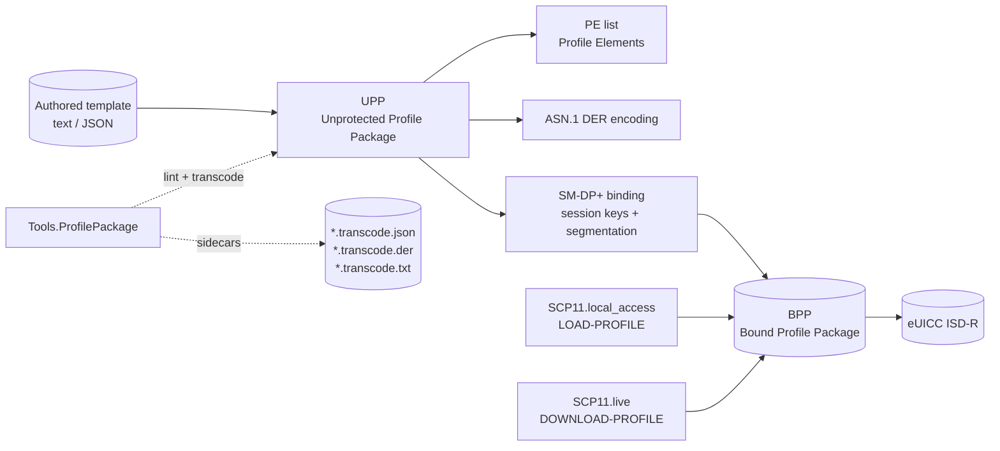

## HIL bridge topology

The HIL bridge keeps a live card visible to both a modem and YggdraSIM
operator shells, and mirrors every APDU to Wireshark.

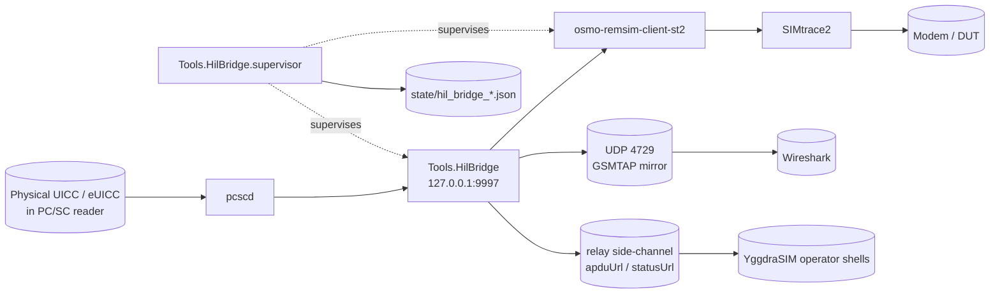

See [HIL Model](concepts/hil-model.md) for the physical plumbing story
and [HIL Bridge](subsystems/hil-bridge.md) for the operator surface.

## Card-backend selection

`yggdrasim_common/card_backend.py` abstracts the physical-versus-simulated
split so subsystem shells can target either backend.

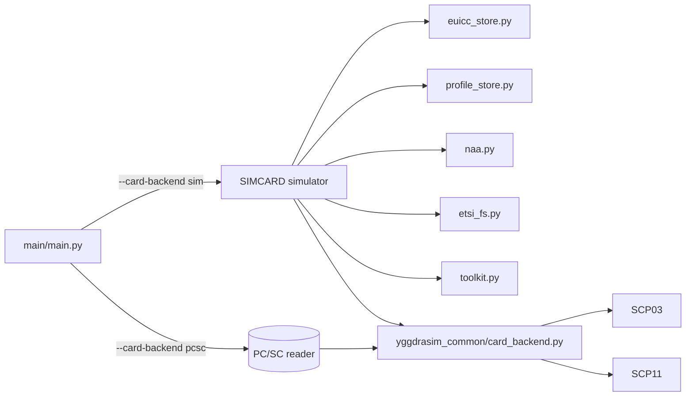

## Operator consequences

- `SCP03` is the card-administration and filesystem environment, not the
  relay shell
- `SCP11/live` and `SCP11/test` are the primary relay-facing shells
- `SCP11/local_access` is the direct local `ISD-R` path
- `SCP11/eim_local` is the eIM-side package, polling, and handover shell
- `Tools/ProfilePackage` is the SAIP package inspection and transcode
  surface
- `Tools/HilBridge` is the dedicated physical-card-to-modem bridge path
- `Tools/SuciTool` is the SUCI key helper
- `SIMCARD` is the simulator backend activated by `--card-backend sim`

## Deep reference

For the full authored architecture narrative, dependency tables, and flow
charts, use `guides/ARCHITECTURE.md`. This site page is intentionally
diagram-first; the guide is the canonical prose version.
