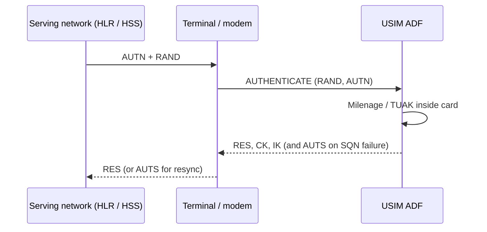

# 3GPP NAA

Network Access Applications are the applets inside a UICC that actually
authenticate a subscriber to a mobile network. In the 3GPP world the two
dominant NAAs are the USIM and the ISIM. The 3GPP TS 31.102 specification
describes the USIM shape, the file contents, and the authentication commands
that every modern SIM and eSIM profile must implement. The vendored copy lives
in `docs/ts_131102v180400p.md`.

## Which NAA does what

| NAA | Standard | Role |
| --- | --- | --- |
| USIM | 3GPP TS 31.102 | 2G/3G/4G/5G access authentication |
| ISIM | 3GPP TS 31.103 | IMS / VoLTE authentication |
| CSIM | 3GPP2 C.S0065 | CDMA access authentication |

All three live as **ADFs** under the MF. The profile loader in RSP workflows
always lands at least a USIM ADF, and often an ISIM ADF as well, depending on
the SAIP template.

## Authentication at a glance

The card keeps the long-term key `K` in tamper-resistant storage and only
releases derived material. Two algorithm families are standard:

- **Milenage**, originally specified in 3GPP TS 35.206
- **TUAK**, specified in 3GPP TS 35.231, offering a Keccak-based alternative

YggdraSIM exposes authentication execution from the admin shell for diagnostic
work. It does not leak `K` out of the card; it only observes the derived
output the card returns.

## Important USIM EFs

| EF | Purpose |
| --- | --- |
| `EF IMSI` | current IMSI |
| `EF Keys` | CK/IK cache |
| `EF LOCI` | last location info |
| `EF PSLOCI` | packet-switched LOCI |
| `EF AD` | administrative data |
| `EF SPN` | service provider name |
| `EF OPL` / `EF PNN` | PLMN name overrides |
| `EF ACC` | access class bits |
| `EF FPLMN` | forbidden PLMN list |
| `EF UST` | USIM service table |

The `EF UST` service table tells the terminal which optional USIM features
are active on this profile. It is a common thing to inspect and lint when a
profile is built from a SAIP template.

## ISIM shape

An ISIM ADF is smaller than a USIM ADF. Key EFs include:

- `EF IMPI` for the IMS private identity
- `EF IMPU` for IMS public identities
- `EF DOMAIN` for the home network domain
- `EF IST` for the ISIM service table

## SUCI and the subscription identifier

5G introduced the **SUCI** to avoid sending SUPI in the clear. The USIM
computes the SUCI locally using an ECIES scheme. YggdraSIM includes
`Tools/SuciTool` to help generate and export the SUCI key material that a
profile expects.

## Where to look in YggdraSIM

- [SCP03 Admin Shell](../subsystems/scp03.md) for live USIM/ISIM file
  access and `AUTHENTICATE` diagnostics
- [SUCI Tool](../subsystems/suci-tool.md) for SUCI key handling
- [SAIP Profiles](saip-profiles.md) for how the SAIP template encodes
  the NAA that finally lands on a card
