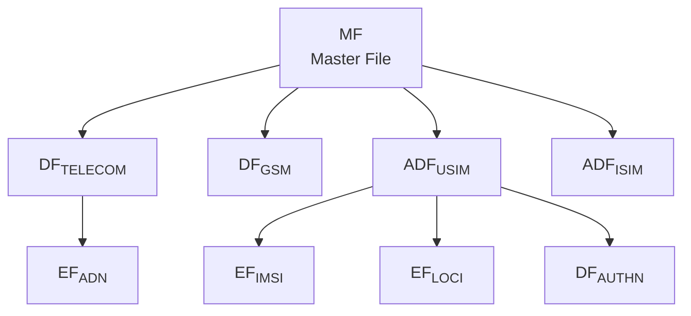

<!--
SPDX-License-Identifier: GPL-3.0-or-later
Copyright (c) 2026 1oT OÜ. Authored by Hampus Hellsberg.
-->


# ETSI UICC

ETSI TS 102 221 defines the UICC's physical, logical, and administrative
interface. The filesystem model, access conditions, and SELECT semantics used
by every admin shell come from this specification. The vendored copy lives in
`docs/ts_102221v160200p.md`.

## Filesystem anatomy



- **MF** is the Master File. It is the root of the tree.
- **DF** is a Dedicated File. It groups related EFs and subordinate DFs.
- **ADF** is an Application Dedicated File. It is the root of a NAA such as
  USIM or ISIM.
- **EF** is an Elementary File. It is where actual data lives.

Each EF carries a structure that determines the right access verb.

| EF structure | Access |
| --- | --- |
| Transparent | `READ BINARY` / `UPDATE BINARY` |
| Linear fixed | `READ RECORD` / `UPDATE RECORD` by record number |
| Cyclic | `READ RECORD` / `UPDATE RECORD` with ring behavior |
| BER-TLV | TLV tag-based access |

## SELECT semantics

`SELECT` addresses a file by **FID**, by **AID**, by path, or by application
template depending on `P1`/`P2`. The card returns a **FCP** template with size,
structure, access conditions, lifecycle, and proprietary tags.

The file-identifier space uses 2-byte FIDs, and the common ones are well
known:

- `3F00` is the MF
- `7FFF` is the reserved value
- `7F10` is historical `DF TELECOM`
- `7F20` is historical `DF GSM`
- ADFs for USIM and ISIM are addressed by AID rather than fixed FID

## Access conditions

Every EF carries access conditions per operation (`READ`, `UPDATE`,
`DEACTIVATE`, `ACTIVATE`, `INCREASE`, etc.). Common values include:

- `ALW` always allowed
- `PIN` requires verified CHV1
- `PIN2` requires verified CHV2
- `ADM` requires administrative authentication (for example GP SCP03)
- `NEV` never allowed

The UICC enforces these before it answers. The admin shell surfaces them in
filesystem listing output.

## PIN and authentication

CHV1 (`PIN`) and CHV2 (`PIN2`) are the user-level authentication credentials.
Blocking counters apply, and `PUK` values reset a blocked CHV. The commands
are `VERIFY`, `CHANGE`, `DISABLE`, `ENABLE`, and `UNBLOCK`.

## APDU pathing

Since `3F00` is addressable explicitly, YggdraSIM's SCP03 shell uses path
strings such as `3F00/7FFF/6F07` when a verb needs an unambiguous target.

```text
[A0...] > SELECT 3F00
[A0...] > SELECT 7FFF
[A0...] > SELECT 6F07
[A0...] > READ
```

## Toolkit

ETSI TS 102 223 defines the Card Application Toolkit that lets the card
initiate actions toward the terminal. YggdraSIM surfaces toolkit interactions
indirectly through SCP80 OTA flows that install or update toolkit applets.

## Where to look in YggdraSIM

- [SCP03 Admin Shell](../subsystems/scp03.md) for live filesystem work
- [SCP80 OTA Shell](../subsystems/scp80.md) for RFM/RAM payloads that
  manipulate the filesystem remotely
- [Standards Map](../reference/standards-map.md) for the specific
  TS 102 221 sections mapped to YggdraSIM code paths
