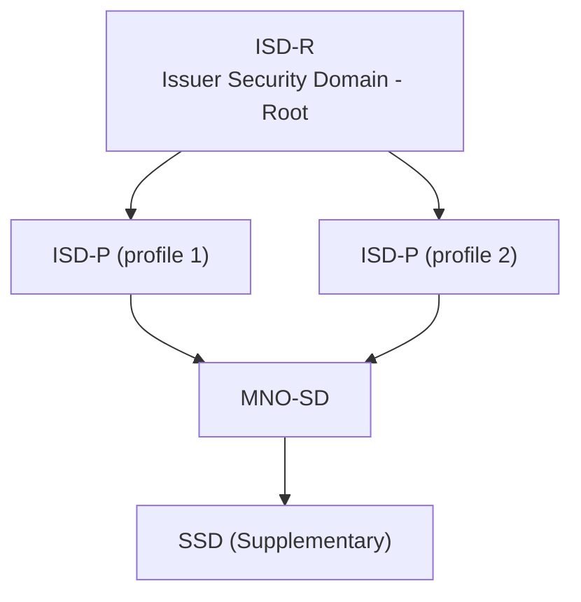
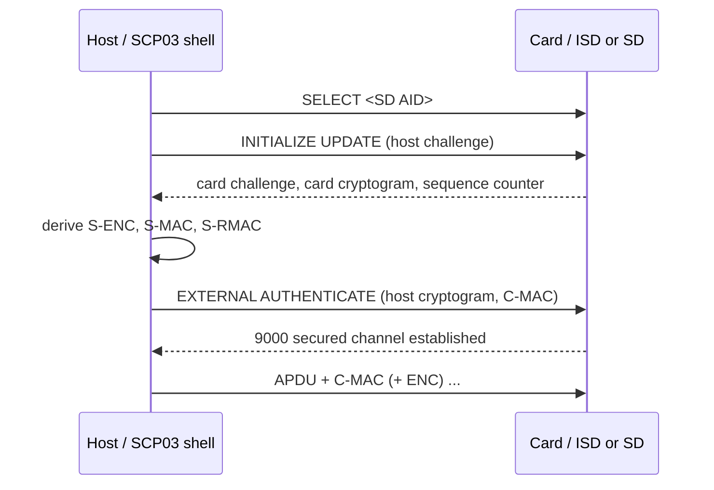

# GlobalPlatform

GlobalPlatform defines how a secure element is partitioned into Security
Domains, how content is loaded and managed, and how secure channels are
established between an off-card administrator and on-card services.
YggdraSIM's admin surface, `SCP03`, is the operator-facing implementation of
this model. `SCP11` provisioning flows rely on GlobalPlatform's trust anchor
and Security Domain primitives.

## Security Domain hierarchy

Each Security Domain (SD) is an on-card authority. It owns a key set, a
lifecycle state, and an access policy. The `ISD-R` on an eUICC is the top
authority for profile lifecycle. The `ISD-P` scopes a single profile. The
`MNO-SD` is the operator-facing management surface inside a profile.

## Secure Channel Protocols

A **Secure Channel Protocol** negotiates a session between a host and a
Security Domain so subsequent APDUs can be authenticated and optionally
encrypted. YggdraSIM uses three of them.

| Protocol | Key shape | Typical use | Operator surface |
| --- | --- | --- | --- |
| SCP02 | symmetric, legacy | older SIM administration flows | fallback path in `SCP03/` |
| SCP03 | symmetric, AES | modern GP administration | primary in `SCP03/` |
| SCP11 | asymmetric, ECKA | eUICC profile provisioning | `SCP11/` family |

### SCP03 in one picture

After `EXTERNAL AUTHENTICATE` returns `9000`, every subsequent command inside
the session is protected by C-MAC, and optionally C-DECRYPTION and R-MAC, for
the duration of the session.

### SCP11 in one paragraph

SCP11 replaces the symmetric mutual authentication with elliptic-curve key
agreement anchored in PKI. The `ISD-R` on an eUICC holds a long-term
ECKA key pair and a CI-rooted certificate chain. The off-card side presents a
certificate chain signed by a recognized Certificate Issuer, the SE
authenticates it, and both sides derive session keys. SCP11 is what every
relay and local eSIM provisioning flow in `SCP11/` establishes before
`LOAD PROFILE` or `AuthenticateServer` exchanges begin.

## Card content lifecycle

GlobalPlatform tracks an explicit lifecycle on every Application and Security
Domain.

- `LOADED` means package bytes have been uploaded but no instance exists yet.
- `INSTALLED` means an instance exists but is not yet selectable.
- `SELECTABLE` means the instance is routable from `SELECT AID`.
- `PERSONALIZED` means the instance has its operational data loaded.
- `LOCKED` means the card OS has blocked selection for policy reasons.

## Registry and on-card enumeration

The **GP registry** holds the identity and state of every SD and every
application on the card. The admin surface exposes it as:

- `GET STATUS` for enumerating Executable Load Files, Applications, and SDs
- `DELETE` for removing a package or an instance
- `INSTALL FOR LOAD`, `INSTALL FOR INSTALL`, and `INSTALL FOR MAKE SELECTABLE`
  for the content-management flows
- `PUT KEY` for key-set rotation under an authenticated SCP session

Inside `SCP03/`, these land under verbs such as `APPS`, `LIST`, `SELECT`,
`PUT-KEY`, and the wizarded install flows.

## Where to look in YggdraSIM

- [SCP03 Admin Shell](../subsystems/scp03.md) for live GP commands and
  registry operations
- [SCP11 Local Access](../subsystems/scp11-local-access.md) for direct
  local SCP11 `ISD-R` sessions
- [Standards Map](../reference/standards-map.md) for the GP
  specification sections mapped to YggdraSIM code paths
