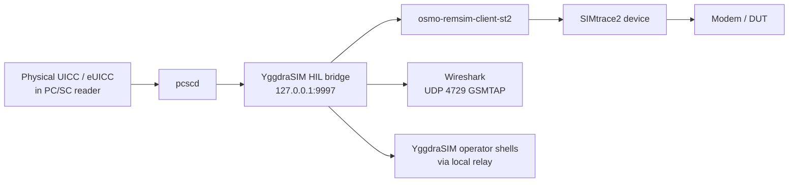
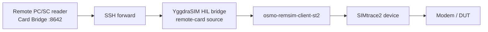
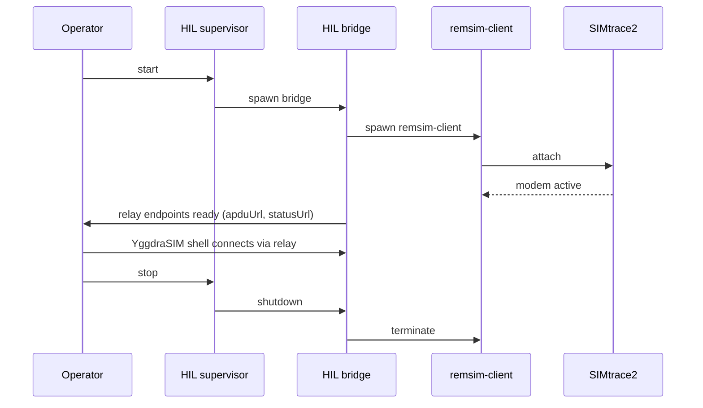

<!--
SPDX-License-Identifier: GPL-3.0-or-later
Copyright (c) 2026 1oT OÜ. Authored by Hampus Hellsberg.
-->

# HIL Model

The HIL (Hardware-In-The-Loop) model is how YggdraSIM exercises a real
UICC/eUICC against a real modem while still letting operator shells see the
card. The physical plumbing is built around sysmocom's SIMtrace2 and the
`osmo-remsim-client-st2` bridge, with a local RSPRO relay on
`127.0.0.1:9997` and GSMTAP mirroring to Wireshark on UDP `4729`.

## Physical topology

The card can be in a reader attached to the rig, or it can be published
from an operator workstation through Card Bridge and an SSH tunnel. The
SIMtrace2 exposes the card to a modem as if it were locally inserted. The
HIL bridge remains the coupler and telemetry source in both modes.

## Responsibility split

| Component | Owns |
| --- | --- |
| `pcscd` | reader arbitration |
| HIL bridge | exclusive PC/SC ownership while active |
| Card Bridge | optional workstation-side PC/SC ownership and `/apdu` publication |
| HIL bridge | GSMTAP mirror of every APDU on UDP 4729 |
| HIL bridge | local APDU relay on 127.0.0.1:9997 |
| supervisor | lifecycle of bridge + remsim-client |
| `osmo-remsim-client-st2` | framing between SIMtrace2 and bridge |
| SIMtrace2 | card-emulation signals to the modem |
| YggdraSIM shells | brokered side-channel access to the same card |

## Access rules

- The HIL bridge keeps **exclusive ownership** of the physical reader while
  active. A second PC/SC client cannot open the same reader at the same time.
- In remote-card mode, Card Bridge owns the reader on the workstation and the
  rig-side HIL bridge consumes its authenticated `/apdu` endpoint over SSH.
- YggdraSIM operator shells reach the card through the bridge's **relay
  side-channel**, not through a second direct PC/SC handle.
- Modem APDUs and YggdraSIM APDUs are **serialized**, not isolated. They
  share a single live session with the card.
- GSMTAP mirroring is passive. Wireshark sees every APDU traveling between
  modem and card, plus the YggdraSIM side-channel traffic.

## Lifecycle

The recommended launch path is the supervisor, not the bridge alone. The
supervisor tracks both processes, cleans up on failure, and keeps the
writable state under `state/hil_bridge_supervisor.json` and
`state/hil_bridge_card_relay.json` up to date.

## Signals to watch

Healthy state looks like:

- `status: running` and `usbPresent: true` in supervisor state
- non-zero `bridgePid`
- `status: ok`, `apduUrl`, `statusUrl`, `cardResetUrl`, selected `reader`,
  and an `atr` in relay state

Any of the following means the stack is not fully armed:

- supervisor `usbPresent: false` means the SIMtrace2 is not enumerated
- relay `status` other than `ok` means the bridge is not serving traffic
- missing `atr` means the card is not currently powered or inserted

## Use cases

- observe a live modem talking to a real eUICC while an SM-DP+ negotiation
  happens in an operator shell
- capture an authenticated SCP03 session end-to-end
- reproduce a field failure with the exact card and exact modem in front of
  you, without losing administrative access to the card
- run a HIL capture that includes both the modem side and the YggdraSIM side
  in one Wireshark trace
- keep a noisy Linux rig near the modem while the operator controls the card
  and GUI from a workstation

## Where to look in YggdraSIM

- [HIL Bridge](../subsystems/hil-bridge.md) for the operator surface
- [Run a HIL Capture](../how-to/run-hil-capture.md) for a recipe-style
  walkthrough
- [Remote APDU Streaming](../how-to/remote-apdu-streaming.md) for the
  Card Bridge over SSH topology
- [Install RemSIM / APDU Streaming](../how-to/install-remsim-apdu-streaming.md)
  for the Linux / Raspberry Pi rig checklist
- `guides/HIL_BRIDGE_GUIDE.md` for the full authored procedure
