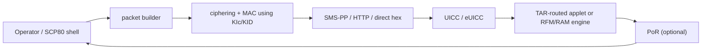

<!--
SPDX-License-Identifier: GPL-3.0-or-later
Copyright (c) 2026 1oT OÜ. Authored by Hampus Hellsberg.
-->


# SCP80 OTA

Secure Channel Protocol 80 is the OTA transport defined by ETSI TS 102 225
and the associated commands in ETSI TS 102 226. It is how remote management
payloads are delivered to a UICC through the SMS-PP bearer, CAT_TP, or an
HTTPS bearer. YggdraSIM's `SCP80/` shell builds, wraps, and decodes SCP80
payloads.

The vendored specs live in:

- `docs/ts_102225v180000p.md`
- `docs/ts_102226v120000p.md`

## What SCP80 protects

SCP80 secures **secured packets** sent over a transport, so that the
receiving card can authenticate the sender, verify integrity, and optionally
decrypt the payload. The transport itself is typically untrusted.

Inside a secured packet, the payload is usually:

- an **RFM** (Remote File Management) command sequence, aimed at UICC EFs
- an **RAM** (Remote Application Management) command sequence, aimed at GP
  administration of applets and packages
- a toolkit command sequence

## Packet shape

A secured packet has a header, a command packet, and optionally a counter
and a cryptographic checksum. The main header fields:

| Field | Purpose |
| --- | --- |
| CPL | command packet length |
| CHL | command header length |
| SPI | Security Parameter Indicator, controls auth / enc / counter mode |
| KIc | key index for ciphering |
| KID | key index for MAC |
| TAR | Toolkit Application Reference, identifies the target applet |
| CNTR | counter value (anti-replay) |
| PCNTR | padding counter |

The response packet uses a similar header and includes a **status word** and
optional response data, with either a checksum, a full cryptographic
signature, or no integrity protection depending on SPI.

## SPI bits at a glance

The SPI has two bytes. The first controls integrity, ciphering, and counter
behavior on the command packet. The second controls status-word behavior and
response packet protection.

| SPI section | Bits | Typical operator concern |
| --- | --- | --- |
| integrity | CC / DS / RC | pick between checksum, full signature, or none |
| ciphering | on / off | whether the payload is encrypted |
| counter | no counter, counter check, counter greater than | replay protection |
| response | requested or not | does the sender expect a PoR |

The SCP80 shell exposes these under structured set commands so the operator
does not have to hand-encode bit layouts.

## Sending and receiving



A minimal send path in the shell is:

```text
[SCP80] > iccid <ICCID>
[SCP80] > set kic_indicator 15
[SCP80] > set kid_indicator 15
[SCP80] > set TAR 000000
[SCP80] > build A0D600...
[SCP80] > send
```

The shell keeps per-ICCID inventory so `KIc`, `KID`, `TAR`, and other state
persist between sessions.

## What RFM and RAM carry

- **RFM** carries ETSI TS 102 222 commands (`CREATE FILE`, `DELETE FILE`,
  `UPDATE BINARY`, `READ RECORD`, and so on). This is what operators use to
  push a roaming list update, a PLMN list change, or EF content edits.
- **RAM** carries GP content-management commands (`INSTALL FOR LOAD`,
  `INSTALL FOR INSTALL`, `LOAD`, `DELETE`, `PUT KEY`). This is what operators
  use to push an applet update or rotate a key set remotely.

SCP80 is the outer envelope. The inner payload shape is whatever the TAR
advertises inside the card.

## Where to look in YggdraSIM

- [SCP80 OTA Shell](../subsystems/scp80.md) for the operator surface
- [SCP03 Admin Shell](../subsystems/scp03.md) for the decoded view of
  what a received RFM/RAM session did to the card filesystem
- [Standards Map](../reference/standards-map.md) for TS 102 225 and
  TS 102 226 cross-reference
