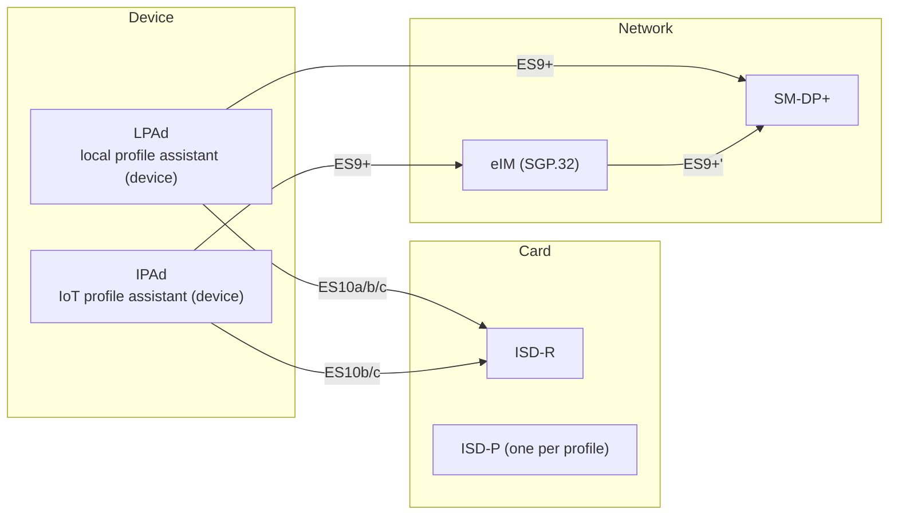
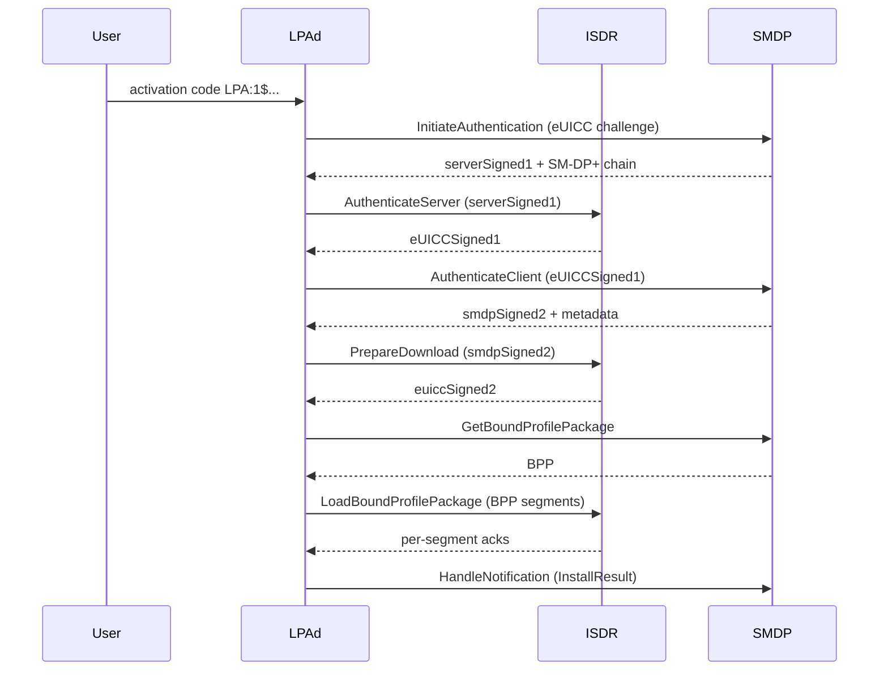
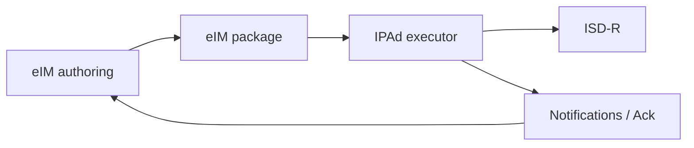

<!--
SPDX-License-Identifier: GPL-3.0-or-later
Copyright (c) 2026 1oT OÜ. Authored by Hampus Hellsberg.
-->

# RSP Architecture

Remote SIM Provisioning is the GSMA family of specifications that governs how
a profile gets prepared, bound, downloaded, installed, enabled, and ultimately
retired on an eUICC. YggdraSIM speaks two of the three families actively:

- SGP.22 for consumer-style RSP (`docs/SGP.22-v3.1.md`)
- SGP.32 for IoT RSP with an eIM in the middle (`docs/SGP.32-v1.2.md`)

SGP.02 (`docs/SGP.02-v4.2.md`) is the classical M2M flavor and is referenced
for context only.

## Actors

- **LPAd** is the consumer-device-side agent in SGP.22. It speaks to the
  user, to the card via ES10, and to SM-DP+ via ES9+.
- **IPAd** is the IoT-device-side agent in SGP.32. It is similar to LPAd but
  assumes no UI and expects a remote orchestrator.
- **eIM** is the SGP.32 orchestrator. It drives an IPAd remotely through a
  bearer such as HTTPS, MQTT, or a vendor channel, and talks to SM-DP+ on the
  IPAd's behalf.
- **SM-DP+** prepares and delivers profiles. It is the source of truth for
  `BPP` generation and for notification acknowledgement.

## ES interfaces relevant to YggdraSIM

| Interface | Between | Purpose |
| --- | --- | --- |
| ES10a | LPAd and ISD-R | eUICC memory reset, EID read |
| ES10b | LPAd/IPAd and ISD-R | AuthenticateServer, PrepareDownload, LoadBoundProfilePackage |
| ES10c | LPAd/IPAd and ISD-R | profile enable, disable, delete, notifications |
| ES9+ | LPAd/IPAd and SM-DP+ | InitiateAuthentication, AuthenticateClient, GetBoundProfilePackage |
| ES9+' | eIM and SM-DP+ | handover flows |

## Consumer download flow

The `BPP` is the ASN.1 structure that carries the profile wrapped in a set of
session keys. The ISD-R unwraps it segment by segment. On completion the
profile is in the `DISABLED` state until an `EnableProfile` is issued.

## IoT (SGP.32) flow

In SGP.32 the IPAd does not initiate. The eIM provisions the IPAd through
**package authoring**, where the eIM produces an `eIM package` carrying a set
of instructions. The IPAd pulls or receives packages and executes them.

- `ADD-INITIAL-EIM` primes an ISD-R with the eIM identity fields in BF55.
- `ADD-EIM` authorizes additional eIMs or rotates entries.
- `LOAD-EIM-PACKAGE` is the card-side consumption step.
- Package exchange lets the IPAd receive work, execute it, and acknowledge
  the result.

## Profile lifecycle states on the eUICC

Each installed profile on the `ISD-R` carries a state.

| State | Meaning |
| --- | --- |
| `DISABLED` | present on card, not active, not visible to the modem |
| `ENABLED` | active profile, visible to the modem as a USIM |
| `DELETED` | reserved for transitional state during a delete |
| `ERASED` | not installed |

`SGP.22` and `SGP.32` both constrain which transitions are legal, which
notifications are emitted, and how the LPA/IPA should acknowledge them.

## Notifications

The eUICC emits notifications for install, enable, disable, and delete. The
LPA/IPA must read them from the card, forward them to SM-DP+ via
`HandleNotification`, and then remove them from the card with
`RemoveNotificationFromList`. YggdraSIM's relay shells automate this around
transactional flows and surface it under `NOTIF-*` verbs when a manual retry
is needed.

## eIM identity and BF55

The BF55 row in `EUICCInfo2` advertises the eIM identity set an eUICC
recognizes. It defines:

- `eimId`
- `eimFqdn`
- `eimIdentificationDomain`
- `eimPublicKeyData`
- `counterValue`

YggdraSIM keeps identity configuration split so the simulator card side and
the Local eIM endpoint side can be tuned independently. See
[SCP11 eIM Local](../subsystems/scp11-eim-local.md).

## Where to look in YggdraSIM

- [SCP11 eSIM Management Relay](../subsystems/scp11-live.md) for
  consumer-style ES9+ flows
- [SCP11 Local Access](../subsystems/scp11-local-access.md) for direct
  ES10b / ES10c without relay
- [SCP11 eIM Local](../subsystems/scp11-eim-local.md) for SGP.32
  orchestration with localized eIM and IPAd flows
- [Standards Map](../reference/standards-map.md) for the specific GSMA
  sections mapped to implementation
