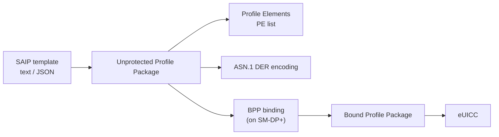

# SAIP Profiles

SAIP is the SIMalliance / TCA Interoperable Profile format. It specifies how a
cellular profile is expressed before it gets bound into a `BPP` and sent to
an eUICC. The authoritative text lives in `docs/Profile_interoperability_V3.4.1.md`
and the technical specification in
`docs/Profile_interoperability_technical_specification_V3.4.1.md`.

YggdraSIM's `Tools/ProfilePackage` workbench is the operator surface that
edits, lints, and transcodes SAIP content.

## Layers

- A **template** is a human-authored profile description.
- A **UPP** is the full profile, as a PE list, ASN.1 encoded in DER.
- A **BPP** is the UPP wrapped in SCP11-derived session keys and segmented so
  the eUICC can consume it.
- The card only ever sees the BPP at install time.

## Profile Element shape

The PE list is an ordered sequence of PE structures. Each PE is one of:

- a header PE with profile-wide metadata
- a file-system PE that creates directories or files
- a PE that installs an applet, a security domain, or an NAA
- a PE that carries the keyset, PINs, or toolkit configuration
- a PE that writes EF records or transparent content
- a PE that sets access conditions

The PE order matters. File-system PEs create structure, content PEs fill it,
and key/auth PEs anchor the operational state. The SAIP spec lists the valid
ordering constraints.

## JSON and DER forms

YggdraSIM works with both forms of a profile.

- the **DER** form is the binary that an SM-DP+ emits and a card consumes
- the **JSON** form is an easier review surface and is round-trip safe for the
  supported PE set

The shell's `ENCODE-JSON` path rebuilds a valid DER from a tagged JSON
representation. The transcode TUI shows the two sides next to each other so
edits can be reviewed before re-encoding.

## Linting

Profile linting in YggdraSIM checks:

- PE ordering rules
- required PE presence, for example a header PE and at least one NAA
- key and PIN consistency
- access-condition sanity
- EF content width and structure against the file FCP
- metadata sanity, for example `profileName` and `serviceProviderName`

Lint modes include strict mode, metadata attachment, preset gate profiles,
and explicit rule gates. Output is YAML by default and JSON when requested.

## Sidecars

The transcode UI persists a stable set of sidecar files next to the profile
under review:

| Sidecar | Contents |
| --- | --- |
| `*.transcode.json` | canonical JSON view of the profile |
| `*.transcode.der` | canonical DER re-encoding |
| `*.transcode.txt` | human-readable inspector text |

These sidecars are used by the download flows to validate what will actually
land on the card.

## Standards map

| Area | Spec |
| --- | --- |
| SAIP template and PE catalog | `docs/Profile_interoperability_V3.4.1.md` |
| SAIP technical specification | `docs/Profile_interoperability_technical_specification_V3.4.1.md` |
| BPP construction and binding | SGP.22 annexes, optional local `docs/SGP.22-v3.1.md` |

## Where to look in YggdraSIM

- [Profile Package](../subsystems/profile-package.md) for the operator
  surface
- [Inspect and Transcode SAIP](../how-to/inspect-and-transcode-saip.md)
  for a recipe-style walkthrough
- [SCP11 Live Relay](../subsystems/scp11-live.md) and
  [Local Access](../subsystems/scp11-local-access.md) for where the
  resulting BPP is consumed
