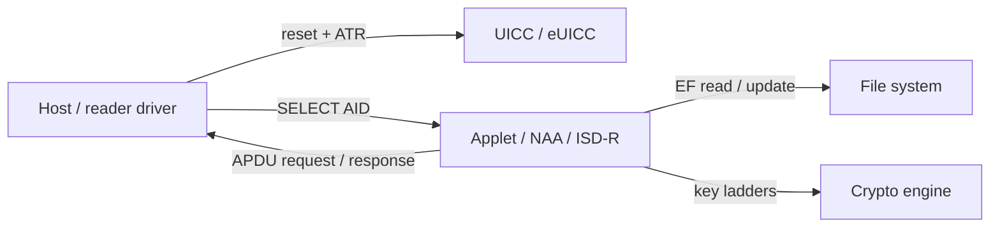

# Secure Element Primer

A secure element is a tamper-resistant, cryptographically-capable
microcontroller. In the telecom domain, the most common form is the UICC in a
SIM socket, the eUICC soldered to a board, or the embedded secure element
adjacent to a modem or baseband. Every card-facing module in YggdraSIM
communicates with one of these via standardized transport and command layers.

## What an SE does

- holds persistent keys without exposing them to the host
- runs applet code inside its own isolated runtime
- performs cryptographic operations on behalf of an outside requester
- enforces access policy through `PIN`, `PUK`, key ladders, and lifecycle state
- stores identity material under a directory and file model

## Anatomy of a card session

1. A physical or logical reset returns an **ATR** that advertises protocol
   parameters such as `T=0` or `T=1`, baud-rate convention, and historical
   bytes.
2. The host issues a `SELECT` against an **AID** to activate either an applet,
   a directory, or the `ISD-R` root.
3. Subsequent **APDU** command and response pairs carry either filesystem
   operations, toolkit operations, or secure-channel operations.
4. Persistent state is kept in the SE's own file system, under access rules
   that the SE enforces before it answers.

## APDU command shape

An APDU command is always five bytes of header plus optional data. A response
is zero or more bytes plus two status bytes. YggdraSIM uses the standard
terminology from ISO/IEC 7816-4 when shells print an APDU trace.

| Field | Width | Meaning |
| --- | --- | --- |
| CLA | 1 byte | command class |
| INS | 1 byte | instruction |
| P1 | 1 byte | first parameter |
| P2 | 1 byte | second parameter |
| Lc | 0, 1, or 3 bytes | length of command data |
| Data | Lc bytes | command payload |
| Le | 0, 1, or 3 bytes | expected response length |
| SW1 SW2 | 2 bytes | final status word |

The response body, when present, is returned before `SW1 SW2`. `9000` is
success. `61xx` indicates that `xx` bytes are available for `GET RESPONSE`.
`6Cxx` advertises the required `Le`. `62xx`, `63xx`, `6Axx`, and `6Dxx` each
carry domain-specific meaning.

## Transport protocols

YggdraSIM and the host PC/SC layer hide most of the transport detail, but the
layer still matters when comparing traces across shells and captures.

- `T=0` is byte-oriented, asynchronous, and most common on legacy SIM work.
- `T=1` is block-oriented and more forgiving for large exchanges.
- Extended-length APDU support depends on the card's ATR advertisement.
- Case 1-4 refers to whether an APDU has command data, expected response data,
  both, or neither.

## Card lifecycle and ownership

Each card keeps an **Operating System** that enforces state. Typical states:

- `OP_READY` or `INITIALIZED` for freshly provisioned material
- `SECURED` for operational cards under a live key set
- `CARD_LOCKED` when a policy lockout applies
- `TERMINATED` when the card has been permanently decommissioned

GlobalPlatform maintains explicit lifecycle states for each Security Domain
and each application. See [GlobalPlatform](globalplatform.md).

## Where to look in YggdraSIM

- [SCP03 Admin Shell](../subsystems/scp03.md) when the task is direct card
  administration, `SELECT`, `READ`, `UPDATE`, or retrieval
- [SCP11 Local Access](../subsystems/scp11-local-access.md) when the task
  is an `ISD-R` local session
- [HIL Bridge](../subsystems/hil-bridge.md) when a live card and a live
  modem must share the same SE
- [SIMCARD Simulator](../subsystems/simcard-simulator.md) when the card
  side is simulated and the transport still looks like an APDU exchange
