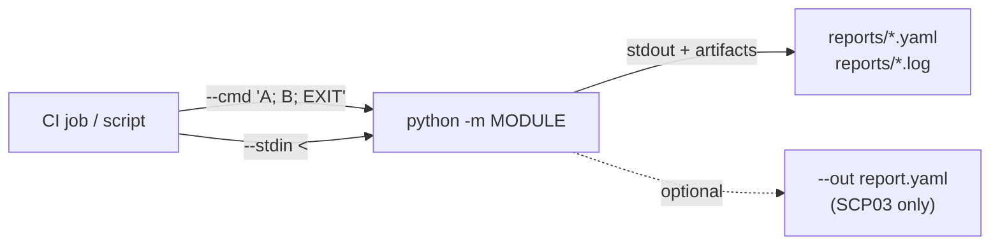

# CLI And Piping Cheatsheet

Non-interactive invocation patterns for CI/CD, automation runners, and
scripted local operation. Use this alongside the full
[Command Suite](command-suite.md) and the [CLI Matrix](cli-matrix.md).

## Assumptions

Every `python -m …` example assumes one of the following:

- you are running the command from the repository root, or
- you already ran `python -m pip install -e /path/to/YggdraSIM` in the same
  Python environment.

After an editable install you can also use the installed console scripts:

- `yggdrasim-scp03`
- `yggdrasim-scp80`
- `yggdrasim-scp11-live`
- `yggdrasim-scp11-test`
- `yggdrasim-scp11-relay`
- `yggdrasim-scp11-local-access`
- `yggdrasim-scp11-eim-local`
- `yggdrasim-profile-package`
- `yggdrasim-profile-autoload`
- `yggdrasim-apdu-fuzzer`
- `yggdrasim-eum-diag`
- `yggdrasim-suci-tool`
- `yggdrasim-hil-bridge`
- `yggdrasim-hil-supervisor`

## Flow at a glance



## Scope

| Module | Interactive shell | `--cmd` | `--stdin` | Notes |
| --- | --- | --- | --- | --- |
| `python -m SCP03` | Yes | Yes | Yes | Supports `--out` YAML export with `--cmd` or `--stdin`. |
| `python -m SCP80` | Yes | Yes | Yes | Uses the same OTA shell commands as the interactive prompt. |
| `python -m SCP11.relay` | Yes | Yes | Yes | Relay shell using the default relay certificate set. |
| `python -m SCP11.live` | Yes | Yes | Yes | Relay shell using live certificate defaults. |
| `python -m SCP11.test` | Yes | Yes | Yes | Relay shell using test certificate defaults. |
| `python -m SCP11.local_access` | Yes | Yes | Yes | Local SMDPP shell against ISD-R. |
| `python -m SCP11.eim_local` | Yes | Yes | Yes | Local eIM shell and localized flows. |
| `python -m Tools.ProfilePackage` | Yes | Yes | Yes | SAIP / profile package shell. |
| `python -m Tools.SuciTool` | Yes | Yes | Yes | SUCI key tool shell. |
| `yggdrasim-hil-bridge` | Daemon | n/a | n/a | Runs a TCP bridge; use supervisor for long-lived setups. |
| `yggdrasim-hil-supervisor` | Daemon | n/a | n/a | Long-running orchestrator for the HIL bridge. |

## Wrapper simulator flags

`python main/main.py` is not itself a `--cmd` shell, but it accepts
launch-time simulator override flags that affect every card-facing module
launched through the wrapper menu.

Useful wrapper flags:

- `--card-backend sim`
- `--sim-isdr-config /path/to/isdr_config.json`
- `--sim-quirks /path/to/sim_quirks.py`
- `--sim-eim-identity /path/to/card_side_eim_identity.json`
- `--sim-euicc-store /path/to/euicc_root`
- `--sim-profile-store /path/to/profile_store`
- `--sim-import-profile /path/to/profile.der`
- `--sim-import-enable`
- `--debug`

Example:

```bash
python main/main.py --card-backend sim \
    --sim-eim-identity /path/to/card_side_eim_identity.json
```

Practical note:

- `--sim-eim-identity` controls the simulated card's default BF55 eIM identity.
- `Workspace/LocalEIM/eim_identity.json` remains the Local eIM **shell**
  identity file and is configured separately.

## Batch conventions

- `--cmd` expects a semicolon-separated command list.
- `--stdin` expects newline-separated commands from standard input.
- Blank stdin lines are ignored.
- Stdin lines that start with `#` are ignored as comments.
- Use `EXIT` to terminate the current shell cleanly in batch mode.
- Avoid `QA` in CI/CD unless the calling wrapper explicitly expects a
  full-suite quit (it exits YggdraSIM entirely).
- Commands run in the same order as provided.

Practical shortcut:

- if the task is profile lifecycle work rather than generic shell
  automation, start from the how-to pair
  [Download a profile via Live](../how-to/download-a-profile-live.md) and
  [Enable / Disable / Delete a profile](../how-to/enable-disable-delete-profile.md).

## Semicolon mode

Use `--cmd` when the command list is naturally constructed as one string:

```bash
python -m SCP03 --cmd "SCP03-SD; LIST; GET-IOT"
```

```bash
python -m SCP11.local_access --cmd "DISCOVER; STATUS; EXIT"
```

```bash
python -m SCP11.eim_local --cmd "DISCOVER; HOTFOLDER-LIST --json; EXIT"
```

```bash
python -m Tools.ProfilePackage --cmd "USE reference_test_profile.txt; INFO; EXIT"
```

## Stdin mode

Use `--stdin` when the command sequence is easier to store as a file or
here-doc:

```bash
python -m SCP11.live --stdin <<'EOF'
DISCOVER
STATUS
EXIT
EOF
```

```bash
cat ci/scp11_local_access.txt | python -m SCP11.local_access --stdin
```

```bash
python -m Tools.SuciTool --stdin <<'EOF'
USE keys/demo_suci.key
DUMP
EXIT
EOF
```

## Profile lifecycle fast paths

Relay snapshot:

```bash
python -m SCP11.live --cmd "DISCOVER; STATUS; LIST; EXIT"
```

Relay `LPAd` download:

```bash
python -m SCP11.live --cmd "DOWNLOAD-PROFILE LPA:1\$SMDP.EXAMPLE\$TOKEN; STATUS; EXIT"
```

Local direct load:

```bash
python -m SCP11.local_access --stdin <<'EOF'
PROFILE Workspace/LocalSMDPP/profile/test_profile.txt
METADATA Workspace/LocalSMDPP/profile/metadata/default_profile_metadata.json
LOAD-PROFILE
EXIT
EOF
```

Local eIM queue run:

```bash
python -m SCP11.eim_local --cmd \
  "HOTFOLDER-LIST --json; POLL-CAMPAIGN --until-empty --max-cycles 20 --json; EXIT"
```

IPAe watchdog (plugin-injected):

```bash
python -m SCP11.live --cmd "DISCOVER; POLL 3 -t 20s -s 5; EXIT"
```

## Module examples

### SCP03

Command batch:

```bash
python -m SCP03 --cmd "SCP03-SD; LIST; GET-IOT"
```

Command batch with YAML export (unique to SCP03):

```bash
python -m SCP03 --cmd "SCP03-SD; LIST" --out reports/scp03_list.yaml
```

Piped commands with structured output:

```bash
python -m SCP03 --stdin --out reports/scp03_batch.yaml <<'EOF'
SCP03-SD
LIST
GET-IOT
EOF
```

### SCP80

Use the OTA shell without entering the interactive prompt:

```bash
python -m SCP80 --cmd "show; build; quit"
```

```bash
python -m SCP80 --stdin <<'EOF'
iccid 8946001234567890123
build
quit
EOF
```

### SCP11 relay shells

Relay default:

```bash
python -m SCP11.relay --cmd "DISCOVER; STATUS; EXIT"
```

Live certificate defaults:

```bash
python -m SCP11.live --cmd "DISCOVER; STATUS; EXIT"
```

Test certificate defaults:

```bash
python -m SCP11.test --stdin <<'EOF'
DISCOVER
LIST
STATUS
EXIT
EOF
```

One-shot relay flow remains available:

```bash
python -m SCP11.live --flow
```

### SCP11 Local SMDPP

```bash
python -m SCP11.local_access --cmd "DISCOVER; CERTS --json; EXIT"
```

```bash
python -m SCP11.local_access --stdin <<'EOF'
PROFILE test_profile.txt
METADATA default_profile_metadata.json
LOAD-PROFILE
EXIT
EOF
```

### SCP11 Local eIM

```bash
python -m SCP11.eim_local --cmd "DISCOVER; PATHS; STATUS; EXIT"
```

```bash
python -m SCP11.eim_local --stdin <<'EOF'
HOTFOLDER-LIST --json
POLL-CAMPAIGN --until-empty --max-cycles 20 --json
EXIT
EOF
```

### SAIP Tool

```bash
python -m Tools.ProfilePackage --cmd "USE reference_test_profile.txt; INFO; TREE; EXIT"
```

```bash
python -m Tools.ProfilePackage --stdin <<'EOF'
USE reference_test_profile.txt
LINT
EXIT
EOF
```

Interactive note:

- `INSPECT` / `TUI` / `TRANSCODE-TUI` remain interactive (split-pane Textual
  UI), but the same profile selection and path resolution rules apply
  before entering the UI.
- The transcode workspace writes `*.transcode.json`, `*.transcode.der`, and
  `*.transcode.txt` sidecars for saved edits.

### SUCI Tool

```bash
python -m Tools.SuciTool --cmd "USE keys/demo_suci.key; DUMP; EXIT"
```

```bash
python -m Tools.SuciTool --stdin <<'EOF'
USE keys/demo_suci.key
GENERATE SECP256R1
DUMP
EXIT
EOF
```

### HIL Bridge daemons

Both `yggdrasim-hil-bridge` and `yggdrasim-hil-supervisor` are
`argparse`-only daemons — no `--cmd` / `--stdin`. Drive them through
systemd or the launcher's `[B]` HIL Bridge Session menu instead:

```bash
yggdrasim-hil-bridge \
    --host 127.0.0.1 --port 9997 \
    --reader-name "SIMtrace 2" \
    --gsmtap-capture-path /tmp/ygg-gsmtap.pcap
```

```bash
yggdrasim-hil-supervisor \
    --usb-match SIMtrace2 \
    --state-file /var/lib/yggdrasim/hil_bridge_supervisor.json
```

See [HIL Bridge subsystem](../subsystems/hil-bridge.md) for systemd unit
templates and the interactive `[B]` flow.

### HIL Bridge offline pcap replay

The wrapper exposes direct flags so CI or ad-hoc operators can re-open
a saved capture in the decoded-APDU TUI without bringing the bridge
stack up:

```bash
python main/main.py --open-pcap captures/session-example.pcapng
python main/main.py \
    --open-pcap captures/session-example.pcapng \
    --keybag    captures/session-2026-04-20.keys.json
```

Sidecar keybag files named `<pcap>.keys.json` or `<stem>.keys.json`
next to the capture are auto-discovered when `--keybag` is omitted.

See [Replay a HIL pcap offline](../how-to/replay-hil-pcap-offline.md)
for the full flow.

### Session keybag export

Keybag JSONs feed the HIL offline decoder. They can be produced by
the same shells that built the secure channel:

```bash
python -m SCP03 --cmd \
    "SCP03-SD; EXPORT-KEYBAG captures/session-2026-04-20.keys.json case-1234; EXIT"
```

```bash
python -m SCP11.local_access --cmd "LOAD-PROFILE" \
    --dump-keybag captures/session-2026-04-20.keys.json
```

```bash
python -m SCP11.local_access --stdin --dump-keybag captures/session.keys.json <<'EOF'
PROFILE Workspace/LocalSMDPP/profile/test_profile.txt
METADATA Workspace/LocalSMDPP/profile/metadata/default_profile_metadata.json
LOAD-PROFILE
EXIT
EOF
```

`python -m SCP11.live --dump-keybag …` is an intentional **no-op
stub** — live-mode SCP11c BSP keys are derived inside the eUICC and
never reach the host. Use `SCP11.local_access` or SCP03 for real
exports.

## Interactive recording

The local SCP11 shells can capture a replayable command transcript plus
the underlying APDU trace. YAML is the default artifact format; use a
`.json` suffix when you want machine-oriented JSON instead.

```bash
python -m SCP11.local_access
RECORD START reports/local_smdpp_session.yaml
DISCOVER
LOAD-PROFILE
RECORD STOP
```

```bash
python -m SCP11.eim_local
RECORD START reports/eim_local_session.yaml
DISCOVER
ADD-EIM package
RECORD STOP
```

## Output handling

- Redirect stdout when the command output is the artifact:

```bash
python -m SCP11.test --cmd "DISCOVER; EXIT" > reports/scp11_test_discover.txt
```

- Capture stdout and keep it visible with `tee`:

```bash
python -m SCP11.local_access --cmd "DISCOVER; EXIT" | tee reports/local_smdpp_discover.log
```

- For SCP03 structured exports, prefer the native `--out` option.

## CI/CD recommendations

- Use direct module entry points in pipelines instead of the top-level
  menu wrapper.
- Keep command files in source control and feed them through `--stdin`
  for repeatable jobs.
- Split hardware-backed jobs from offline jobs.
- Use `EXIT` as the last batch command so the shell terminates
  deterministically.
- Store generated reports outside the source tree or under dedicated
  report folders.

## Minimal pipeline pattern

```bash
set -euo pipefail

python -m SCP03 --stdin --out reports/scp03.yaml <<'EOF'
SCP03-SD
LIST
GET-IOT
EOF

python -m Tools.ProfilePackage --cmd "USE reference_test_profile.txt; LINT; EXIT"
python -m Tools.SuciTool --cmd "USE keys/demo_suci.key; DUMP; EXIT"
```

## Notes

- Hardware-backed commands still require the correct reader, card,
  certificates, and runtime files.
- `--stdin` only strips blank lines and full-line `#` comments. Inline
  comments are not removed.
- Existing interactive flows remain unchanged. The automation paths call
  the same shell handlers used by the prompts, so any new command added to
  a shell is immediately available via `--cmd` / `--stdin`.
