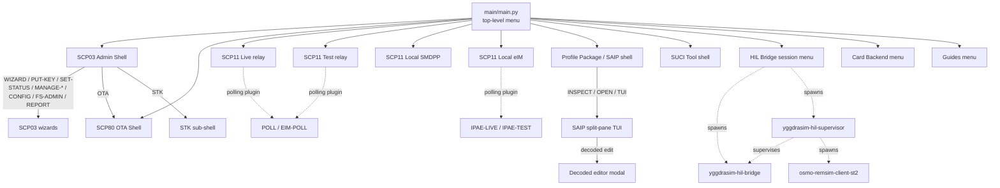

# Command Suite

A meticulous, source-verified inventory of **every command reachable from
every YggdraSIM shell, launcher, daemon, and plugin**, including the wizards
they branch into. Use this page to answer:

- "Does this command exist?"
- "Under which shell and help section?"
- "What sub-steps does the wizard walk through?"
- "Which aliases resolve to the canonical name?"
- "Which flags does the command accept?"

For **one-liners / piping / non-interactive invocations** see the
[CLI and Piping Cheatsheet](cli-and-piping-cheatsheet.md). For the
matrix of console scripts and `python -m` invocations see the
[CLI Matrix](cli-matrix.md).

## How to read this page

- Top-level entries are typed at a shell prompt (or menu pick).
- `<required>` / `[optional]` mirror the usage strings registered in source.
- "→ wizard" means the command enters a tag-granular interactive wizard
  whose sub-prompts are listed directly beneath it.
- Aliases resolve to the canonical handler and are listed explicitly.
- Commands marked *(expert)* only appear with `HELP EXPERT` / `HELP-ALL`
  (SCP11 Live / Test only).
- Commands marked *(not in HELP)* are registered but omitted from the
  default help screen; they still dispatch at the prompt.
- Commands marked *(hidden)* are dispatchable but removed from
  tab-completion.

## Navigation cheat sheet



---

## 1. `main/main.py` -- Top-level Menu Launcher

Invoke with `python main/main.py` or any wrapper console script
(`yggdrasim-scp03`, `yggdrasim-scp11`, etc., which delegate to the
launcher's helpers). The launcher is menu-driven, not a command-line
shell; numeric or letter picks open another surface. All pre-shell
options are consumed by `argparse` before the menu is drawn.

### 1.1 Launch-time CLI flags

| Flag | Values / type | Default | Purpose |
| --- | --- | --- | --- |
| `--version` | flag | off | Print `YggdraSIM <version>` sourced from `yggdrasim_common.__about__.get_version()` (which reads `pyproject.toml` / installed distribution metadata) and exit `0`. |
| `--doctor` | flag | off | Run a read-only preflight (`yggdrasim_common.doctor.run_doctor`) covering Python ≥3.10, `cryptography`, `pycryptodomex`, `asn1tools`, the optional on-disk `pysim/` tree, SQLite, optional `textual`, PC/SC readers, and the `gpg` binary. Exit `0` when every probe is `ok`/`info`, `1` when any is `warn`/`fail`. |
| `--scp03` | flag | off | Target the SCP03 shell non-interactively (pair with `--cmd`). |
| `--cmd "<semicolon list>"` | string | -- | Batch commands for the `--scp03` pipeline. |
| `--out <path>` | path | -- | YAML output for `--cmd` (forwarded to `run_scp03_cmd`). |
| `--card-backend` | `reader` \| `sim` | persisted | Physical PC/SC reader vs simulated eUICC; re-persists when reused. |
| `--sim-isdr-config` | JSON path | -- | Seed simulated ISD-R/eUICC personality. |
| `--sim-quirks` | Python path | -- | Quirks override for the simulated SIM. |
| `--sim-eim-identity` | JSON path | -- | Simulated BF55 eIM identity. |
| `--sim-euicc-store` | directory | -- | Persistent EID-scoped eUICC state root. |
| `--sim-profile-store` | directory | -- | Persisted simulated-profile artifacts directory. |
| `--sim-import-profile` | path | -- | Import DER / BIN / hex-text / tagged SAIP JSON / `profile_image.json` before launch. |
| `--sim-import-enable` | flag | off | Enable the imported simulated profile immediately. |
| `--open-pcap <path>` | path | -- | Open a saved `.pcap` / `.pcapng` directly in the HIL decoded-APDU TUI in offline review mode. No SIMtrace2, no supervisor, no FIFO, no systemd service touch. Short-circuits the main menu. |
| `--keybag <path>` | path | -- | Optional keybag JSON with SCP03 / SCP11c session keys. Used with `--open-pcap` to decrypt secure-messaging APDUs inline. If omitted, `<pcap>.keys.json` / `<stem>.keys.json` sidecars are auto-discovered. |
| `--gui` | flag | off | Launch the desktop Universal GUI Command Center (requires the `[gui]` extra; `pywebview`-backed). Short-circuits the menu. |
| `--web-server` | flag | off | Launch the Universal GUI as a FastAPI loopback service (requires the `[gui-server]` extra). Short-circuits the menu. |
| `--host <addr>` | str | `127.0.0.1` | Bind address for `--web-server`. |
| `--port <n>` | int | `8765` | Bind port for `--web-server`. |
| `--token-file <path>` | path | -- | Persisted bearer-token file for the web server. |
| `--tls-cert <path>` / `--tls-key <path>` | path | -- | Optional TLS material for the web server. |
| `--tls-self-signed` | flag | off | Generate an in-memory self-signed certificate for the web server. |
| `--debug` / `--verbose` | flag | off | Promote global debug to every sub-module (`YGGDRASIM_GLOBAL_DEBUG=1`). |

### 1.2 Top-level numeric / letter menu

| Pick | Label | Opens |
| --- | --- | --- |
| `1` | Admin Shell -- Local Management | SCP03 Admin Shell |
| `2` | OTA Simulator -- Remote Management | SCP80 OTA Shell |
| `3A` | eSIM Management Relay (Live Certificates) | SCP11 Live console |
| `3B` | eSIM Management Relay (Test Certificates) | SCP11 Test console |
| `3C` | Local SMDPP | SCP11 Local Access shell |
| `3D` | Local eIM | SCP11 Local eIM shell |
| `7` | SAIP Tool | Profile Package / SAIP shell |
| `8` | SUCI Key Tool | SUCI Tool shell |
| `9A` | Admin Shell -- Script Execution | SCP03 batch-script mode (prompts for path) |
| `9B` | Admin Shell -- Report & DUMP-FS | SCP03 report-wizard pipeline |
| `9C` | OTA Simulator -- Script Execution | SCP80 batch-script mode |
| `C` | Card Backend / Simulator Settings | Nested backend/sim picker (§1.5) |
| `B` | HIL Bridge Session | Nested HIL session controller (§1.4) |
| `G` | Guides & Documentation | Nested in-terminal guide menu (§1.6) |
| `A` | About | Read-only splash |
| `L` | License (GPLv3) | License text |
| `Q` / `QA` | Quit | Exit YggdraSIM |

### 1.3 Legacy numeric aliases

Accepted by `_dispatch_main_menu_choice`:

| Legacy input | Rewritten to |
| --- | --- |
| `3` | `3A` |
| `4` | `3B` |
| `5` | `3C` |
| `6` | `3D` |
| `9` | `9A` |
| `10` | `9B` |
| `11` | `9C` |

### 1.4 `[B]` HIL Bridge sub-menu

Managed from `main/main.py::manage_hil_bridge`. Renders live status
(service state, supervisor state, bridge/REMSIM presence, card-relay
URL, ATR) each iteration.

| Pick | Action |
| --- | --- |
| `1` | Start HIL session -- prompts for a view mode: `[1]` Raw APDU only, `[2]` Raw APDU + Wireshark, `[3]` Decoded APDU in terminal (Textual TUI), `[Q]` Back. Starts `yggdrasim-hil-supervisor.service` (user unit). |
| `2` | Stop HIL session -- stops the user unit. |
| `3` | Open saved `.pcap` (offline review, no bridge) -- prompts for a capture path (native picker with manual fallback) and an optional keybag JSON path. Auto-discovers `<pcap>.keys.json` / `<stem>.keys.json` sidecars when the keybag prompt is left blank. Runs `Tools.HilBridge.live_decode_tui.run_live_decode_tui` with `live_capture=False`; no supervisor, no FIFO, no `tshark -i`, no systemd touch. Same code path as `main/main.py --open-pcap <path> [--keybag <path>]`. |
| `R` | Refresh status header. |
| `Q` / *(empty)* | Return to main menu. |

Sub-tooling spawned from `[B]`:

- **Wireshark live capture** -- `wireshark -k -i <iface> -f "udp port 4729"`. `iface` defaults to `lo`/`lo0`; override via `YGGDRASIM_HIL_CAPTURE_INTERFACE`. Binary override via `YGGDRASIM_HIL_WIRESHARK_BIN`.
- **Decoded-APDU Textual TUI** -- `Tools.HilBridge.live_decode_tui.run_live_decode_tui` driving either the live pcap with `tshark -i` (live mode) or a saved pcap with `tshark -r` (offline review mode). Override via `YGGDRASIM_HIL_TERMSHARK_BIN`, warmup via `YGGDRASIM_HIL_TERMSHARK_WARMUP_SECONDS`. In offline mode, a keybag JSON can be layered in via the `[3]` prompt or `--keybag`.
- **Raw APDU stream view** -- tails `journalctl --user -u yggdrasim-hil-supervisor.service -f -n 0 -o cat`, filtered to APDU-flavored lines.
- **Pcap writers** -- `Tools/HilBridge/termshark_capture_pcap.py` (preferred) or `tshark`/`dumpcap`. Mirror fan-out via `termshark_capture_mirror.py` when `--gsmtap-capture-mirror-fifo-path` is set.
- **Offline replay engine** -- `Tools.HilBridge.scp_replay.ScpReplayEngine` unwraps secure-messaging APDUs (CLA bit `0x04`) for SCP03 / SCP11c when a keybag JSON is loaded via `load_keybag()` / `try_autodiscover_sidecar_keybag()`. Keybags are produced by `EXPORT-KEYBAG` in SCP03 / SCP11 Local Access or by `python -m SCP11.local_access --dump-keybag`.

### 1.5 `[C]` Card Backend sub-menu

`configure_card_backend()` re-prints the live backend (`reader` / `sim`)
plus paths for ISDR config, quirks, eIM identity, eUICC store, and
profile store on every iteration.

| Pick | Action |
| --- | --- |
| `1` | Use physical PC/SC reader. |
| `2` | Use simulated SIM. |
| `3` | Set / clear ISDR config path (blank keeps, `NONE` clears). |
| `4` | Set / clear quirks file path. |
| `E` | Set / clear eIM identity path. |
| `5` | Set / clear eUICC store root. |
| `6` | Set / clear profile store override. |
| `7` | Import simulator profile artifact (prompts for path + `[Y/n]` enable). |
| `8` | Reset simulator overrides to workspace defaults. |
| `9` | Reset simulator state + workspace personality (destructive, requires `Y`/`YES`). |
| `Q` / *(empty)* | Back to main menu. |

### 1.6 `[G]` Guides sub-menu

Every pick paginates via `_show_text_document` (20 lines/page). Topic
picks delegate to `SCP03.interface.guides.ShellGuides`.

| Pick | Target |
| --- | --- |
| `1` | Admin Shell guide topics (`ShellGuides.print_guide("WIZARD")`) |
| `2` | OTA Simulator guide (`ShellGuides._print_ota_guide`) |
| `3` | eSIM Relay Live -- `SCP11/live/README.md` |
| `4` | eSIM Relay Test -- `SCP11/test/README.md` |
| `5` | Local SMDPP -- `SCP11/local_access/README.md` |
| `5C` | Local SMDPP certificate override -- `SCP11/local_access/certs/README.md` |
| `6` | Local eIM overview -- `SCP11/eim_local/README.md` |
| `6D` | Local eIM detailed guide -- `SCP11/eim_local/GUIDE.md` |
| `6T` | Local eIM package templates -- `SCP11/eim_local/eim_packages/templates/README.md` |
| `7` | SAIP Tool guide (`ShellGuides._print_saip_guide`) |
| `8` | SUCI Tool guide (`ShellGuides._print_suci_guide`) |
| `R` | Root `README.md` |
| `H` | Architecture -- `guides/ARCHITECTURE.md` |
| `N` | `NOTICE` |
| `Q` | Back to main menu |

### 1.7 Console-script entry points

Defined in `pyproject.toml`/`yggdrasim_common/console_scripts.py`:

| Script | Dispatches to |
| --- | --- |
| `yggdrasim-scp03` | `SCP03.main.run_standalone` |
| `yggdrasim-scp80` | `SCP80.main.run_standalone` |
| `yggdrasim-scp11` | `SCP11.main.entry` → `SCP11.live.main.entry` |
| `yggdrasim-scp11-live` | `SCP11.live.main.entry` |
| `yggdrasim-scp11-test` | `SCP11.test.main.entry` |
| `yggdrasim-scp11-relay` | `SCP11.relay.main.entry` |
| `yggdrasim-scp11-local-access` | `SCP11.local_access.main.entry` |
| `yggdrasim-scp11-eim-local` | `SCP11.eim_local.main.entry` |
| `yggdrasim-hil-bridge` | `Tools.HilBridge.main.entry` |
| `yggdrasim-hil-supervisor` | `Tools.HilBridge.supervisor.entry` |
| `yggdrasim-profile-package` | `Tools.ProfilePackage.main.run_standalone` |
| `yggdrasim-profile-autoload` | `Tools.ProfilePackage.simcard_watch.run_cli` |
| `yggdrasim-apdu-fuzzer` | `Tools.ApduFuzz.main.run_cli` |
| `yggdrasim-eum-diag` | `Tools.EumDiag.main.run_cli` |
| `yggdrasim-suci-tool` | `Tools.SuciTool.main.run_standalone` |

---

## 2. SCP03 -- GlobalPlatform Admin Shell

`python -m SCP03` / `yggdrasim-scp03`. Command dispatcher:
`SCP03.interface.commands.CommandRegistry`. Entry points:
`SCP03.main::entry`, `entry_cmd`, `entry_stdin`, `run_standalone`,
`run_script`, `run_report_wizard`.

### 2.1 Launcher flags

| Flag | Type | Purpose |
| --- | --- | --- |
| `--cmd "<c1; c2; ...>"` | string | Semicolon-separated non-interactive batch (`entry_cmd`). |
| `--stdin` | flag | Read newline-separated commands from stdin (`entry_stdin`). |
| `--out <path>` | path | YAML transcript paired with `--cmd` / `--stdin`. |
| `--debug` / `--verbose` | flag | Promote APDU hex logging (`dispatcher.debug_mode` + transport debug). |

No `--scp03-keys`, `--aid`, `--reader` or similar flags -- *(not in source)*.

### 2.2 Session & card info

| Command | Args | Aliases | Purpose |
| --- | --- | --- | --- |
| `SCP03-SD` | -- | `AUTH-SD` | Authenticate ISD with SCP03. |
| `AUTH-SD` | -- | `SCP03-SD` | Legacy alias. |
| `SCP02-SD` | -- | -- | Authenticate ISD with SCP02. |
| `RESET` | -- | -- | Reset card; re-read ATR; auto-restore session if one was active. |
| `INFO` | -- | -- | ATR, ICCID, EID, SGP version summary. |
| `ATR` | -- | -- | Parsed ATR breakdown after reset. |
| `KEYS` | `[AID]` | -- | Retrieve key information for current / given AID. |
| `LOGOUT` | -- | -- | Close the secure session. |
| `CLS` | -- | -- | Clear terminal screen. |
| `OTA` | -- | -- | Switch to the SCP80 OTA shell (in-process; reader released and reacquired). |
| `STK` | `[Commands]` | -- | Enter the SCP03 STK subsystem (or run semicolon batch). See §2.10. |

### 2.3 GlobalPlatform execution wizards

Each wizard is tag-granular -- every sub-prompt is its own step.

#### `WIZARD` → **GlobalPlatform Execution Wizards** (`Choice [0-8]`)

1. **INSTALL [for load]** (P1=02)
    1. `lf_aid` -- Executable Load File AID [Hex, optional]
    2. `sd_aid` -- Target Security Domain AID [Hex, optional]
    3. `lf_hash` -- Load File Data Block Hash [Hex, optional]
    4. `params` -- Launch Load Parameters TLV Builder? [y/N] → nested **Install Parameters TLV Builder**
    5. `raw_params` -- Raw hex-only Load Parameters [Hex, optional]
    6. `token` -- Load Token [Hex, optional]
2. **INSTALL [for install]** (P1=04)
    1. `elf_aid` -- Executable Load File / Package AID [Hex, mandatory]
    2. `em_aid` -- Executable Module AID [Hex, mandatory]
    3. `app_aid` -- Target Application / Applet AID [Hex, mandatory]
    4. `priv` -- Launch Privileges Builder? [y/N] → nested **Privileges Builder**
    5. `raw_priv` -- Raw Privileges bitmask [Hex, default 00]
    6. `params` -- Launch Install Parameters TLV Builder? [y/N] → nested builder
    7. `raw_params` -- Raw Install Parameters [Hex, default C900]
    8. `token` -- Install Token [Hex, optional]
3. **INSTALL [for make selectable]** (P1=08) -- sub-steps: `app_aid`, `priv`, `raw_priv`, `params`, `raw_params`, `token`.
4. **INSTALL [for extradition]** (P1=10)
    1. `sd_aid` -- Destination Security Domain AID [Hex]
    2. `app_aid` -- Application / ELF AID [Hex]
    3. `token` -- Extradition Token [Hex, optional]
5. **INSTALL [for registry update]** (P1=40) -- sub-steps: `app_aid`, `priv`, `raw_priv`, `params`, `raw_params`, `token`.
6. **INSTALL [for personalization] / STORE DATA helper** (`run_dgi_personalization`)
    1. `target_mode` -- Mode [1=INSTALL for personalization, 2=Direct STORE DATA only]
    2. `target_aid` -- Target AID [Hex] *(only when mode=1)*
    3. `input_mode` -- [1=Structured TLV builder, 2=Raw payload hex only]
    4. `store_p1` -- STORE DATA P1 [Hex, default 90]
    5. `store_p2` -- STORE DATA P2 [Hex, default 00]
    6. `raw_payload` -- STORE DATA payload [Hex] *(only when input_mode=2)*
    7. `42` -- Issuer/SD ID (Tag 42) [Hex, SKIP]
    8. `45` -- Card/SD Image Number (Tag 45) [Hex, SKIP]
    9. `4F` -- Issuer SD AID (Tag 4F) [Hex, SKIP]
    10. `66` -- Card/SD Recognition Data (Tag 66) [Hex, SKIP]
    11. `67` -- Launch Card Capability Info Builder (Tag 67)? [y/N] → nested **Tag 67 builder**
    12. `5F50` -- SD Manager URL (Tag 5F50) [Hex, SKIP]
    13. `86` -- Security Level (Tag 86) [Hex, SKIP]
    14. `8A` -- Admin IP/Host (Tag 8A) [Hex, SKIP]
    15. `8C` -- Admin URL (Tag 8C) [Hex, SKIP]
    16. `custom` -- Add Custom TLV String [Hex, SKIP]
    17. `tx` -- Transmit Confirmation [y/N]
7. **INSTALL [for install and make selectable]** (P1=0C) -- same surface as step 2.
8. **Full CAP Install Sequence**
    1. Prompt: path to CAP/IJC file
    2. `app_aid` -- Target Applet AID [Hex, defaults from CAP]
    3. `mod_aid` -- Target Module AID [Hex, default=MIRROR → same as applet]
    4. `priv` -- Privileges bitmask [Hex, default 00]
    5. `run_b` -- Launch Install Parameters TLV Builder? [y/N]
    6. `raw_p` -- Raw Install Parameters [Hex, default C900]
    7. `ota` -- Format LOAD blocks for OTA / SMS-PP size limits? [y/N]
    8. `algo` -- Encryption profile [1=3DES-sized chunks, 2=AES-sized chunks]
    9. `execute` -- Execute the full CAP install on the connected SIM? [y/N]
0. Exit Menu

##### Nested shared builders

- **Install Parameters TLV Builder** (`_build_install_parameters_tlv`):
    1. `c9` -- Application-Specific (Tag C9) [Hex, default C900]
    2. `ef` -- Build GP System Parameters (Tag EF)? [y/N] → **Tag EF builder** (`c6`, `c7`, `c8`, `c9`, `ca`, `cb`)
    3. `ca` -- SIM File Access (Tag CA) [Raw Hex, SKIP] *(CA + EA cannot coexist per ETSI TS 102 226)*
    4. `ea` -- Build UICC System Parameters (Tag EA)? [y/N] *(skipped if `ca` set)* → **Tag EA builder**:
        - `inc_80` -- Toolkit Parameters (Tag 80)? [y/N] → `prio`, `timers` (max 08), `text`, `menu`, `menu_list`, `msl`, `tar`, `chan`, `srv`
        - `inc_c3` -- Toolkit Parameters DAP (Tag C3)? [y/N] → `dap`
        - `inc_81` -- Access Parameters (Tag 81)? [y/N] → **Access Domain** sub-wizard `choice` (1=Full 00, 2=UICC 02, 3=No Access FF, 4=Raw), `add`, `raw`
        - `inc_82` -- Admin Access Parameters (Tag 82)? [y/N] *(same sub-wizard)*
        - `inc_83` -- Update Access Parameters (Tag 83)? [y/N] *(same sub-wizard)*
- **Privileges Builder** (`_build_privileges`): bits `b7` Security Domain, `b6` DAP Verification, `b5` Delegated Management, `b4` Card Lock, `b3` Card Terminate, `b2` Default Selected, `b1` CVM Management, `b0` Mandated DAP Verification.
- **Tag 67 builder** (`_build_tag_67`): `scp`, `scp_id`, `scp_opt`, `scp_mask`, `other`.
- **Transmit confirmation**: every `_finalize_and_transmit` path ends with `tx [y/N]`; on yes, `_ensure_auth_sd(gp_ctrl)` runs first.

#### Other GP wizards

| Command | Purpose | Steps |
| --- | --- | --- |
| `PUT-KEY` | GP PUT KEY (GPCS 11.8). | `action` [1=Add, 2=Rotate KVN 01, 3=Replace] → `okvn`/`okid` (replace only) → `nkid` → `nkvn` → `enc` → `mac` → `dek` → `algo` [AES/3DES, default AES] → `exec` [y/N]. On success prompts **Configuration Synchronization** `upd` to persist into SQLite. |
| `SET-STATUS` | GP SET STATUS (GPCS 11.10) -- irreversible. | `target` [1=ISD, 2=App, 3=ELF] → `state` [Hex] → `aid` [Hex, SKIP for ISD] → `exec` [y/N]. |
| `MANAGE-CHANNEL` | GP MANAGE CHANNEL (GPCS 11.6). | `choice` [1=Open, 2=Close] → `chan` [Hex]. |
| `GET-DATA` | GP GET DATA (GPCS 11.3). | `choice` [1=Apps, 2=Pkgs, 3=SDs, 4=CPLC, 5=Custom] → `p1` / `p2` (Custom only). |

#### GP shortcuts

| Command | Args | Purpose |
| --- | --- | --- |
| `APPS` | -- | `GET-DATA APPS`. |
| `PKGS` | -- | `GET-DATA PACKAGES`. |
| `SD` | -- | `GET-DATA SD`. |
| `LOCK` | `<AID>` | `SET-STATUS → 0x80` for the given AID. |
| `UNLOCK` | `<AID>` | `SET-STATUS → 0x07`. |
| `DEL` | `<AID>` | Delete object (`gp_ctrl.delete_object(aid, True)`). |
| `STORE-DATA` | `<Hex> [P1] [P2]` | Raw STORE DATA transmit. |

### 2.4 Telecom & eSIM lifecycle

| Command | Args | Aliases | Purpose |
| --- | --- | --- | --- |
| `LIST` | -- | `LIST-IOT` | List eSIM profiles (GetProfilesInfo, SGP.22 / SGP.32). |
| `LIST-IOT` | -- | `LIST` | Alias. |
| `GET-IOT` | -- | *(not in HELP)* | Run the SGP.22 profile-scan probe. |
| `MANAGE-PROFILE` | -- | -- | Spec-aware wizard with dedicated SGP.22, SGP.32, and SGP.02 branches. |
| `RUN-AUTH` | -- | -- | GSM / USIM / ISIM authentication wizard: `ctx` [1=GSM, 2=USIM, 3=ISIM] → `rand` [32 hex chars] → `autn` [32 hex chars, non-GSM only]. |
| `RUN-AUTH-TEST` | -- | -- | Offline 3GPP TS 35.207 Milenage vector validation. |
| `DERIVE-OPC` | `<Ki_hex> <OP_hex>` | -- | Derive OPc per 3GPP TS 35.206 (32 hex chars each). |

#### `MANAGE-PROFILE` wizard

1. `spec` -- Target spec [1=SGP.22, 2=SGP.32, 3=SGP.02]
2. `action22` -- SGP.22 Action [1=List, 2=Scan, 3=Enable, 4=Disable, 5=Delete, 6=GetConfiguredData, 7=GetCerts, 8=GetEID, 9=ReadMetadata] *(spec=1)*
3. `action32` -- SGP.32 Action [1=List, 2=Scan, 3=Enable, 4=Disable, 5=Delete, 6=GetAllData, 7=ReadMetadata] *(spec=2)*
4. `action02` -- SGP.02 Action [1=Scan] *(spec=3)*
5. `target` -- Target Profile AID / ICCID / alias *(only for actions 3/4/5)*

### 2.5 Security / PIN management

#### `MANAGE-PIN [Args]`

Interactive wizard (`run_manage_pin_wizard`):

1. `action` -- [1=Verify, 2=Change, 3=Disable, 4=Enable, 5=Unblock]
2. `pin_id` -- PIN ID [Hex, default 01]
3. `curr` -- Enter PIN [ASCII] *(action ≠ 5)*
4. `new` -- New PIN [ASCII] *(action ∈ {2, 5})*
5. `puk` -- PUK [ASCII] *(action = 5)*

Non-interactive macro forms:

- `MANAGE-PIN verify <pin_id> <pin>`
- `MANAGE-PIN change <pin_id> <curr> <new>`
- `MANAGE-PIN disable <pin_id> <curr>`
- `MANAGE-PIN enable <pin_id> <curr>`
- `MANAGE-PIN unblock <pin_id> <puk> <new>`

### 2.6 Environment configuration

| Command | Args | Purpose |
| --- | --- | --- |
| `CONFIG` | -- | Wizard -- `key` [1=SCP03 ENC, 2=SCP03 MAC, 3=SCP03 DEK, 4=SCP03 KVN, 5=SCP02 ENC, 6=SCP02 MAC, 7=SCP02 DEK, 8=SCP02 KVN, 9=ADM, 10=AID] → `val` [Hex]. |
| `SHOW` | -- | Display the SQLite-backed SCP03 configuration (`[KEYS]`, `[GOLD_PROFILE]`, ICCID, eID). |
| `AIDS` | -- | List registered AID aliases from `Workspace/SCP03/aid.txt` (tagged `[ARAM]` / `[ARAC]` where relevant). |
| `SET-AID-ALIAS` | `<Name> <AID>` | Map a friendly name to an AID (persisted). |
| `SET-DEFAULT` | -- | Factory-reset configuration to default test keys. |
| `BINDS` | -- | Manage custom macros. Opens **Manage Custom Binds** wizard -- `action` [ADD/DEL/LIST], `trigger`, `sequence` (supports `{0}`, `{1}`... placeholders). Default seeded: `adm → manage-pin verify 0a {0}`. |

### 2.7 File system

| Command | Args | Aliases | Purpose |
| --- | --- | --- | --- |
| `SCAN` | -- | -- | Traverse and discover the UICC file tree; sets current path hint to MF. |
| `REPORT` | `[Args]` | -- | Opens the **File System Reporting Wizard** (see below). |
| `FS-ADMIN` | -- | -- | Opens the **ETSI File System Administration** wizard (see below). |
| `SELECT` | `<Path/FID>` | -- | Select DF / EF; auto-reads ARA-M/ARA-C rules when selection is a registered ARAM/ARAC alias. |
| `READ` | `[Path]` | -- | Read binary data from the selected EF (or `Path`). |
| `RECORD` | `<N\|ALL\|Start-End> [Path]` | -- | Read record(s) from a linear fixed / cyclic EF. |
| `UPDATE` | `BINARY <Hex>` *or* `RECORD <N> <Hex>` | -- | Write data to an EF (falls back to `update_binary` if neither token given). |
| `DUMP-FS` | `[OutputDir]` | *(not in HELP)* | Dump the entire filesystem to disk (default `~/Documents/FS_DUMP`). |
| `VALIDATE` | `[ALL\|MF\|USIM\|ISIM] [ProfileDump.yaml\|.json]` | -- | Validate the active profile against the profile interoperability spec. |
| `EXPORT-EUICC` | `[OutputPath.yaml]` | *(not in HELP)* | One-shot eUICC report export (default `euicc_report.yaml`, SGP.32). |
| `ARR` | `[Path]` | *(not in HELP)* | Decode ARA-M / ARA-C access rules. |
| `CERT-INFO` | -- | *(not in HELP)* | Select ECASD; decode EID / CIN / IIN / Key Info / Certificate (Tag 5A / 45 / 42 / E0 / 7F21). |

#### `REPORT` → **File System Reporting Wizard**

1. `choice` -- [1=Export FS to Disk (DUMP-FS), 2=Full YAML Report, 3=eUICC YAML, 4=Combined FS+eUICC YAML]
2. `dest` -- Destination Directory [SKIP = default FS_DUMP] *(choice=1)*
3. `yaml` -- YAML Filename [SKIP = default] *(choice ∈ {2, 3, 4})*
4. `std` -- Target Standard [1=SGP.22, 2=SGP.32, 3=SGP.02] *(choice ∈ {3, 4})*
5. *(choice=4 only)* -- free-form prompts: `Enter ADM: (Skip if no)` → `Authenticate SD? (Y/N)`.

#### `FS-ADMIN` → **ETSI File System Administration**

1. `action` -- [1=ACTIVATE, 2=DEACT, 3=SUSPEND, 4=SEARCH, 5=CREATE, 6=DELETE, 7=TERM DF, 8=TERM EF, 9=RESIZE]
2. `target` -- Target FID / Path [SKIP for current / Suspend / Create]
3. `search` -- Search string [Hex, SEARCH only]
4. `create` -- Creation mode [1=Raw FCP, 2=Builder, SKIP for non-CREATE]
5. `raw_fcp` -- Raw FCP Template [Hex, CREATE mode 1]
6. `parent` -- Parent path [Hex, SKIP for current]
7. `resize83` -- FID for Resize (Tag 83) [Hex]
8. `resize80` -- New File Size (Tag 80) [Hex]
9. `resize81` -- New Total Size (Tag 81) [Hex]

When `create=2` → **ETSI TS 102 222 FCP Builder** (`_build_fcp_template`):

1. `type` -- File type [1=DF/ADF, 2=Transparent EF, 3=Linear Fixed EF]
2. `path` -- Full path for new file [Hex]
3. `sec` -- Security attribute TLV (Tag 8C / 8B / AB) [Hex]
4. `size` -- File size / DF memory [Hex]
5. `aid` -- ADF AID (Tag 84) [Hex, DF/EF skip]
6. `c6` -- PIN Status Template DO (Tag C6) [Hex, EF skip]
7. `sfi` -- Short File Identifier [Hex, DF/none skip]
8. `reclen` -- Record length [Hex, DF/Transparent skip]
9. `numrec` -- Number of records [Hex, DF/Transparent skip]
10. `prop` -- Proprietary Info (Tag A5) [Hex, SKIP to omit]

When the built file is an EF, an **EF Initialization** wizard asks `upd [y/N]`. On yes, **EF Data Update** appears:

- Transparent EF → `t_data` (max `file_size` bytes, hex)
- Linear Fixed EF → `rec` (record number) + `l_data` (max `rec_len` bytes, hex)

### 2.8 Gold profile and diffing

| Command | Args | Purpose |
| --- | --- | --- |
| `SET-GOLD-PROFILE` | `<path> [SGP.32\|SGP.22\|SGP.02] [AUTH=Y\|AUTH=N]` | Persist gold combined-YAML path. |
| `GOLD-PROFILE` | -- | Show persisted gold path, GSMA standard, SD-auth flag. |
| `CLEAR-GOLD-PROFILE` | -- | Clear the persisted path (keeps flags). |
| `PROFILE-DIFF` | `[gold.yaml] [STANDARD] [AUTH=Y\|AUTH=N]` | Capture live FS+eUICC+MNO-SD and diff vs gold (timestamps stripped). |

### 2.9 System & developer

| Command | Args | Aliases | Purpose |
| --- | --- | --- | --- |
| `GUIDE` | `[Topic]` | -- | In-shell documentation. Topics: `GP`, `ETSI`, `GSMA`, `INSTALL`, `SECURITY`, `OTA`, `CONFIG`, `SAIP`, `SUCI`, `CLI`, plus implicit `WIZARD`. |
| `DECODE` | `<Hex>` | -- | Parse and decode a raw BER-TLV string (falls back to simple LV decoder when not valid BER-TLV). |
| `RUN` | `<File> [Out.yaml]` | `SCRIPT` | Execute a batch script; optional YAML transcript output. |
| `SCRIPT` | `<File>` | `RUN` | Alias (no output-path form). |
| `DEBUG` | -- | `VERBOSE`, *(hidden from tab-completion)* | Toggle raw APDU hex logging. |
| `VERBOSE` | -- | `DEBUG`, *(hidden from tab-completion)* | Alias. |
| `EXPORT-KEYBAG` | `[OutputPath.keys.json] [Label]` | -- | Dump the active SCP03 session keys (S-ENC, S-MAC, S-RMAC, SSC, chaining value) and `gp_ctrl.target_aid` into a keybag JSON (`yggdrasim-hil-keybag/v1`). Refuses cleanly if the session is missing or unauthenticated. Writes via `Tools.HilBridge.scp_keybag_export.write_keybag_file`. Consumed by the HIL decoded-APDU TUI in offline review mode. |
| `HELP` | -- | -- | Print the full menu. No `HELP EXPERT` / `HELP-ALL` exists in this shell. |
| `EXIT` | -- | `Q` | Disconnect reader and leave SCP03. |
| `Q` | -- | `EXIT` | Alias. |
| `QA` | -- | -- | Disconnect reader and exit YggdraSIM (`quit_all`). |

### 2.10 STK sub-shell (`STK` → `SCP03.interface.stk_shell.StkShell`)

Opened by `STK` with no argument; accepts a semicolon batch when called
as `STK <commands>`. Commands are handled by their upper-case keyword.

| Command | Args | Aliases | Purpose |
| --- | --- | --- | --- |
| `HELP` | -- | -- | STK help banner. |
| `INIT` | -- | `RESET` | Reset session state; run STK terminal-profile bootstrap. |
| `APDU` | `<hex>` | -- | Send a raw APDU; auto-handle the proactive chain. |
| `SMS` | `<tpdu_hex>` | `SMS-PP` | Send an ENVELOPE (SMS-PP DOWNLOAD). |
| `QUEUE` | `<hex>` | -- | Queue virtual-channel data for later RECEIVE DATA. |
| `DATA` | `[hex]` | -- | Optionally queue bytes, then emit EVENT DOWNLOAD DATA AVAILABLE. |
| `EVENT` | `<name\|hex> [extra_tlvs_hex]` | -- | Generic EVENT DOWNLOAD envelope. Names: `MT-CALL`, `CALL-CONNECTED`, `CALL-DISCONNECTED`, `LOCATION-STATUS`, `USER-ACTIVITY`, `IDLE-SCREEN`, `LANGUAGE-SELECTION`, `BROWSER-TERMINATION`, `DATA-AVAILABLE`, `CHANNEL-STATUS`, `ACCESS-TECHNOLOGY-CHANGE`. |
| `CALL CONNECTED` | `[extra_tlvs_hex]` | -- | Shorthand for `EVENT CALL-CONNECTED`. |
| `CALL DISCONNECTED` | `[extra_tlvs_hex]` | -- | Shorthand for `EVENT CALL-DISCONNECTED`. |
| `LOCATION` | `[status_hex] [location_hex]` | -- | LOCATION STATUS envelope. |
| `STATE` | -- | -- | Current STK / virtual-channel state. |
| `HISTORY` | -- | -- | Recent proactive commands, triggers, flow events. |
| `DEBUG` / `VERBOSE` | -- | -- | Toggle raw STK APDU logging. |
| `EXIT` / `BACK` / `Q` | -- | -- | Return to SCP03 shell. |
| `QA` | -- | -- | Exit YggdraSIM entirely. |

### 2.11 Argument-requirement classification

Enforced by `CommandRegistry.get_arg_requirements`:

- **Mandatory argument** (dispatcher errors out if absent): `SET-AID-ALIAS`, `SELECT`, `UPDATE`, `LOCK`, `UNLOCK`, `DEL`, `SCRIPT`, `STORE-DATA`, `DECODE`, `DERIVE-OPC`, `SET-GOLD-PROFILE`.
- **Optional argument** (handler called with or without tail): `REPORT`, `KEYS`, `READ`, `RECORD`, `RUN`, `GUIDE`, `STK`, `DEBUG`, `VERBOSE`, `DUMP-FS`, `MANAGE-PIN`, `EXPORT-EUICC`, `EXPORT-KEYBAG`, `ARR`, `VALIDATE`, `GOLD-PROFILE`, `CLEAR-GOLD-PROFILE`, `PROFILE-DIFF`.
- Everything else is called with no arguments; extra tokens are silently ignored.

Any line that starts with a pure-hex token routes to `_exec_line → transport.transmit(line)` and triggers auto-sync for `A4` (SELECT), `B0` (READ BINARY), `B2` (READ RECORD), `CA` (GET DATA).

---

## 3. SCP80 -- OTA Shell

`python -m SCP80` / `yggdrasim-scp80`. Dispatcher: `SCP80.cli.OtaShell`.
Command names registered as `do_<lowercase>`; runtime matching is
case-insensitive.

### 3.1 Launcher flags

| Flag | Purpose |
| --- | --- |
| `--cmd "<c1; c2; ...>"` | Semicolon-separated batch via `run_commands()`. |
| `--stdin` | Read newline-separated commands from stdin; `#` comments skipped; joined with `; ` and executed. |
| `--debug` / `--verbose` | Force `verbose=True` on `build`, `send`, and `ota`. |

### 3.2 Commands

| Command | Args | Purpose |
| --- | --- | --- |
| *(bare hex)* | `<hex>` | Pure-hex line falls through to `do_ota` (OTA wrap + send). |
| `ota` | `<hex>` | Explicit OTA wrap + send with `ContentDecoder`-driven POR handling. |
| `iccid` | `[decimal-iccid]` | No args: reader transport re-reads MF/EF_ICCID (`3F00`/`2FE2`/READ BINARY) and rebinds inventory; else prints current ICCID. With arg: strip to digits, bind inventory profile. |
| `script` | `<file>` | Execute hex APDU lines from a file. Supports inline `#` comments; leading-hex regex extracts the APDU; non-hex lines are skipped. Aborts on any POR failure (counter not advanced). |
| `history` | -- | Print readline history. |
| `set` | `<key> <value>` | Update a parameter (see §3.3). |
| `send` | `[-v] [<hex>]` | Build plan and deliver via `transport.send_ota_sequence`. `-v` forces the 03.48 block breakdown + APDU tracing. |
| `build` | `[-v] [<hex>]` | Build plan and print APDUs (single or concatenated). Does NOT transmit. |
| `show` | -- | Print all parameters **except** the hidden keys `header`, `cla`, `sender`. Keys `kic` / `kid` rendered via `CryptoEngine.describe_keyset()`. |
| `sendraw` | `<hex>` | Send a raw APDU (no OTA wrapping, no ICCID/counter side-effects). |
| `reset` | -- | Reset STK transport (disconnect → connect → re-prime TERMINAL PROFILE); re-pulls inventory on `reader` transport. |
| `help` | -- | Help banner. Lists only `concat_sms` and `tp_ud_max` under "Config keys"; other keys are undocumented in-app. |
| `quit` / `exit` / `q` | -- | Save config, disconnect, leave SCP80 shell. *(`exit` and `q` are not listed in `help`.)* |
| `qa` | -- | Save, disconnect, exit YggdraSIM (`quit_all`). |
| `admin` | -- | *(not in `help`)* Hot-swap to the SCP03 Admin Shell (reloads `SCP03.main`). Returns here on exit. |

### 3.3 `set <key> <value>` -- full key matrix

Strict validation in `ConfigManager.set`. Keys not in the table below are silently ignored.

| Key | Default | Accepted form | Effect |
| --- | --- | --- | --- |
| `cntr` | `0000000001` | 10 hex chars (5 bytes) | 03.48 counter; low byte is SMS concat reference; auto-increments modulo 2⁴⁰ after successful reader delivery. |
| `header` | `447FF600000000000000` | even-length hex | Persisted but not consumed by the builder. Hidden from `show`. |
| `payload` | `""` | even-length hex | Default OTA payload when `send`/`build` run without an inline hex. |
| `spi` | `1621` | 4 hex chars | 03.48 SPI (security level / integrity / ciphering semantics). |
| `kic` | `15` | 2 hex chars | KIC byte. Low nibble selects CT algo (`0x02=AES`, `0x05=3DES2`, `0x09=3DES3`, else 3DES2); high nibble is keyset index. |
| `kid` | `15` | 2 hex chars | KID byte (same nibble semantics, MAC algo). |
| `tar` | `B00000` | 6 hex chars | Toolkit Application Reference in 03.48 header. |
| `key_enc` | `1111111111111111` | even-length hex | Cipher key for CT (3DES-16 keys auto-expand to 24). |
| `key_mac` | `1111111111111111` | even-length hex | MAC key (AES-CMAC truncated to 8; else 3DES-CBC-MAC last 8). |
| `cla` | `80` | 2 hex chars | CLA byte of the outer ENVELOPE APDU. Hidden from `show`. |
| `transport` | `print` | `print` \| `reader` | Selects delivery path. `reader` engages pyscard, STK bootstrap, counter increment, ME response emulation. |
| `reader_idx` | `0` | decimal int | PC/SC reader index. |
| `sender` | `82` | 2 hex chars | Persisted but not consumed by the builder. Hidden from `show`. |
| `concat_sms` | `ON` | `ON/OFF/TRUE/FALSE/YES/NO/1/0` | Concatenation policy; overflow raises when disabled. |
| `tp_ud_max` | `140` | decimal int, 8-140 | Per-segment TP-UD ceiling (`concat_budget = tp_ud_max - 6`). |

Per-ICCID persistence covers `cntr, header, spi, kic, kid, tar, key_enc, key_mac, cla, sender, concat_sms, tp_ud_max`. `payload`, `transport`, `reader_idx` are module-level only.

---

## 4. SCP11 Live / Test consoles

`python -m SCP11.live` (`yggdrasim-scp11-live`),
`python -m SCP11.test` (`yggdrasim-scp11-test`). Both consoles share the
byte-identical `_register_commands` surface in
`SCP11/live/console.py` and `SCP11/test/console.py`. `python -m SCP11`
delegates to the Live shell.

### 4.1 Launcher flags (Live, Test)

| Flag | Purpose |
| --- | --- |
| `--debug` / `--verbose` | Verbose session; enables raw APDU logging. |
| `--flow` | Run `orchestrator.run_flow()` once and exit. |
| `--cmd "<c1; c2; ...>"` | Non-interactive batch via `run_commands()`. |
| `--stdin` | Read newline-separated commands from stdin; `;`-joined batch. |
| `--dump-keybag <path>` *(Live only)* | **No-op stub**. SCP11c BSP keys are derived inside the eUICC during BPP processing and never reach the host, so live mode cannot export them. The flag prints a guidance message pointing at `SCP11.local_access` (host-derived BSPs) or SCP03 (SCP03 session keys) and exits with code `2`. Present only on `python -m SCP11.live` / `yggdrasim-scp11-live`. |

Env: `SCP11_PINNED_HELP ∈ {1, true, yes, on}` pins the command help
pane to the top half of the terminal (TTY only, ≥24 rows).

### 4.2 Prompts / namespaces

| Shell | Prompt | Module state | Inventory namespace | Polling-surface key |
| --- | --- | --- | --- | --- |
| Live | `[eSIM Live] >` | `scp11_live_config` | `scp11_live` | `scp11.live` |
| Test | `[eSIM Test] >` | `scp11_test_config` | `scp11_test` | `scp11.test` |

### 4.3 HELP categories

Exact section titles emitted by the consoles:

- `Relay Utilities`
- `LPAd`
- `IPAd`
- `IPAe`
- `Expert / Compatibility` *(only with `HELP EXPERT` / `HELP ALL` / `HELP-ALL`)*

### 4.4 Relay Utilities

| Command | Aliases | Usage | Purpose |
| --- | --- | --- | --- |
| `HELP` | `H`, `?` | `HELP [EXPERT]` | Show command list; `HELP EXPERT` / `HELP ALL` includes expert section. |
| `SCAN` | `INFO` | `SCAN` | Refresh card snapshot (EID, issuer, SM-DP+/SM-DS, profiles, eIM, Info2). |
| `RESET` | -- | `RESET` | Reset card and reinitialize SCP11 session. |
| `STATUS` | -- | `STATUS` | Decode `EuiccConfiguredData` (default SM-DP+, SM-DS roots, eIM entries). |
| `LIST` | -- | `LIST` | Print profile metadata table from `GetProfilesInfo`. |
| `METADATA` | `GET-METADATA` | `METADATA <id\|aid\|alias>` | Read per-profile metadata (nickname, service provider, PPR, etc.). |
| `EXIT` | `QUIT`, `Q` | `EXIT` | Leave SCP11 shell. |
| `QA` | -- | `QA` | Leave SCP11 shell **and** exit YggdraSIM. |

### 4.5 LPAd

| Command | Aliases | Usage | Purpose |
| --- | --- | --- | --- |
| `DOWNLOAD-PROFILE` | `DOWNLOAD-AC` | `DOWNLOAD-PROFILE <activation>` | LPAd profile download via activation code (`LPA:1$smdp$mid$...`). Triggers notification sync. |
| `ENABLE-PROFILE` | -- | `ENABLE-PROFILE <iccid-or-aid>` | ES10c.EnableProfile. Triggers notification sync. |
| `DISABLE-PROFILE` | -- | `DISABLE-PROFILE <iccid-or-aid>` | ES10c.DisableProfile. Triggers notification sync. |
| `DELETE-PROFILE` | -- | `DELETE-PROFILE <iccid-or-aid>` | ES10c.DeleteProfile. Triggers notification sync. |
| `REFRESH-MODEM` | `MODEM-REFRESH` | `REFRESH-MODEM [mode]` | Queue proactive REFRESH via HIL bridge. |

### 4.6 IPAd

| Command | Aliases | Usage | Purpose |
| --- | --- | --- | --- |
| `DISCOVER` | `EIM-DISCOVER` | `DISCOVER` | IPAd consolidated eUICC + eIM discovery (SGP.32 get_all_data compact). |
| `DOWNLOAD` | `EIM-DOWNLOAD` | `DOWNLOAD` | IPAd eIM package request + relay flow via `orchestrator.run_eim_poll`. If the argument parses as an LPA activation code, falls through to `DOWNLOAD-PROFILE`. Triggers notification sync. |

### 4.7 IPAe (plugin-injected)

Present only when the polling plugin is loaded. Host shells must call
`extend_target_with_plugins(self)` (Live/Test constructors do).

| Command | Aliases | Usage | Purpose |
| --- | --- | --- | --- |
| `POLL` | `EIM-POLL` | `POLL [attempts] [timer-window] [-t 20s] [-s 5] [--debug]` | IPAe poll trigger + continuous STATUS watchdog (Ctrl+C to stop). |

Argument grammar (shared via `yggdrasim_common.polling_plugin_support`):

- Positional 1 → `poll_attempts_per_fqdn`.
- Positional 2 → `timer_expiration_window_seconds`.
- `-t <n[s]>` / `--attempt-delay=<n>` / `--poll-delay=<n>` / shorthand `-Ns` → `poll_attempt_delay_seconds`.
- `-s <n>` / `--status-loops=<n>` → `poll_attempt_post_status_loops`.
- `--debug` / `-d` / `debug` → debug mode.

### 4.8 Expert / Compatibility *(`HELP EXPERT` / `HELP-ALL` only)*

| Command | Usage | Purpose |
| --- | --- | --- |
| `HELP-ALL` | -- | Print every command, visible or hidden. |
| `GET-EID` | -- | Read and decode the EID value. |
| `GET-SMDP` | -- | Show default SM-DP+ / SM-DS roots on card. |
| `SET-SMDP` | `SET-SMDP <address>` | Set default SM-DP+ address on card. |
| `GET-ES9` | -- | Show active ES9 base URL in tool. |
| `SET-ES9` | `SET-ES9 [--persist] <url>` | Set active ES9 base URL; `--persist` saves to module state. |
| `SET-ES9-TLS` | `SET-ES9-TLS [--persist] <on\|off>` | Set ES9 TLS verification mode. |
| `SET-ES9-CA` | `SET-ES9-CA [--persist] <pemPath\|NONE>` | Set ES9 CA bundle path. |
| `ES9-CERT-INFO` | -- | Inspect ES9 server TLS certificate / trust status. |
| `VERIFY-SCP11` | `VERIFY-SCP11 [matchingId]` | Run SCP11 auth verification only. |
| `FLOW` | `FLOW [matchingId]` | Run SCP11 flow end-to-end with active SM-DP+. Triggers notification sync. |
| `GET-EUICC-INFO1` | -- | ES10a.GetEuiccInfo1 (`BF20 00`). |
| `GET-EUICC-INFO2` | -- | ES10a.GetEuiccInfo2 (`BF22 00`). |
| `GET-RAT` | -- | ES10b.GetRAT (`BF43 00`). |
| `GET-CERTS` | -- | ES10b.GetCerts (`BF56 00`). |
| `GET-NOTIFICATIONS` | -- | ES10b.RetrieveNotificationsList (`BF2B 00`). |
| `REMOVE-NOTIFICATION` | `REMOVE-NOTIFICATION <seq>` | ES10b.RemoveNotificationFromList (decimal or `0x...`). |
| `CLEAR-NOTIFICATIONS` | -- | Drain / clear all queued ES10b notifications. |
| `AIDS` | -- | List AID aliases loaded from Admin registry (`aid.txt`). |
| `READ-METADATA` | `READ-METADATA [22\|32]` | Profile metadata summary (ICCID / AID / state / class / PPR). |
| `GET-POL` | `GET-POL <id\|aid\|alias>` | Read profile policy rules (PPR) from metadata. |
| `SET-POL` | `SET-POL <id\|aid\|alias> <hex>` | Guarded POL update (placeholder). |
| `STORE-METADATA` | `STORE-METADATA <id\|aid\|alias> <hex>` | Guarded metadata update (placeholder). |
| `GET-EIM-CONFIG` | -- | ES10b.GetEimConfigurationData (`BF55 00`, SGP.32). |
| `GET-ALL-DATA` | -- | Consolidated dump (GET-EID, LIST, STATUS, INFO1, INFO2, RAT, NOTIFICATIONS, EIM-CONFIG, CERTS). |
| `EIM-AUTHENTICATE` | `EIM-AUTHENTICATE [matchingId]` | SGP.32 / SGP.22 authentication phase only. |

### 4.9 Flag reference (Live / Test)

| Flag | Commands |
| --- | --- |
| `--persist` | `SET-ES9`, `SET-ES9-TLS`, `SET-ES9-CA` |
| `--debug`, `-d`, `-t <n[s]>`, `-s <n>`, `--status-loops=<n>`, `--attempt-delay=<n>`, `--poll-delay=<n>`, `-Ns` | `POLL` / `EIM-POLL` (plugin) |
| `--flow`, `--cmd`, `--stdin`, `--debug` | Launcher-level only |

`--json` / `--yaml` are *(not in source)* for Live/Test.

### 4.10 Divergences

Live ↔ Test: no semantic command differences. Housekeeping only --
prompt string, module state name, inventory namespace, polling-surface
key. No command exists in one shell and not the other. Test carries a
dead-code `_add_scaffold` helper that is never called.

---

## 5. SCP11 Relay & top-level `SCP11/console.py`

`python -m SCP11.relay` (`yggdrasim-scp11-relay`) re-exports the
standalone `SCP11.console.SCP11Console`. This is a narrower surface
than Live/Test (no IPAe, no notification auto-sync, only two help
sections).

### 5.1 Launcher flags

Same shape as Live/Test launchers (`--debug`, `--flow`, `--cmd`, `--stdin`).
The relay launcher does **not** call `ensure_plugins_loaded()`, so the
polling plugin never extends this shell -- `POLL` / `EIM-POLL` are
unavailable.

### 5.2 Prompt / namespace

| Attribute | Value |
| --- | --- |
| Prompt | `[SCP11] >` |
| Module state | `scp11_relay_config` |
| Inventory namespace | `scp11` |
| Polling plugin | Not wired |

### 5.3 HELP sections

Only two:

- `Session & Utilities`
- `SGP.22 / SGP.32 Operations`

### 5.4 Session & Utilities

| Command | Aliases | Usage | Purpose |
| --- | --- | --- | --- |
| `HELP` | `H`, `?` | `HELP` | Show command list (no EXPERT mode here). |
| `SCAN` | `INFO` | `SCAN` | Refresh card snapshot. |
| `GET-EID` | -- | `GET-EID` | Read / decode EID. |
| `STATUS` | -- | `STATUS` | Decode `EuiccConfiguredData`. |
| `LIST` | -- | `LIST` | List profiles with metadata. |
| `GET-SMDP` | -- | `GET-SMDP` | Show default SM-DP+ / SM-DS roots. |
| `SET-SMDP` | -- | `SET-SMDP <address>` | Set default SM-DP+ address. |
| `GET-ES9` | -- | `GET-ES9` | Show active ES9 base URL. |
| `SET-ES9` | -- | `SET-ES9 [--persist] <url>` | Set active ES9 base URL. |
| `SET-ES9-TLS` | -- | `SET-ES9-TLS [--persist] <on\|off>` | Set ES9 TLS verification mode. |
| `SET-ES9-CA` | -- | `SET-ES9-CA [--persist] <pemPath\|NONE>` | Set ES9 CA bundle path. |
| `ES9-CERT-INFO` | -- | `ES9-CERT-INFO` | Inspect ES9 server TLS certificate. |
| `VERIFY-SCP11` | -- | `VERIFY-SCP11 [matchingId]` | Run SCP11 auth verification only. |
| `FLOW` | -- | `FLOW [matchingId]` | Run SCP11 flow. |
| `DOWNLOAD-AC` | -- | `DOWNLOAD-AC <activation>` | Parse activation code and run FLOW. |
| `EXIT` | `QUIT`, `Q` | `EXIT` | Leave shell. |
| `QA` | -- | `QA` | Leave shell and exit YggdraSIM. |

### 5.5 SGP.22 / SGP.32 Operations

| Command | Usage | Purpose |
| --- | --- | --- |
| `GET-EUICC-INFO1` | -- | ES10a.GetEuiccInfo1. |
| `GET-EUICC-INFO2` | -- | ES10a.GetEuiccInfo2. |
| `GET-RAT` | -- | ES10b.GetRAT. |
| `GET-NOTIFICATIONS` | -- | ES10b.RetrieveNotificationsList. |
| `REMOVE-NOTIFICATION` | `REMOVE-NOTIFICATION <seq>` | ES10b.RemoveNotificationFromList. |
| `ENABLE-PROFILE` | `ENABLE-PROFILE <iccid-or-aid>` | ES10c.EnableProfile. |
| `DISABLE-PROFILE` | `DISABLE-PROFILE <iccid-or-aid>` | ES10c.DisableProfile. |
| `DELETE-PROFILE` | `DELETE-PROFILE <iccid-or-aid>` | ES10c.DeleteProfile. |
| `REFRESH-MODEM` | `REFRESH-MODEM [mode]` | Queue proactive REFRESH via HIL bridge (alias `MODEM-REFRESH`). |
| `AIDS` | -- | List AID aliases from Admin registry. |
| `READ-METADATA` | `READ-METADATA [22\|32]` | Read profile metadata summary. |
| `GET-POL` | `GET-POL <id\|aid\|alias>` | Read PPR from metadata. |
| `SET-POL` | `SET-POL <id\|aid\|alias> <hex>` | Guarded POL update (placeholder). |
| `GET-METADATA` | `GET-METADATA <id\|aid\|alias>` | Read per-profile metadata. |
| `STORE-METADATA` | `STORE-METADATA <id\|aid\|alias> <hex>` | Guarded metadata update (placeholder). |
| `GET-CERTS` | -- | ES10b.GetCerts. |
| `GET-EIM-CONFIG` | -- | ES10b.GetEimConfigurationData (SGP.32). |
| `EIM-DISCOVER` | -- | SGP.32 eIM capability discovery. |
| `EIM-AUTHENTICATE` | `EIM-AUTHENTICATE [matchingId]` | SGP.32 / SGP.22 authentication phase. |
| `EIM-DOWNLOAD` | `EIM-DOWNLOAD [matchingId]` | SGP.32 eIM poll and relay flow. |

### 5.6 Commands present in Live/Test but not in Relay

`RESET`, `HELP-ALL`, `CLEAR-NOTIFICATIONS`, `GET-ALL-DATA`,
`POLL` / `EIM-POLL`, `METADATA` alias for `GET-METADATA`,
`DOWNLOAD-PROFILE` alias for `DOWNLOAD-AC`, `DISCOVER` alias for
`EIM-DISCOVER`, `DOWNLOAD` alias for `EIM-DOWNLOAD`. No
section-aware hidden / expert partitioning; no automatic
notification sync.

---

## 6. SCP11 Local Access (`python -m SCP11.local_access`)

`LocalAccessShell` in `SCP11/local_access/main.py`. Prompt
`[Local SMDPP] >`. Command registration lives in the module-level
`_COMMANDS` / `_COMMAND_ALIASES` / `_COMMAND_DOCS` tables. `--debug`
as a *trailing* token on any command enables per-call raw APDU
logging via `_extract_debug_flag`.

### 6.1 Launcher flags

| Flag | Purpose |
| --- | --- |
| `--debug` / `--verbose` | Global debug + APDU tracing for the whole session. |
| `--cmd "<c1; c2; ...>"` | Non-interactive batch. |
| `--stdin` | Newline-separated batch from stdin. |
| `--dump-keybag <path>` | Append `EXPORT-KEYBAG <path>` to the resolved command batch. If `--cmd` / `--stdin` is present the export runs after the last command; otherwise a standalone one-shot is executed. Uses `_append_keybag_dump_command` internally. |

### 6.2 Session & Discovery

| Command | Aliases | Usage | Flags | Purpose |
| --- | --- | --- | --- | --- |
| `CERTS` | `SMDP-CERTS` | `CERTS [--json\|--yaml]` | `--json`, `--yaml`, `--debug` | Show local SM-DP+ certificate inventory and current selection. |
| `DISCOVER` | `INFO` | `DISCOVER` | `--debug` | Shared SCP11 SGP.22 / SGP.32 discovery snapshot. |
| `EXPLAIN-LAST` | -- | `EXPLAIN-LAST [--json\|--yaml]` | `--json`, `--yaml`, `--debug` | Explain last local SCP11 command state, selections, responses. |
| `STATUS` | -- | `STATUS` | `--debug` | Current Local SMDPP session state and active targets. |
| `LOAD-PROFILE` | -- | `LOAD-PROFILE [path]` | `--debug` | One-shot open, prepare, load, close for the active profile. Triggers notification sync. |

### 6.3 Profile state management

| Command | Aliases | Usage | Flags | Purpose |
| --- | --- | --- | --- | --- |
| `ENABLE-PROFILE` | `ENABLE` | `ENABLE-PROFILE <id>` | `--debug` | Enable target profile (auto-disables current active; guarded by PPR1). Queues modem REFRESH. |
| `DISABLE-PROFILE` | `DISABLE` | `DISABLE-PROFILE <id>` | `--debug` | Disable profile by ICCID / AID / alias. Queues REFRESH. |
| `DELETE-PROFILE` | `DELETE` | `DELETE-PROFILE <id>` | `--debug` | Delete profile by ICCID / AID / alias. Queues REFRESH. |
| `REFRESH-MODEM` | `MODEM-REFRESH` | `REFRESH-MODEM [mode]` | `--debug` | Queue proactive REFRESH via HIL bridge. |

### 6.4 Metadata / ASN.1 runtime

| Command | Aliases | Usage | Flags | Purpose |
| --- | --- | --- | --- | --- |
| `STORE-METADATA` | -- | `STORE-METADATA [path]` | `--debug` | Encode BF25 from metadata JSON and send. |
| `UPDATE-METADATA` | -- | `UPDATE-METADATA [path]` | `--debug` | Encode BF2A from metadata JSON and send. |
| `STORE-METADATA-CUSTOM` | -- | `STORE-METADATA-CUSTOM <tag> [path]` | `--debug` | Send one enabled custom metadata tag row. |
| `STORE-METADATA-CUSTOM-ALL` | -- | `STORE-METADATA-CUSTOM-ALL [path]` | `--debug` | Send all enabled custom metadata tag rows. |
| `METADATA` | -- | `METADATA [path]` | `--debug` | Show / set the active metadata JSON file. |
| `METADATA-LINT` | -- | `METADATA-LINT [path] [--json\|--yaml]` | `--json`, `--yaml`, `--debug` | Validate metadata JSON, ASN.1 encodes, enabled custom rows. |
| `METADATA-CLEAR` | `METADATA-RESET` | `METADATA-CLEAR` | `--debug` | Clear the metadata override. |

### 6.5 File selection

| Command | Aliases | Usage | Flags | Purpose |
| --- | --- | --- | --- | --- |
| `PROFILE` | -- | `PROFILE [path]` | `--debug` | Show / set the active profile override. |
| `PROFILE-CLEAR` | `PROFILE-RESET` | `PROFILE-CLEAR` | `--debug` | Clear the profile override. |

### 6.6 Shell

| Command | Aliases | Usage | Purpose |
| --- | --- | --- | --- |
| `RECORD` | -- | `RECORD [STATUS\|START [out]\|STOP [out]\|CANCEL]` | Capture replayable shell commands + APDU trace. YAML default; JSON when `out` ends in `.json`. Auto-saves on shell exit. |
| `EXPORT-KEYBAG` | -- | `EXPORT-KEYBAG [Path.keys.json] [Label]` | Dump the last captured pySim BSP snapshot (S-ENC, S-MAC, MAC chain, block number, AID; protocol `SCP11c`) into a keybag JSON (`yggdrasim-hil-keybag/v1`). Snapshot is populated by `_snapshot_session_bsp` every time `_build_session_bsp` runs, so any BSP-building verb (`LOAD-PROFILE`, `ENABLE-PROFILE`, `DISABLE-PROFILE`, `DELETE-PROFILE`, `STORE-METADATA`, `UPDATE-METADATA`, ...) primes the export. Refuses cleanly when the session is uninitialized or no BSP has been built yet. |
| `HELP` | -- | `HELP [command]` | Grouped help or per-command help. `?` → `HELP` is not registered here. |
| `EXIT` | `QUIT`, `Q` | `EXIT` | Leave the Local SMDPP shell. |
| `QA` | -- | `QA` | Leave shell and call `quit_all()`. |

### 6.7 Notification-sync callouts

Only `LOAD-PROFILE` triggers automatic notification sync in Local
Access (`run_load_profile_chain` emits sync in the load loop and
again in its `finally` block). `EXPLAIN-LAST` reports sync state but
does not itself sync.

---

## 7. SCP11 Local eIM (`python -m SCP11.eim_local`)

`EimLocalShell` in `SCP11/eim_local/main.py`. Prompt `[Local eIM] >`.
Commands are registered in `__init__` via `self._commands`,
`self._command_aliases`, `self._command_docs`.

### 7.1 Launcher flags

| Flag | Purpose |
| --- | --- |
| `--debug` / `--verbose` | Global debug + APDU tracing. |
| `--cmd "<c1; c2; ...>"` | Non-interactive batch. |
| `--stdin` | Newline-separated batch from stdin. |

### 7.2 Local Profile Flow

| Command | Aliases | Usage | Purpose |
| --- | --- | --- | --- |
| `DISCOVER` | `INFO` | `DISCOVER` | Shared discovery snapshot; populates internal poll-target FQDN cache. |
| `LIST` | -- | `LIST` | List known profile aliases (AID registry). |
| `LOAD-PROFILE` | -- | `LOAD-PROFILE [profilePath]` | PrepareDownload + profile load chain. Triggers notification sync. |
| `ENABLE-PROFILE` | `ENABLE` | `ENABLE-PROFILE <iccid\|aid\|alias>` | Enable profile. Queues modem REFRESH. |
| `DISABLE-PROFILE` | `DISABLE` | `DISABLE-PROFILE <iccid\|aid\|alias>` | Disable profile. Queues REFRESH. |
| `DELETE-PROFILE` | `DELETE` | `DELETE-PROFILE <iccid\|aid\|alias>` | Delete profile. Queues REFRESH. |
| `REFRESH-MODEM` | `MODEM-REFRESH` | `REFRESH-MODEM [mode]` | Queue proactive REFRESH via HIL bridge (`euicc-profile-state-change`, `uicc-reset`, ...). |
| `STORE-METADATA` | -- | `STORE-METADATA [metadataPath]` | Encode / send StoreMetadata (BF25). |
| `UPDATE-METADATA` | -- | `UPDATE-METADATA [metadataPath]` | Encode / send UpdateMetadata (BF2A). |

### 7.3 Targets & Overrides

| Command | Usage | Purpose |
| --- | --- | --- |
| `PROFILE` | `PROFILE [profilePath]` | Show / set profile override. |
| `PROFILE-CLEAR` | `PROFILE-CLEAR` | Clear profile override. |
| `METADATA` | `METADATA [metadataPath]` | Show / set metadata override. |
| `METADATA-CLEAR` | `METADATA-CLEAR` | Clear metadata override. |
| `METADATA-LINT` | `METADATA-LINT [metadataPath]` | Validate metadata JSON + encoding feasibility. |

### 7.4 Localized Routing & Handover

| Command | Aliases | Usage | Purpose |
| --- | --- | --- | --- |
| `PATHS` | -- | `PATHS` | Show Direct Auth / IPAd polling / IPAe polling / localized bridge endpoints. |
| `IPAD-DISCOVER` | -- | `IPAD-DISCOVER [packagePath]` | IPAd discovery + optional package selection. |
| `IPAD-LIVE` | -- | `IPAD-LIVE [matchingId] [--debug]` | Localized IPAd polling via the Live orchestrator (internal `--debug`). |
| `IPAD-TEST` | -- | `IPAD-TEST [matchingId] [--debug]` | Localized IPAd polling via the Test orchestrator (internal `--debug`). |
| `IPAE-AUTHENTICATE` | -- | `IPAE-AUTHENTICATE [matchingId]` | Seed handover context with `transactionId`. |
| `IPAE-DOWNLOAD` | -- | `IPAE-DOWNLOAD [profilePath] [matchingId]` | Handover-linked download / load profile chain. Triggers notification sync. |
| *(plugin)* `IPAE-LIVE` | -- | `IPAE-LIVE [attempts] [timer-window] [-t 20s] [-s 5] [--debug]` | Localized IPAe STK/BIP watchdog via SCP11.live (internal `--debug`). |
| *(plugin)* `IPAE-TEST` | -- | `IPAE-TEST [attempts] [timer-window] [-t 20s] [-s 5] [--debug]` | Localized IPAe STK/BIP watchdog via SCP11.test (internal `--debug`). |
| `HANDOVER-SET` | -- | `HANDOVER-SET <txidHex> [matchingId]` | Manually seed handover context. |
| `HANDOVER-STATUS` | -- | `HANDOVER-STATUS [--json\|--yaml]` | Print current handover context. |

### 7.5 eIM Packages & ISD-R

| Command | Aliases | Usage | Purpose |
| --- | --- | --- | --- |
| `EIM-PACKAGE` | -- | `EIM-PACKAGE [packagePath]` | Show / set package override. |
| `EIM-PACKAGE-CLEAR` | -- | `EIM-PACKAGE-CLEAR` | Clear package override. |
| `EIM-PACKAGE-LINT` | -- | `EIM-PACKAGE-LINT [path] [--strict-exec] [--json\|--yaml]` | Detailed package lint + spec checks. |
| `EIM-PACKAGE-EXPLAIN` | -- | `EIM-PACKAGE-EXPLAIN [path] [--strict-exec] [--json\|--yaml]` | Runtime hints + signing-cert selection preview. |
| `EIM-PACKAGE-ISSUE` | -- | `EIM-PACKAGE-ISSUE [path]` | Issue one package by `package_type`. |
| `EIM-PACKAGE-ISSUE-ALL` | -- | `EIM-PACKAGE-ISSUE-ALL [directory]` | Issue every JSON package in the directory. |
| `EIM-CERTS` | -- | `EIM-CERTS [--json\|--yaml] [pkg] [cert]` | Signing-cert inventory + auto-selected preview. |
| `ADD-INITIAL-EIM` | -- | `ADD-INITIAL-EIM [package\|isdr] [certPath] [pkgPath]` | Card-aware AddInitialEim. |
| `ADD-EIM` | -- | `ADD-EIM [package\|isdr] [certPath] [pkgPath]` | Card-aware AddEim. |
| `GET-EIM-CONFIG` | -- | `GET-EIM-CONFIG` | Standalone BF55 GetEimConfigurationData. |
| `DELETE-EIM` | -- | `DELETE-EIM <eimId>` | BF59 DeleteEim request (eimId is OID-form). |
| `EUICC-MEMORY-RESET` | `ISDR-EUICC-MEMORY-RESET` | `EUICC-MEMORY-RESET [packagePath]` | Template-driven ES10c eUICCMemoryReset on ISD-R; queues REFRESH. |
| `ISDR-GET-EIM-CONFIG` | -- | `ISDR-GET-EIM-CONFIG` | Decode / report live BF55 eIM rows from the card. |
| `ISDR-DELETE-EIM` | -- | `ISDR-DELETE-EIM <eimId>` | Delete target eIM and print decoded post-state. |
| `ISDR-ADD-INITIAL-EIM` | -- | `ISDR-ADD-INITIAL-EIM [certPath] [pkgPath]` | Validate AddInitialEim directly on-card. |
| `ISDR-ADD-EIM` | -- | `ISDR-ADD-EIM [certPath] [pkgPath]` | Validate AddEim directly on-card. |
| `LOAD-EIM-PACKAGE` | `ISDR-PACKAGE`, `ISDR-LOAD-PACKAGE` | `LOAD-EIM-PACKAGE [pkgPath] [certPath]` | Execute a card-facing package toward ISD-R. |
| `EIM-ACKNOWLEDGE` | `EIM-ACK` | `EIM-ACKNOWLEDGE [txidHex] [matchingId]` | Close pending eIM ops + sync notifications. |

### 7.6 Queue Campaigns

| Command | Usage | Purpose |
| --- | --- | --- |
| `HOTFOLDER` | `HOTFOLDER [directory]` | Show / set hotfolder override. |
| `HOTFOLDER-CLEAR` | `HOTFOLDER-CLEAR` | Clear hotfolder override. |
| `HOTFOLDER-LIST` | `HOTFOLDER-LIST [dir] [--json\|--yaml]` | Preview effective poll queue without issuing. |
| `HOTFOLDER-POLL` | `HOTFOLDER-POLL [dir] [--json\|--yaml]` | Effective poll metadata for harnesses. |
| `HOTFOLDER-FETCH` | `HOTFOLDER-FETCH [dir] [--json\|--yaml]` | Issue effective poll queue deterministically. |
| `POLL-CAMPAIGN` | `POLL-CAMPAIGN [cycles] [intervalMs] [dir] [--until-empty] [--max-cycles <n>] [--json\|--yaml]` | Run a poll-queue campaign (one package per cycle). |
| `POLL-EXPORT` | `POLL-EXPORT [cycles] [intervalMs] [dir] [--until-empty] [--max-cycles <n>] [out]` | Run a campaign and export a JSON report. |
| `POLL-AGGREGATE` | `POLL-AGGREGATE [reportsDir] [--json\|--yaml] [--export [out]]` | Aggregate exported campaign reports. |

### 7.7 Diagnostics & Runtime

| Command | Aliases | Usage | Purpose |
| --- | --- | --- | --- |
| `STATUS` | -- | `STATUS` | Runtime / session state (session, BIP, eIM identity, bridge, counters, handover). |
| `NOTIF-HYGIENE` | -- | `NOTIF-HYGIENE [maxPending]` | Drain / check pending notifications threshold. |
| `COUNTERS` | -- | `COUNTERS` | List persisted counters by eIM ID. |
| `COUNTER` | -- | `COUNTER <eimId> [set <n>]` *or* `COUNTER set <n>` | Inspect / override next counter value. |
| `ERROR-CODES` | -- | `ERROR-CODES [SGP.02\|SGP.22\|SGP.32\|ALL]` | List GSMA error-code tables. |
| `ERROR-CODE-SET` | -- | `ERROR-CODE-SET <family> <code\|name> [pkg]` | Apply resolved error code into a package JSON. Families: `sgp32_eim_package_result_error`, `sgp32_profile_download_error_reason`, `sgp22_profile_state_result`. |
| `RESP-LOG` | `RESPONSE-LOG` | `RESP-LOG [n] [--json\|--yaml]` | Show last *n* response-log entries. |
| `RESP-LOG-FILTER` | -- | `RESP-LOG-FILTER <query> [n] [--json\|--yaml]` | Filter by txid / matchingId / path / action. |
| `RESP-LOG-CLEAR` | -- | `RESP-LOG-CLEAR` | Clear response-log JSONL. |

### 7.8 Shell

| Command | Aliases | Usage | Purpose |
| --- | --- | --- | --- |
| `RECORD` | -- | `RECORD [STATUS\|START [out]\|STOP [out]\|CANCEL]` | Replayable shell + APDU trace (YAML default, JSON for `.json` outputs). |
| `HELP` | `?` | `HELP [command]` | Grouped help or per-command help. |
| `EXIT` | `QUIT`, `Q` | `EXIT` | Exit shell (closes session). |
| `QA` | -- | `QA` | Exit shell + `quit_all()`. |

### 7.9 Notification-sync callouts

Commands that automatically run `_sync_pending_notifications`
(followed by `load_notifications_synced = True`):

- `LOAD-PROFILE`, `IPAE-DOWNLOAD`.
- `EIM-PACKAGE-ISSUE`, `EIM-PACKAGE-ISSUE-ALL`, `HOTFOLDER-FETCH`, `POLL-CAMPAIGN`, `POLL-EXPORT` -- but only when the queued package is one of `eim_package_result`, `euicc_package_result`, `ipa_euicc_data_response`, `profile_download_trigger_result`, `eim_acknowledgements`.
- `EIM-ACKNOWLEDGE` (alias `EIM-ACK`).
- `LOAD-EIM-PACKAGE` on load-chain package types.

Commands that re-read BF55 without notification sync:
`ISDR-DELETE-EIM`, `ISDR-ADD-INITIAL-EIM`, `ISDR-ADD-EIM`,
`EUICC-MEMORY-RESET`, `LOAD-EIM-PACKAGE` (add/reset types).

### 7.10 `--debug` modifier semantics

`EimLocalShell._execute_command_line` strips `--debug` / `-d` unless
the canonical command is in `_commands_with_internal_debug_flags()`:
`IPAD-LIVE`, `IPAD-TEST`, `IPAE-LIVE`, `IPAE-TEST`. Those four keep
the flag internal so their localized runner / polling plugin can
parse it together with `[matchingId]` or `[attempts] [timer-window]
[-t 20s] [-s 5]`.

---

## 8. Tools.ProfilePackage -- SAIP Tool Shell

`python -m Tools.ProfilePackage` / `yggdrasim-profile-package`.
`ProfilePackageShell` in `Tools/ProfilePackage/shell.py`. Seeds
`Workspace/SAIP/profile` and `Workspace/SAIP/examples` on startup.
Preferences persisted in `Workspace/SAIP/saip_tool_config.json`.

### 8.1 Launcher flags

| Flag | Purpose |
| --- | --- |
| `--debug` / `--verbose` | Global debug toggle. |
| `--cmd "<c1; c2; ...>"` | Non-interactive batch. |
| `--stdin` | Newline-separated batch from stdin (`#` comments ignored). |
| `--inspect` / `--transcode-tui` | Jump straight into the split-pane INSPECT TUI. |
| `--profile <path>` | Pre-select the profile before `--inspect`. |

### 8.2 Shell commands

| Command | Aliases | Args | Modifiers | Purpose |
| --- | --- | --- | --- | --- |
| `HELP` | -- | -- | -- | Command reference + examples. |
| `STATUS` | -- | -- | -- | Active profile + transcode dir. |
| `PWD` | -- | -- | -- | Workspace root + selected input path. |
| `TOOL` | -- | `[command]` | -- | Show / override `saip-tool` executable (shlex-split). |
| `PROFILE-DIR` | -- | `[dir]` | -- | Show / set default profile directory; auto-selects the sole profile on reload. |
| `TRANSCODE-DIR` | -- | `[dir]` | -- | Show / set default INSPECT save directory. |
| `USE` | -- | `<file>` | -- | Select active DER input. `.txt` / `.hex` auto-decoded and cached as `.profilepackage-cache/<stem>-<digest>.der`. |
| `OPEN` | -- | `[file]` | -- | With arg: `USE` then `INSPECT`. Without: launches the `SaipOpenPickerApp` Textual TUI (see §8.4). |
| `INSPECT` | `TUI`, `TRANSCODE-TUI` | -- | -- | Launch the split-pane Textual TUI (see §8.5). |
| `INFO` | -- | `[APPS]` | `APPS` / `--APPS` → `--apps` | `saip-tool <input> info [--apps]`. |
| `TREE` | -- | -- | -- | `saip-tool <input> tree`. |
| `CHECK` | -- | -- | -- | `saip-tool <input> check`. |
| `DUMP` | -- | `[ALL\|TYPE\|NAA] [DECODED]` | `DECODED` / `--DECODED` → `--dump-decoded`. `> <file>` redirection -- `.json` → JSON, else YAML (ANSI-stripped). Path must be workspace-confined. | `saip-tool dump ...`. |
| `LINT` | -- | `[STRICT] [METADATA <path>] [PROFILE <name>] [GATE <p1,p2,...>] [FAIL-CODES <c1,c2,...>] [MIN-SCORE <n>] [FAIL-ON-WARN] [ENFORCE]` *plus* `HELP`/`--HELP`/`-H` and `PROFILES`/`LIST-PROFILES` (self-documenting) | `> out` → YAML default / JSON on `.json`. | Integrated `SaipProfileLinter` over the decoded dump + `saip-tool check`. Presets: `STRICT-FS`, `RELEASE-GATE`, `RELAXED-CI`. `ENFORCE` raises `SystemExit(2)` on gate fail. |
| `ENCODE-JSON` | -- | `<in.json> <out.der>` | -- | Rebuild DER from tagged SAIP JSON (supports `__ygg_token_defs__`, `__ygg_placeholder_style__` = `brace` / `bracket`). |
| `GENERATE-TEMPLATE` | -- | `<out.json> [ICCID=<digits>] [IMSI=<digits>]` | Only `ICCID` and `IMSI` are accepted. | Export active profile as tagged JSON with placeholder injection. |
| `GENERATE-PROFILE` | -- | `<template.json> <out.der> [NAME=value ...]` | `ICCID=<digits>` derives `{ICCID}` + `{ICCID_EF}`; `IMSI=<digits>` derives `{IMSI}`; other names → raw-hex overrides. | Build DER from a tagged JSON template with overrides. |
| `GENERATE-BATCH` | -- | `<template.json> <data_file> <out_dir>` | `.csv` (header row), `.json` (list), `.jsonl`/`.ndjson` (one/line), `.yaml`/`.yml` (list of mappings). `ICCID` implicitly supplies `ICCID_EF`; unknown placeholders fail. | Batch-generate DER per record. Output stem: `profile_iccid_<digits>` / `profile_imsi_<digits>` / `profile_<idx:03d>`. |
| `LIST-AKA` | -- | -- | -- | Read-only summary of every `akaParameter` PE: section key, algorithm, Ki/OPc byte length, Keccak count, `authCounterMax`, `sqnInit` presence. Decodes via `saip_aka_wizard.list_aka_sections` -- no shell redirection, no mutation. |
| `PROVISION-AKA` | -- | `<out.der \| IN-PLACE> [ALGORITHM=..] [KI=..] [OPC=..] [NUMBER-OF-KECCAK=..] [AUTH-COUNTER-MAX=..] [SQN-INIT=..]` | `ALGORITHM` ∈ {`milenage`, `tuak`, `xor-3g`}. `KI` / `OPC` lengths validated per algorithm (MILENAGE 16 B, TUAK 16/32 + 32 B, XOR-3G 16 B, OPC unused). `NUMBER-OF-KECCAK` ∈ `[1,255]` (TUAK only). `AUTH-COUNTER-MAX` = 3 B optional. `SQN-INIT` = 6 B optional. `IN-PLACE` rewrites the selected input file. Without overrides walks the interactive tag-granular wizard. | Tag-granular AKA provisioning using `saip_aka_wizard.apply_aka_configuration`. Fails closed on missing required fields when non-interactive. |
| `RANDOMIZE-AKA` | -- | `<out.der \| IN-PLACE> [ALGORITHM=..] [INCLUDE-AUTH-COUNTER-MAX] [INCLUDE-SQN-INIT]` | `ALGORITHM` ∈ {`milenage`, `tuak`, `xor-3g`}; falls back to the PE's current algorithm when omitted. `INCLUDE-AUTH-COUNTER-MAX` adds a 3-byte random `authCounterMax`. `INCLUDE-SQN-INIT` adds a 6-byte random `sqnInit` seed. | Development helper. Uses `secrets.token_bytes` to generate Ki (and OPc/TOPc plus `numberOfKeccak` for TUAK). Leaves replay-protection fields untouched unless explicitly included. Prints an explicit dev-only banner after writing. |
| `SPLIT` | -- | `[prefix]` | -- | `saip-tool split [--output-prefix <prefix>]`. |
| `EXTRACT-APPS` | -- | `[dir] [CAP\|IJC]` | Two tokens max. | `saip-tool extract-apps [--output-dir <dir>] [--format cap\|ijc]`. |
| `REMOVE-NAA` | -- | `<USIM\|ISIM\|CSIM> <out>` | -- | `saip-tool remove-naa --naa-type <naa> --output-file <out>`. |
| `RAW` | -- | `<subcmd args...>` | Path flags auto-resolved: `--applet-file` (must exist), `--output-dir`, `--output-file`, `--output-prefix`, `--pe-file` (workspace-confined). | Pass-through to `saip-tool <input> ...`. |
| `EXIT` | `QUIT`, `Q` | -- | -- | `SystemExit(0)`. |
| `QA` | -- | -- | -- | `quit_all()`. |

`saip-tool` resolution order: `TOOL` override → `YGGDRASIM_SAIP_TOOL`
env → `saip-tool.py` / `saip-tool` on `PATH` →
`<workspace|bundle|module-root>/pysim/contrib/saip-tool.py`.
Subprocess timeout: 60 s (override via
`YGGDRASIM_SAIP_TOOL_TIMEOUT_SECONDS`).

### 8.3 `RAW` -- underlying `saip-tool` subcommands

| Subcommand | Flags / positionals |
| --- | --- |
| `split` | `[--output-prefix OUTPUT_PREFIX]` (default `.`) |
| `dump` | `{all_pe,all_pe_by_type,all_pe_by_naa}`, `[--dump-decoded]` |
| `check` | -- |
| `extract-pe` | `--pe-file`, `[--identification]` |
| `remove-pe` | `--output-file`, `[--identification ...]` *(repeatable)*, `[--type ...]` *(repeatable)* |
| `remove-naa` | `--output-file`, `--naa-type {csim,usim,isim}` |
| `info` | `[--apps]` |
| `extract-apps` | `[--output-dir]` (default `.`), `[--format {ijc,cap}]` (default `cap`) |
| `add-app` | `--output-file`, `--applet-file`, `--aid`, `[--sd-aid]`, `[--non-volatile-code-limit]`, `[--volatile-data-limit]`, `[--non-volatile-data-limit]`, `[--hash-value]` |
| `remove-app` | `--output-file`, `--aid` |
| `add-app-inst` | `--output-file`, `--aid`, `--class-aid`, `--inst-aid`, `[--app-privileges]` (default `000000`), `[--volatile-memory-quota]`, `[--non-volatile-memory-quota]`, `[--app-spec-pars]` (default `00`), `[--uicc-toolkit-app-spec-pars]`, `[--uicc-access-app-spec-pars]`, `[--uicc-adm-access-app-spec-pars]`, `[--process-data]` *(repeatable)* |
| `remove-app-inst` | `--output-file`, `--aid`, `--inst-aid` |
| `edit-mand-srv-list` | `--output-file`; repeatable `[--add-flag ...]` / `[--remove-flag ...]`: `contactless, usim, isim, csim, milenage, tuak128, cave, gba-usim, gba-isim, mbms, eap, javacard, multos, multiple-usim, multiple-isim, multiple-csim, tuak256, usim-test-algorithm, ber-tlv, dfLink, cat-tp, get-identity, profile-a-x25519, profile-b-p256, suciCalculatorApi, dns-resolution, scp11ac, scp11c-authorization-mechanism, s16mode, eaka` |
| `tree` | -- |

### 8.4 `OPEN` picker TUI -- `saip_open_picker_tui.SaipOpenPickerApp`

Filtering:

- Dotfiles hidden.
- Directories always shown (label `DIR  <name>/`); first row is `DIR  ../` except at filesystem root.
- Files listed only if suffix ∈ `{.bin, .der, .hex, .txt, .upp}`.
- Directories sorted before files, case-insensitive.

Keybindings:

| Key | Action |
| --- | --- |
| `Enter` | Activate (descend into dir or return file path). |
| `Backspace` / `Left` | Parent directory. |
| `r` | Refresh listing. |
| `q` / `Escape` | Cancel (returns `None`). |

### 8.5 `INSPECT` TUI -- `saip_transcode_tui.run_saip_transcode_tui`

Pane-mode cycle (`_PANE_MODE_SEQUENCE`): `der`, `inspect`, `lint`,
`none`, `decoded`. Slot defaults: `right=der`,
`bottom_left=inspect`, `bottom_right=lint`. Column sizes, pane modes,
and theme persist to `Tools/ProfilePackage/saip_transcode_tui_config.json`.

#### Global keybindings

| Key | Action |
| --- | --- |
| `Ctrl+C` / `Ctrl+Insert` | Copy text selection |
| `Ctrl+V` / `Shift+Insert` | Paste clipboard |
| `F1` | Keybind help modal |
| `Ctrl+F` | Focus outline search |
| `Ctrl+S` / `F2` | Save: re-encode and refresh `.transcode.json/.der/.txt` |
| `Ctrl+T` | Context menu for selected outline node |
| `Ctrl+A` / `Ctrl+Shift+F` | Add PE from file into selected FS PE / DF |
| `Ctrl+Up` / `Ctrl+Shift+Up` | Move PE up |
| `Ctrl+Down` / `Ctrl+Shift+Down` | Move PE down |
| `Ctrl+D` / `Ctrl+Shift+D` | Remove PE |
| `Ctrl+Y` / `Ctrl+Shift+C` | Copy PE into TUI clipboard |
| `Ctrl+P` / `Ctrl+Shift+V` | Paste PE after selection |
| `Ctrl+B` / `Ctrl+Shift+B` | Paste PE before selection |
| `Ctrl+E` / `Ctrl+Shift+E` | Open decoded edit modal / focus decoded pane |
| `Ctrl+L` / `Ctrl+Shift+L` | Run lint now |
| `Ctrl+Enter` | Apply pending decoded-pane edit |
| `F3` | Insert PE block picker |
| `F4` | Toggle inspect-left mode (`selection` ↔ `profile_asn1`) |
| `F5` | Cycle right-slot pane mode |
| `F6` | Show / hide outline pane |
| `F7` | Cycle theme (`textual-ansi`, `textual-dark`, `nord`, `dracula`, `catppuccin-mocha`, `tokyo-night`, `gruvbox`, `solarized-dark`, `rose-pine`, `textual-light`, `solarized-light`, `catppuccin-latte`) |
| `F8` | Cycle bottom-left-slot pane mode |
| `F9` | Cycle bottom-right-slot pane mode |
| `F10` | Pane layout picker |
| `F11` | Insert selected PE after (no picker) |
| `F12` | Insert selected PE before (no picker) |
| `Ctrl+Q` | Quit |

Mouse: tree double-click → jump JSON editor; tree right-click →
context menu; DER double-click → jump DER↔JSON; split-handle drag →
resize columns / rows.

PE block picker options: `header`, `end`, `mf`, `telecom`, `cd`,
`phonebook`, `gsm-access`, `df-5gs`, `eap`, `df-saip`, `df-snpn`,
`df-5gprose`, `pinCodes`, `pukCodes`, `securityDomain`,
`securityDomain_ssd`, `application`, `nonStandard`, `usim`,
`opt-usim`, `isim`, `opt-isim`, `akaParameter`,
`genericFileManagement`. `header` / `end` / `mf` are at-most-once --
blocked when already present.

### 8.6 Decoded edit modal -- `saip_decoded_edit.py`

Global modal keybindings:

| Key | Action |
| --- | --- |
| `Escape` / Cancel | Dismiss (returns `None`). |
| `Ctrl+Enter` / Apply to JSON | Validate + apply to JSON editor. |

Three modal variants selected by `editor_kind`:

- `ServiceTableEditorPicker` (`editor_kind=="service_table"`).
- `StructuredDecodedFieldEditorPicker` -- kinds `short_efid`, `byte_count`, `arr_reference`, `lcsi_state`, `fill_file_offset`, `file_id`.
- `DecodedValueEditorPicker` -- generic JSON textarea.

Supported decoded fields and validation (`build_decoded_value_editor_model`):

| Field | Kind | Validation |
| --- | --- | --- |
| `shortEFID` | `short_efid` | `supported: bool`; if true, `sfi ∈ [1, 30]`. |
| `efFileSize` | `byte_count` | `byteCount ≥ 1`; encoded minimal big-endian. |
| `securityAttributesReferenced` | `arr_reference` | `recordNumber ∈ [1, 255]`; optional `arrFileId` (4 hex chars). |
| `lcsi` | `lcsi_state` | State enum ↦ `00/01/03/05/04/C0`. |
| `fillFileOffset` | `fill_file_offset` | `offset ≥ 0`. |
| `fileID` | `file_id` | Exactly 4 hex chars. |
| `iccid` | free JSON | Re-encoded via `encode_iccid_ef_hex`. |
| `fillFileContent` + `ef-ust`/`ef-est`/`ef-ist` | `service_table` | Services keyed `"<n>: <name>"`, `y/n` toggles; `preserveByteLength ≥ 0`. |
| `fillFileContent` + `ef-imsi` | free JSON | Re-encoded via `encode_imsi_ef_hex`. |
| `fillFileContent` + `ef-iccid` | free JSON | Re-encoded via `encode_iccid_ef_hex`. |

### 8.7 Placeholder syntax for `GENERATE-*`

Regex: `{NAME}` (default) or `[NAME]` when root JSON sets
`__ygg_placeholder_style__: "bracket"`. Names must match
`[A-Za-z][A-Za-z0-9_]*`.

- `GENERATE-TEMPLATE` -- only `ICCID` and `IMSI` accepted as typed
  injections. ICCID injects `{ICCID}` into `header.iccid` and
  `{ICCID_EF}` into every `mf.ef-iccid` `fillFileContent`. IMSI
  injects `{IMSI}` into every EF.IMSI `fillFileContent`.
- `GENERATE-PROFILE` -- typed assignments derive hex encodings;
  unknown names become raw-hex overrides via
  `normalize_raw_hex_token_value`.
- `GENERATE-BATCH` -- extension picks loader: `.csv` (header row),
  `.json` (list of objects), `.jsonl`/`.ndjson` (one per line),
  `.yaml`/`.yml` (list of mappings). `ICCID` implicitly supplies
  `ICCID_EF`; unknown placeholders fail the batch. Quote ICCID /
  IMSI in JSON / YAML to preserve leading zeros.

---

## 9. Tools.SuciTool -- SUCI Key Shell

`python -m Tools.SuciTool` / `yggdrasim-suci-tool`. `SuciToolShell` in
`Tools/SuciTool/shell.py`.

### 9.1 Launcher flags

| Flag | Purpose |
| --- | --- |
| `--debug` / `--verbose` | Global debug toggle. |
| `--cmd "<c1; c2; ...>"` | Non-interactive batch. |
| `--stdin` | Newline-separated batch from stdin. |

### 9.2 Commands

| Command | Aliases | Args | Purpose |
| --- | --- | --- | --- |
| `HELP` | -- | -- | Banner + workflow. |
| `STATUS` | -- | -- | Active key file selection. |
| `PWD` | -- | -- | Workspace root + selected key file. |
| `TOOL` | -- | `[command]` | Show / override `suci-keytool` executable (shlex-split). |
| `USE` | -- | `<key_file>` | Select active SUCI key file (need not exist yet). Absolute paths must still resolve inside the workspace. |
| `GENERATE` | -- | `<SECP256R1\|CURVE25519>` | `suci-keytool --key-file <key> generate-key --curve <curve>` (case-insensitive). |
| `DUMP` | -- | `[COMPRESSED]` | `suci-keytool --key-file <key> dump-pub-key [--compressed]`. |
| `EXIT` | `QUIT`, `Q` | -- | `SystemExit(0)`. |
| `QA` | -- | -- | `quit_all()`. |

`suci-keytool` resolution order: `TOOL` override →
`YGGDRASIM_SUCI_TOOL` env → `suci-keytool.py` / `suci-keytool` on
`PATH`. If none resolve: error *"suci-keytool was not found. Install
pySim suci-keytool or set YGGDRASIM_SUCI_TOOL."*

Only two underlying `suci-keytool` subcommands are reachable from this
shell: `generate-key --curve {secp256r1, curve25519}` and
`dump-pub-key [--compressed]`. No RAW passthrough.

---

## 10. HIL Bridge daemons

Both binaries are non-interactive daemons -- there is no shell and no
command dispatcher. They run stand-alone or via the
`[B]` HIL Bridge Session menu (§1.4).

### 10.1 `yggdrasim-hil-bridge`

`Tools/HilBridge/main.py::entry`. Signals: `SIGTERM` / `SIGINT` stop
the server via an internal `threading.Event`. `stdin` is never read.

| Flag | Type | Default | Repeatable | Purpose |
| --- | --- | --- | --- | --- |
| `--debug` / `--verbose` | flag | off | no | Verbose bridge logging. |
| `--host` | str | `127.0.0.1` | no | TCP listen address. |
| `--port` | int | `9997` | no | Control + bankd socket port. |
| `--advertise-host` | str | `127.0.0.1` | no | Address advertised to `osmo-remsim-client-st2`. |
| `--apdu-relay-host` | str | `127.0.0.1` | no | Local APDU relay bind address. |
| `--apdu-relay-port` | int | `0` (auto) | no | Local APDU relay port. |
| `--no-apdu-relay` | flag | off | no | Disable local APDU relay side-channel. |
| `--reader-index` | int | `0` | no | PC/SC reader index. |
| `--reader-name` / `--reader` | str | `""` | no | Case-insensitive substring match for reader. |
| `--list-readers` | flag | off | no | List PC/SC readers and exit. |
| `--client-id` | int | `0` | no | RSPRO client ID. |
| `--client-slot` | int | `0` | no | RSPRO client slot. |
| `--bank-id` | int | `1` | no | Synthetic bank ID. |
| `--bank-slot` | int | `0` | no | Synthetic bank slot. |
| `--bridge-name` | str | `yggdrasim-hil-bridge` | no | RSPRO identity name. |
| `--bridge-software` | str | `YggdraSIM HIL bridge` | no | RSPRO software identity. |
| `--bridge-version` | str | `0.1` | no | RSPRO software version. |
| `--gsmtap-host` | str | `127.0.0.1` | no | GSMTAP UDP host. |
| `--gsmtap-port` | int | `4729` | no | GSMTAP UDP port. |
| `--gsmtap-capture-path` | str | `""` | no | Optional pcap path mirroring GSMTAP. |
| `--gsmtap-capture-mirror-fifo-path` | str | `""` | no | Named pipe mirroring the pcap stream. |
| `--gsmtap-compat` | choice | `native` | no | `native`, `wireshark44`, ... |
| `--no-gsmtap` | flag | off | no | Disable GSMTAP mirroring entirely. |

Environment variables consulted: `YGGDRASIM_GLOBAL_DEBUG`,
`PYTHONUNBUFFERED`.

### 10.2 `yggdrasim-hil-supervisor`

Inherits every bridge runtime flag **except** `--list-readers`. Signals:
`SIGTERM` / `SIGINT` → `request_stop()`; children escalated to
`SIGKILL` after `--termination-timeout`.

| Flag | Type | Default | Repeatable | Purpose |
| --- | --- | --- | --- | --- |
| `--debug` / `--verbose` | flag | off | no | Verbose supervisor + child bridge logging. |
| `--usb-match` | append str | `("simtrace","sysmocom")` | yes | Case-insensitive USB descriptor substring for SIMtrace2. |
| `--usb-vidpid` | append str | `[]` | yes | Explicit `VID:PID` selector. |
| `--poll-interval` | float | `2.0` | no | Max seconds between USB reconciliations. |
| `--restart-backoff` | float | `1.0` | no | Backoff before restarting the bridge child. |
| `--termination-timeout` | float | `5.0` | no | SIGTERM grace before SIGKILL. |
| `--lsusb-path` | str | `lsusb` | no | lsusb binary for fallback presence probe. |
| `--no-pyudev` | flag | off | no | Disable pyudev hotplug; use lsusb polling only. |
| `--state-file` | str | `<runtime_root>/state/hil_bridge_supervisor.json` | no | Supervisor status JSON path. Empty default falls through to `yggdrasim_common.hil_bridge_runtime.supervisor_state_path()`. |
| `--bridge-python` | str | `sys.executable` | no | Python interpreter for the bridge child. |
| `--no-remsim-client` | flag | off | no | Disable the managed `osmo-remsim-client-st2`. |
| `--remsim-binary` | str | `osmo-remsim-client-st2` | no | Binary path / name. |
| `--remsim-host` | str | `""` | no | Forwarded via `-i` (defaults to bridge listener). |
| `--remsim-port` | int | `0` | no | Forwarded via `-p` (defaults to bridge port). |
| `--remsim-client-id` | int | unset | no | Forwarded via `-c` (defaults to `--client-id`). |
| `--remsim-client-slot` | int | unset | no | Forwarded via `-n` (defaults to `--client-slot`). |
| `--remsim-arg` | append str | `[]` | yes | Raw forwarded args to `osmo-remsim-client-st2`. |

### 10.3 Bridge flags forwarded to the child

`HilBridgeSupervisor._build_bridge_command()` composes
`<bridge_python> -m Tools.HilBridge.main` plus:

```
[--debug]
--host <host>
--port <port>
--advertise-host <addr>
--apdu-relay-host <addr>
--apdu-relay-port <port>
--reader-index <n>
--reader-name <substring>
--client-id <n>
--client-slot <n>
--bank-id <n>
--bank-slot <n>
--bridge-name <name>
--bridge-software <name>
--bridge-version <version>
--gsmtap-host <host>
--gsmtap-port <port>
--gsmtap-compat <mode>
[--no-apdu-relay]
[--no-gsmtap]
[--gsmtap-capture-path <path>]
```

Not forwarded: `--list-readers`,
`--gsmtap-capture-mirror-fifo-path`.

### 10.4 `osmo-remsim-client-st2` flags forwarded

`_build_remsim_command()` always emits:

```
<remsim_binary> -i <host> -p <port> -c <client_id> -n <client_slot>
```

If none of `("-V","-P","-C","-I","-S","-A","-H")` is already present in
`--remsim-arg`, the supervisor auto-appends USB selectors:

```
-V 0x<vid> -P 0x<pid> -A <address> -C 1 -I 0 -S 0
```

Any `--remsim-arg=<value>` tokens are appended verbatim, allowing
operators to inject `-H`, custom selectors, or bare switches.

### 10.5 Runtime files

- `runtime/state/hil_bridge_supervisor.json` -- rewritten every
  `_write_state()` with `status`, `reason`, `updatedAt`, USB/bridge/
  REMSIM running flags, PIDs and commands.
- `runtime/state/hil_bridge_card_relay.json` -- written by the bridge;
  stale markers cleaned by the supervisor.

### 10.6 Offline pcap replay tooling

The decoded-APDU TUI doubles as an offline-review surface. Offline
mode shares the same `Tools.HilBridge.live_decode_tui.run_live_decode_tui`
entry point as live mode, but sets `live_capture=False` and feeds the
capture via `tshark -r` instead of starting a FIFO / `tshark -i`
child.

| Entry point | Launch |
| --- | --- |
| Wrapper flags | `python main/main.py --open-pcap <file> [--keybag <file>]` -- short-circuits the menu and drops straight into offline review. |
| `[B]` sub-menu | Pick `[3]` (see §1.4). Prompts for the pcap path (native picker with manual-input fallback) and an optional keybag path. |
| Programmatic | `from main.main import _open_hil_bridge_pcap_offline; _open_hil_bridge_pcap_offline(pcap_path, keybag_path="")` |

Keybag resolution order when no explicit `--keybag` is provided:

1. `<pcap>.keys.json` (path + `.keys.json`)
2. `<stem>.keys.json` (splitext + `.keys.json`)
3. none -- ciphered APDUs stay wrapped in the TUI

Unwrapping is performed by
`Tools.HilBridge.scp_replay.ScpReplayEngine`, which matches keybag
entries by protocol (`SCP03` / `SCP11c`) and AID against the SELECT
history captured by `LiveDecodeStateTracker`. Matched APDUs gain a
plaintext row in `StatefulFrameAnnotation.context_lines`.

Keybag files are produced by:

- `EXPORT-KEYBAG` in the SCP03 shell (§2.9)
- `EXPORT-KEYBAG` in SCP11 Local Access (§6.6)
- `python -m SCP11.local_access --dump-keybag <path>` (§6.1)

`python -m SCP11.live --dump-keybag` is the intentional no-op stub
documented in §4.1 -- live-mode BSP keys are derived inside the eUICC
and never reach the host.
- `state/hil_termshark/live_capture.pcap` and
  `state/hil_termshark/{config,cache}/...` -- created by the launcher's
  `[B]` menu.

---

## 11. Plugin-injected commands

Plugins live under the runtime `plugins/` directory (source tree
during development, writable runtime path in frozen builds).
`ensure_plugins_loaded()` discovers them; the launcher calls this on
startup.

### 11.1 Discovery contract

- Sorted `os.listdir(plugins_root)`; entries starting with `.` or `_` skipped.
- `<name>.py` → synthetic module `yggdrasim_plugin_<name>`.
- `<name>/__init__.py` → synthetic module `yggdrasim_plugin_<name>`.
- Each module must export `def register_plugins(manager)`.
- Per-module exceptions captured into `PluginManager.load_errors()` without aborting.

`extend_target_with_plugins(target)` calls
`manager.extend_target(target)` plus every registered capability's
`extend_target(target)` once per target (idempotent via a per-instance
attribute).

### 11.2 Capability contract for host shells

The core surfaces a `polling` capability slot consumed by the SCP11 host
shells when a plugin registers it. Without that capability registered
the listed commands are simply absent from `HELP`.

For Live / Test the capability calls `target._add_command(name, usage, description, handler, aliases=None, section=..., visible_in_help=True, trigger_notification_sync=False)`; the host console must expose:

- `target._commands` -- dict keyed by canonical name.
- `target._add_command(...)` registration helper.
- `target.HELP_SECTION_IPAE` -- section constant.
- `target._cmd_eim_poll(self, argument)` -- pre-defined handler.

For eIM Local the capability writes directly into the shell instance:

- `target._commands` (dict).
- `target._command_docs` (dict) -- receives `{"usage", "summary", "examples"}` entries.
- `target._plugin_path_sections` -- list for `PATHS` rendering.
- `target._plugin_localized_help_rows` -- list for localized help rows.
- `target._cmd_ipae_live` / `target._cmd_ipae_test` -- pre-defined handlers.

Runtime dispatch helpers in `yggdrasim_common/polling_plugin_support.py`:

- `dispatch_poll_command(surface, command_name, target, argument)` -- routes to the capability.
- `dispatch_poll_method(target, method_name, *args, **kwargs)` -- routes to polling-owned methods.
- `install_poll_method_stubs(target_cls)` -- installs the forwarding stubs.
- `require_polling_plugin()` -- raises with a helpful message when the plugin is absent.

See [Plugin Contract](../internals/plugin-contract.md) for the formal
spec.

---

## 12. Alphabetical index

The quickest way to find a command is the in-browser search or
in-doc find (Ctrl+F). Every canonical command is listed once in the
tables above. When the same name appears in multiple shells it means
the surfaces intentionally mirror each other so operators can move
between Live, Test, Local Access, and Local eIM without re-learning
the prompt.
