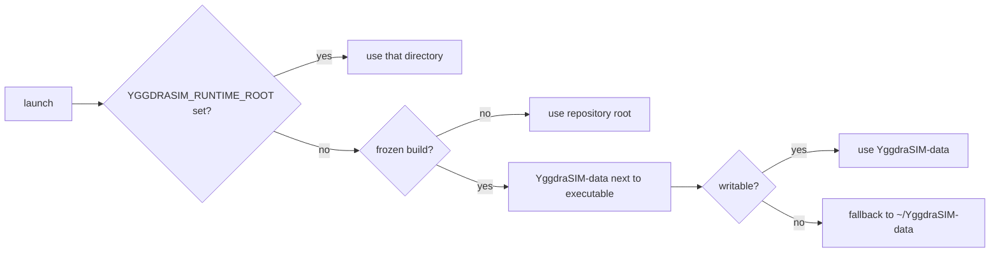

# Runtime Root

The **runtime root** is the writable directory YggdraSIM uses to hold mutable
state, drop-in certificates, keys, package templates, hotfolders, caches,
plugins, and logs. Every card-facing subsystem resolves its paths relative to
the active runtime root.

## Resolution order



| Case | Resolution |
| --- | --- |
| `YGGDRASIM_RUNTIME_ROOT` is set | that path wins, always |
| source run (editable install, in-repo) | the repository root is the runtime root |
| frozen build, writable next-to-executable directory | `YggdraSIM-data/` next to the executable |
| frozen build, not writable | `~/YggdraSIM-data/` |

## What lives under the runtime root

The runtime root contains several well-known subdirectories. The full set
depends on the subsystem, but the common shape is:

| Subdirectory | Purpose |
| --- | --- |
| `state/` | shared SQLite inventory and HIL state files |
| `plugins/` | optional runtime plugin drop-ins |
| `SCP11/local_access/certs/` | local SCP11 certificate drop-ins |
| `SCP11/eim_local/certs/` | eIM-local certificate drop-ins |
| `SCP11/eim_local/eim_packages/` | authored and seeded eIM package artifacts |
| `SCP11/eim_local/eim_packages/hotfolder/` | hotfolder queue |
| `Workspace/` | per-scenario authored identity and metadata |

## Why this matters for frozen builds

Frozen builds keep their bundled assets read-only. All mutable files have to
land in a separate writable tree, which is the runtime root. That is how:

- drop-in certificates are honored without rebuilding the bundle
- plugins work after publication
- SQLite state persists across releases
- the transcode TUI can keep sidecars next to a profile

## Environment override

`YGGDRASIM_RUNTIME_ROOT` wins over every other rule. Use it when:

- the same machine runs several YggdraSIM instances isolated by directory
- a CI job needs a clean, ephemeral runtime tree
- an automation harness must pick an exact location

```bash
export YGGDRASIM_RUNTIME_ROOT=/var/lib/yggdrasim/tenant-a
yggdrasim-scp11-live --cmd "STATUS; EXIT"
```

## Validation

After a first launch the runtime root should contain at least:

- a `state/` directory
- a populated `state/device_inventory.sqlite3`
- a `plugins/` directory that matches the source-tree shape if plugins are
  expected
- any subsystem-specific certificate and package directories the launcher or
  individual subsystems touched

## Related pages

- [State Schema](state-schema.md)
- [Build and Packaging](../build-and-packaging.md)
- [Build a Bundled Executable](../how-to/build-a-bundled-exe.md)
